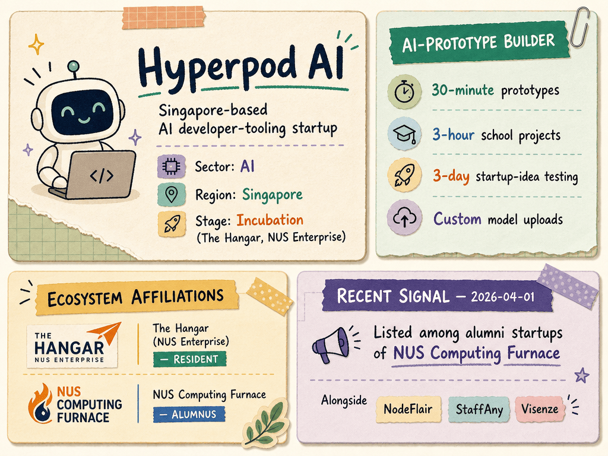

# Hyperpod AI — LIVING BRIEF
_Last updated: 2026-07-11 14:21 UTC_

## Thesis
Hyperpod AI is a Singapore-based AI developer-tooling startup offering an AI-prototype builder that enables rapid validation — 30-minute prototypes, 3-hour school projects, and 3-day startup-idea testing with custom model uploads. The company is a The Hangar (NUS Enterprise) resident and has recently been listed as an alumnus of NUS Computing's Furnace incubator, signalling deepening ties to the NUS startup ecosystem.

## Profile
- Sector: AI
- Region: Singapore
- Stage / funding: Incubation (The Hangar, NUS Enterprise)
- Identifiers: app.hyperpodai.com

## Recent signals
- **2026-04-01** — Listed among alumni startups of the NUS Computing Furnace incubator program — [comp.nus.edu.sg](https://www.comp.nus.edu.sg/entrepreneurship/furnace/start)
  - Summary: Hyperpod AI appears on the NUS Computing Furnace alumni roster, alongside startups like NodeFlair, StaffAny, and Visenze. The listing confirms the company's affiliation with NUS Enterprise's deep-tech incubation pipeline in addition to its The Hangar residency.
  - Counterparties: NUS Computing Furnace (incubator)

## Older signals
_none_

## Open questions
- What user traction or revenue has Hyperpod AI achieved since launching its prototype builder?
- Has the company raised any external equity funding beyond NUS Enterprise incubation support?
- Which specific developer segments or use cases (enterprise, education, indie) does Hyperpod AI prioritize?
