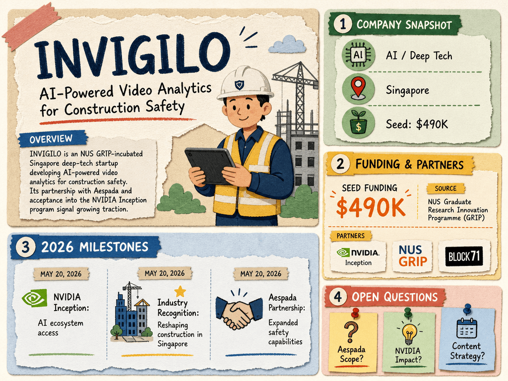

# INVIGILO — LIVING BRIEF
_Last updated: 2026-05-20 16:33 UTC_

## Thesis
INVIGILO is an NUS GRIP-incubated Singapore deep-tech startup developing AI-powered video analytics for construction safety. Its recent partnership with Aespada and acceptance into the NVIDIA Inception program signal growing industry traction and technology validation.

## Profile
- Sector: AI-powered video analytics / construction safety
- Region: Singapore
- Stage / funding: Seed ($490K from NUS GRIP, NVIDIA Inception, BLOCK71)

## Funding history
- **date unknown** — Seed, $490K — NUS Graduate Research Innovation Programme, NVIDIA Inception, BLOCK71 — [pitchbook.com](https://pitchbook.com/profiles/company/509812-57)
_Total disclosed: $0.5M._

## Recent signals
- **2026-05-20** — Accepted into NVIDIA Inception program for AI tech ecosystem access — [INVIGILO](https://www.invigilo.ai/post/invigilo-technologies-joins-nvidia-inception-program)
- **2026-05-20** — Featured for reshaping construction practices in Singapore — [INVIGILO](https://www.invigilo.ai/post/invigilo-reshaping-the-construction-scene-in-singapore)
- **2026-05-20** — Strategic partnership with Aespada to expand safety capabilities — [INVIGILO](https://www.invigilo.ai/post/invigilo-partnership-with-aespada)

## Older signals
_none_

## Open questions
- What is the scope of the Aespada partnership?
- How will NVIDIA Inception membership accelerate product development?
