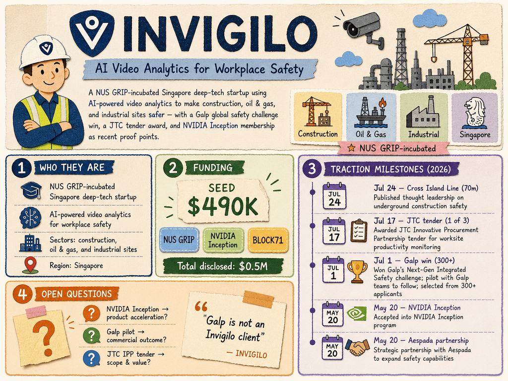

# INVIGILO — LIVING BRIEF
_Last updated: 2026-08-19 13:49 UTC_

## Thesis
INVIGILO is an NUS GRIP-incubated Singapore deep-tech startup developing AI-powered video analytics for workplace safety across construction, oil & gas, and industrial sites. Recent milestones include winning Galp's global safety challenge (selected from 300+ applicants) and being awarded a JTC Innovative Procurement Partnership tender, signaling growing traction in both commercial and government markets.

_Last material event: 2026-07-17 — Awarded JTC Innovative Procurement Partnership tender as one of three start-ups selected for worksite productivity monitoring_

## Profile
- Sector: AI / Deep tech
- Region: Singapore
- Stage / funding: Seed ($490K from NUS GRIP, NVIDIA Inception, BLOCK71)

## Funding history
- **date unknown** — Seed, $490K — NUS Graduate Research Innovation Programme, NVIDIA Inception, BLOCK71 — [pitchbook.com](https://pitchbook.com/profiles/company/509812-57)
_Total disclosed: $0.5M._

## Recent signals
- **2026-07-24** — Published thought leadership on underground construction safety challenges specific to Singapore's Cross Island Line — [invigilo.ai](https://www.invigilo.ai/post/underground-changes-every-safety-rule-you-know)
  - Summary: INVIGILO published a detailed analysis of how underground construction (specifically the Cross Island Line at 70m depth) inverts standard safety hazards like work at height and confined-space plant proximity. The piece positions INVIGILO's computer-vision platform as adapted for low-light, dust-heavy underground environments where conventional monitoring falls short.

## Older signals
- **2026-07-17** — Invigilo AI awarded JTC Innovative Procurement Partnership tender as one of three start-ups selected for worksite productivity monitoring — [sg.news.yahoo.com](https://sg.news.yahoo.com/more-support-construction-tech-firms-022000931.html)
  - Summary: National Development Minister Chee Hong Tat announced INVIGILO is one of three start-ups awarded tenders under JTC's Innovative Procurement Partnership for computer-vision solutions that monitor worksite productivity. The government is waiving sandbox rental fees and extending support for proven construction tech solutions.
  - Counterparties: JTC
- **2026-07-01** — Won Galp's Next-Gen Integrated Safety innovation challenge; pilot with Galp teams to follow — [invigilo.ai](https://www.invigilo.ai/news/galp-next-gen-safety-challenge-win)
  - Summary: INVIGILO won the Next-Gen Integrated Safety challenge run by Portuguese energy company Galp through its Startup the Future programme. Selected from over 300 applicants, INVIGILO presented at Galp Safety Day and pilot work with Galp teams is expected to follow.
  - Counterparties: Galp
  - Numbers: selected from 300+ applicants
  - Quote: "this is a challenge result, not a commercial engagement, and Galp is not an Invigilo client" — INVIGILO
- **2026-06-25** — Signed MOU with Motorola Solutions | Avigilon Alta for joint go-to-market across Singapore, Malaysia, Thailand and the Philippines — [invigilo.ai](https://www.invigilo.ai/news/motorola-solutions-avigilon-alta-mou)
  - Summary: INVIGILO and Motorola Solutions | Avigilon Alta signed a Memorandum of Understanding on 25 June 2026 to develop a joint go-to-market across Singapore, Malaysia, Thailand and the Philippines, focused initially on construction and industrial sectors. The collaboration pairs INVIGILO's SafeKey AI video analytics with Avigilon Alta's cloud-native video security platform, running on cameras sites already own, so automated safety responses can connect to access-control systems. INVIGILO stresses the instrument is an MOU to develop the approach, not a signed commercial contract.
  - Counterparties: Motorola Solutions | Avigilon Alta
  - Quote: "this is an MOU, an agreement between the two companies to develop the joint go-to-market approach together. It is not a signed commercial contract." — Invigilo announcement
- **2026-05-20** — Accepted into NVIDIA Inception program for AI tech ecosystem access — [INVIGILO](https://www.invigilo.ai/post/invigilo-technologies-joins-nvidia-inception-program)
- **2026-05-20** — Featured for reshaping construction practices in Singapore — [INVIGILO](https://www.invigilo.ai/post/invigilo-reshaping-the-construction-scene-in-singapore)
- **2026-05-20** — Strategic partnership with Aespada to expand safety capabilities — [INVIGILO](https://www.invigilo.ai/post/invigilo-partnership-with-aespada)

## Open questions
- How will NVIDIA Inception membership accelerate product development?
- What is the commercial outcome of the Galp pilot program?
- What is the scope and value of the JTC IPP tender for INVIGILO?
- Will the Motorola Solutions | Avigilon Alta MOU convert into a commercial agreement, and does it signal expansion beyond the construction and industrial verticals in Southeast Asia?
