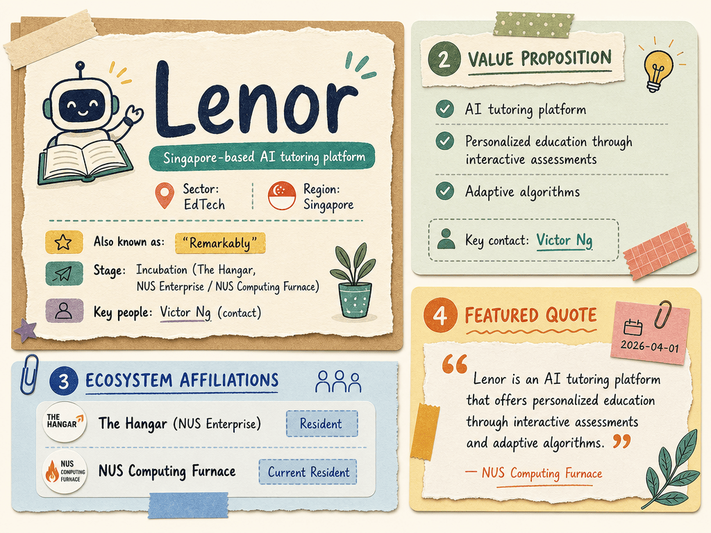

# Lenor — LIVING BRIEF
_Last updated: 2026-07-11 14:21 UTC_

## Thesis
Lenor is a Singapore-based AI tutoring platform (also operating under the name "Remarkably") that offers personalized education through interactive assessments and adaptive algorithms. A current resident of NUS Computing's Furnace incubator and The Hangar (NUS Enterprise), the startup is building an AI-native tutoring experience for students. Public information remains limited beyond these directory listings.

## Profile
- Sector: EdTech
- Region: Singapore
- Stage / funding: Incubation (The Hangar, NUS Enterprise / NUS Computing Furnace)
- Key people: Victor Ng (contact)
- Identifiers: lenorai.com

## Recent signals
- **2026-04-01** — Listed as a current resident of NUS Computing Furnace, described as an AI tutoring platform for personalized education — [comp.nus.edu.sg](https://www.comp.nus.edu.sg/entrepreneurship/furnace/start)
  - Summary: Lenor is listed as a current Furnace resident and also goes by the name "Remarkably". The incubator describes it as an AI tutoring platform offering personalized education through interactive assessments and adaptive algorithms. Victor Ng is the listed contact.
  - People: Victor Ng (contact)
  - Counterparties: NUS Computing Furnace (incubator)
  - Quote: "Lenor is an AI tutoring platform that offers personalized education through interactive assessments and adaptive algorithms." — NUS Computing Furnace page

## Older signals
_none_

## Open questions
- Has Lenor launched a live product or piloted with any schools or tutoring centres?
- What is the company's revenue model (subscription, per-student, B2B licensing)?
- Does Lenor have any disclosed institutional backing beyond incubator support?
