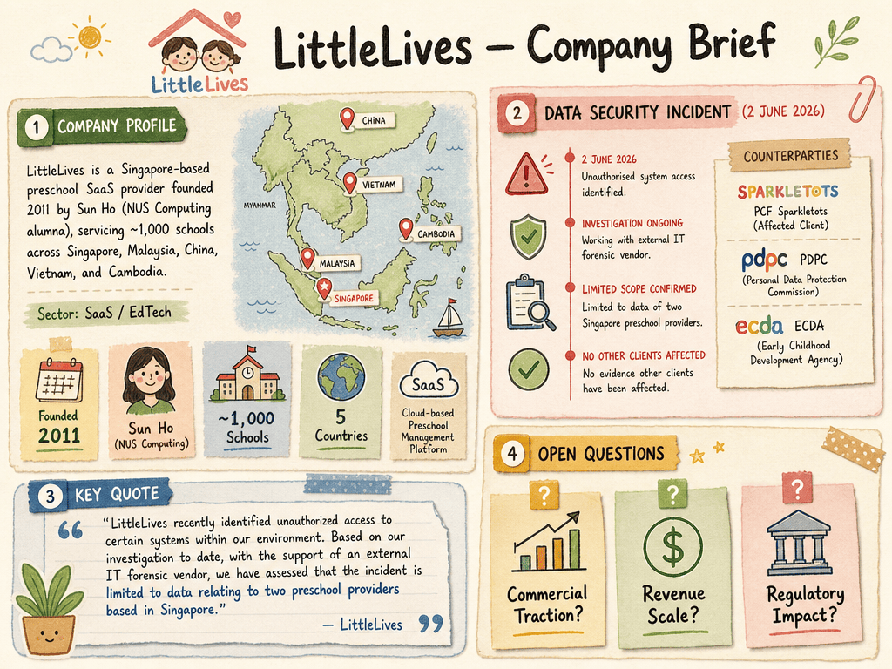

# LittleLives — LIVING BRIEF
_Last updated: 2026-07-12 14:37 UTC_

## Thesis
LittleLives is a Singapore-based preschool SaaS provider (founded 2011 by Sun Ho, NUS Computing alumna) servicing ~1,000 schools across Singapore, Malaysia, China, Vietnam, and Cambodia with a holistic school-management platform for early-childhood centres.

## Profile
- Sector: SaaS / EdTech
- Region: Indonesia
- Founded: 2011

## Recent signals
- **2026-06-02** — LittleLives confirms unauthorised system access affecting two Singapore preschool clients — [littlelives.com](https://www.littlelives.com/id/community-events/press/security-announcement)
  - Summary: LittleLives identified unauthorised access to certain systems and, with external forensic support, assessed that the incident is limited to data of two Singapore preschool providers. The company is working with affected organisations, authorities, and external experts. No evidence other clients were affected.
  - Counterparties: PCF Sparkletots (affected client), PDPC, ECDA
  - Quote: "LittleLives recently identified unauthorized access to certain systems within our environment. Based on our investigation to date, with the support of an external IT forensic vendor, we have assessed that the incident is limited to data relating to two preschool providers based in Singapore." — LittleLives
- **2026-06-02** — PDPC investigating potential data breach at PCF Sparkletots involving LittleLives' pupil-management system — [straitstimes.com](https://www.straitstimes.com/singapore/pdpc-investigating-potential-data-breach-involving-pcf-sparkletots-pupil-information)
- **2026-06-26** — LittleLives — Preschool SaaS company profile — [sg.linkedin.com](https://sg.linkedin.com/company/littlelives)
- **2026-06-26** — LittleLives careers — Join the team — [littlelives-talent.freshteam.com](https://littlelives-talent.freshteam.com/jobs)

## Older signals
_none_

## Open questions
- What commercial traction or pilot deployments does LittleLives have to date?
- Is LittleLives generating revenue, and at what scale?
- What is the full scope of the data breach, and could regulatory findings affect LittleLives' client relationships or procurement pipeline?
