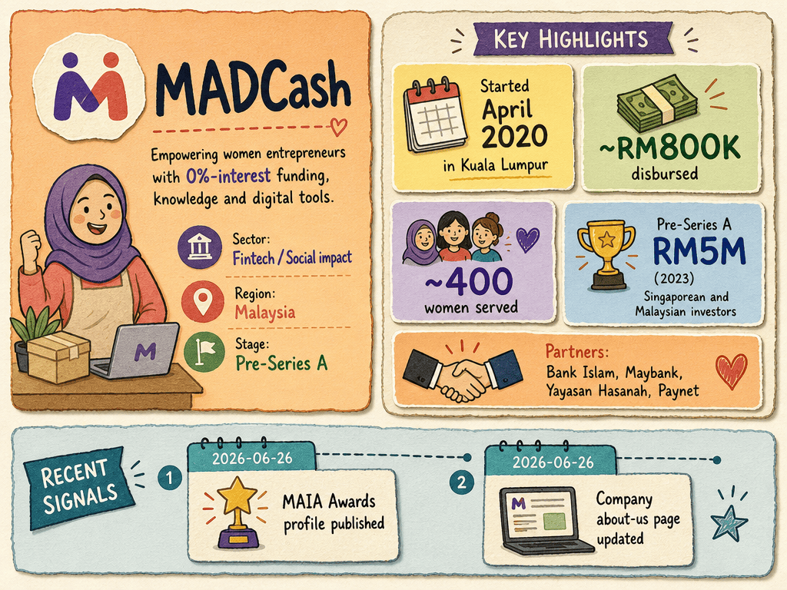

# MADCash — LIVING BRIEF
_Last updated: 2026-06-26 15:36 UTC_

## Thesis
MADCash is a Malaysia-based Shariah-compliant fintech (HQ Kuala Lumpur) providing 0%-interest micro-funding plus financial literacy and digital tools to women micro-entrepreneurs. Since 2020, it has disbursed ~RM800K to ~400 women, operating across Malaysia, Singapore, and Tajikistan with support from Bank Islam and Maybank.

## Profile
- Sector: Fintech / Social impact
- Region: Malaysia
- Stage / funding: Pre-Series A; Incubation

## Funding history
- **2023-08-01** — Pre-Series A, RM5M — Singaporean and Malaysian investors (unnamed publicly) — [vulcanpost.com](https://vulcanpost.com/841503/madcash-malaysia-fintech-microloans-pre-series-a-funding/)

_Total disclosed: $1.1M._

## Recent signals
- **2026-06-26** — MADCash — MAIA Awards profile — [maiawards.org](https://www.maiawards.org/MAIApedia/madcash-2)
  - Summary: MADCash is a fintech that helps women achieve greater financial security by providing capital, business and financial acumen to grow micro businesses. Grew from USD65 to USD700K loan pool. Partners include Bank Islam, Maybank, Yayasan Hasanah.
- **2026-06-26** — Micro Funding For Malaysian Women Entrepreneurs — About MADCash — [getmadcash.com](https://getmadcash.com/about-us)
  - Summary: MADCash started April 2020 in Kuala Lumpur as a Shariah-compliant fintech. Provides 0%-interest micro-funding. Partners: Bank Islam, YFCT, Yayasan Hasanah, Maybank, Paynet. Works with women micro-entrepreneurs in Malaysia.

## Older signals
  _none_

## Open questions
- What commercial traction or pilot deployments does MADCash have to date?
- Is MADCash generating revenue, and at what scale?
