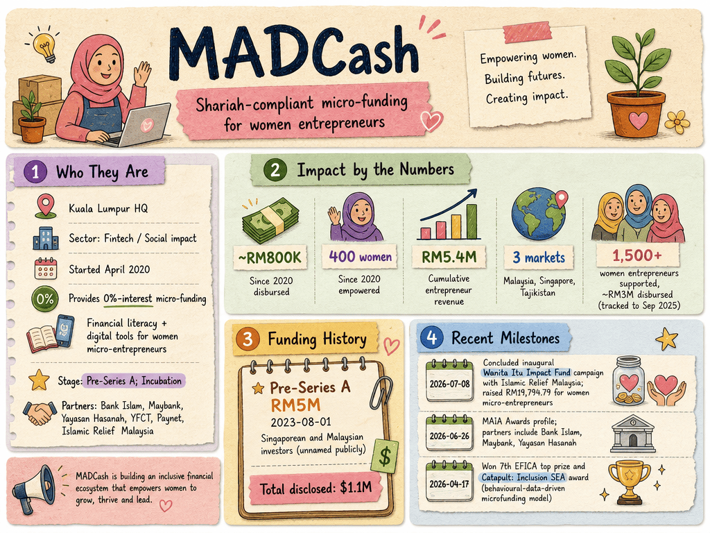

# MADCash — LIVING BRIEF
_Last updated: 2026-08-07 14:18 UTC_

## Thesis
MADCash is a Malaysia-based Shariah-compliant fintech (HQ Kuala Lumpur) providing 0%-interest micro-funding plus financial literacy and digital tools to women micro-entrepreneurs. Since 2020, it has disbursed ~RM800K to ~400 women, operating across Malaysia, Singapore, and Tajikistan with support from Bank Islam and Maybank.

_Last material event: 2026-07-08 — Inaugural Wanita Itu Impact Fund campaign concluded with Islamic Relief Malaysia (RM19,794.79 raised)_

## Profile
- Sector: Fintech / Social impact
- Region: Malaysia
- Stage / funding: Pre-Series A; Incubation

## Funding history
- **2023-08-01** — Pre-Series A, RM5M — Singaporean and Malaysian investors (unnamed publicly) — [vulcanpost.com](https://vulcanpost.com/841503/madcash-malaysia-fintech-microloans-pre-series-a-funding/)

_Total disclosed: $1.1M._

## Recent signals
_none_

## Older signals
- **2026-07-08** — Concluded its inaugural Wanita Itu Impact Fund campaign with Islamic Relief Malaysia, raising RM19,794.79 for women micro-entrepreneurs — [linkedin.com](https://www.linkedin.com/posts/noor-amy-ismail-b7755685_wanita-itu-impact-fund-wiif-pillar-1-economic-activity-7480737711763529728-C9-G)
- **2026-06-26** — MADCash — MAIA Awards profile — [maiawards.org](https://www.maiawards.org/MAIApedia/madcash-2)
  - Summary: MADCash is a fintech that helps women achieve greater financial security by providing capital, business and financial acumen to grow micro businesses. Grew from USD65 to USD700K loan pool. Partners include Bank Islam, Maybank, Yayasan Hasanah.
- **2026-06-26** — Micro Funding For Malaysian Women Entrepreneurs — About MADCash — [getmadcash.com](https://getmadcash.com/about-us)
  - Summary: MADCash started April 2020 in Kuala Lumpur as a Shariah-compliant fintech. Provides 0%-interest micro-funding. Partners: Bank Islam, YFCT, Yayasan Hasanah, Maybank, Paynet. Works with women micro-entrepreneurs in Malaysia.
- **2026-04-17** — Jelawang Capital profiles MADCash's behavioural-data-driven microfunding model: 1,500+ women entrepreneurs supported, ~RM3M disbursed, cumulative entrepreneur revenue of RM5.4M (tracked to Sep 2025), expanded to Singapore and Tajikistan; won 7th EFICA top prize and Catapult: Inclusion SEA award — [jelawangcapital.com](https://www.jelawangcapital.com/our-resources/from-unbankable-to-creditworthy-how-madcash-is-turning-behavioural-data-int)

## Open questions
- What is MADCash's own operating revenue, distinct from the revenue generated by its micro-entrepreneurs?
- Is the Wanita Itu Impact Fund a one-off campaign or the start of a recurring partnership with Islamic Relief Malaysia?
