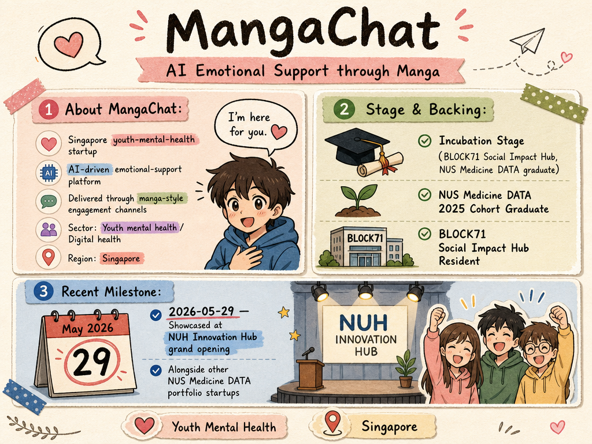

# MangaChat — LIVING BRIEF
_Last updated: 2026-05-29 16:46 UTC_

## Thesis
MangaChat is a Singapore youth-mental-health startup building an AI-driven emotional-support platform delivered through manga-style engagement channels. A graduate of the NUS Medicine Digital Advanced Technology Accelerator (DATA) 2025 cohort and resident at BLOCK71 Social Impact Hub, it was showcased at the NUH Innovation Hub grand opening alongside other DATA portfolio companies.

## Profile
- Sector: Youth mental health / Digital health
- Region: Singapore
- Stage / funding: Incubation (BLOCK71 Social Impact Hub, NUS Medicine DATA graduate)

## Recent signals
- **2026-05-29** — MangaChat was showcased at the NUH Innovation Hub grand opening alongside other NUS Medicine DATA portfolio startups. — [LinkedIn (NUS Medicine DATA)](https://www.linkedin.com/posts/nusmeddata_healthtech-startups-digitalhealth-activity-7450758713738465280-kPbP)

## Older signals
_none_

## Open questions
- What usage or pilot metrics does MangaChat have for its AI-driven emotional-support platform?
- Has the company raised any equity funding beyond BLOCK71 incubation support and accelerator participation?
- What is the go-to-market strategy for a manga-style mental-health platform in Singapore's healthcare ecosystem?
