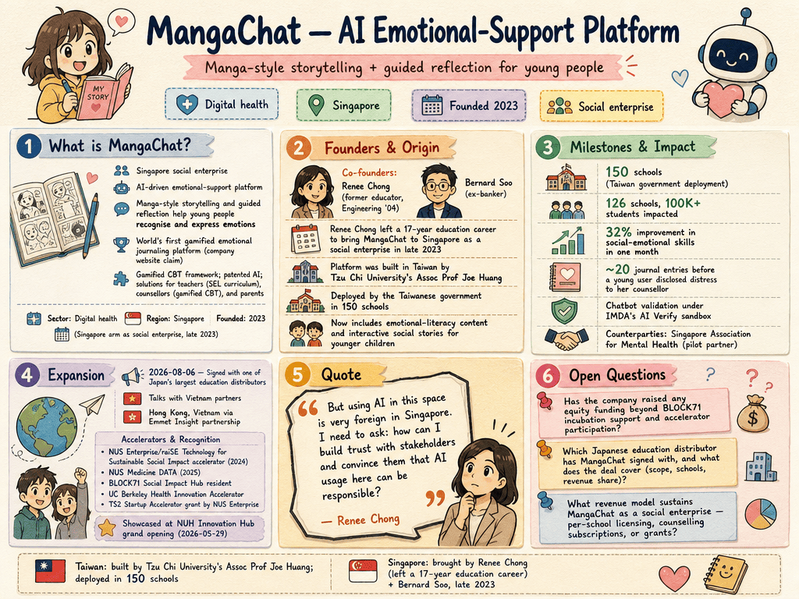

# MangaChat — LIVING BRIEF
_Last updated: 2026-08-15 13:35 UTC_

## Thesis
MangaChat is a Singapore social enterprise building an AI-driven emotional-support platform that uses manga-style storytelling and guided reflection to help young people recognise and express emotions. Co-founded by former educator Renee Chong and ex-banker Bernard Soo, the platform originated in Taiwan as a CBT-based gamified journalling tool and was brought to Singapore in late 2023; it now targets schools and counselling channels with chatbot validation under IMDA's AI Verify sandbox. Expansion is moving beyond Singapore through a signed distribution deal with one of Japan's largest education distributors and talks with Vietnam partners.

_Last material event: 2026-08-06 — Signed with one of Japan's largest education distributors_

## Profile
- Sector: Digital health
- Region: Singapore
- Founded: 2023 (Singapore arm as social enterprise, late 2023)
- Stage / funding: Social enterprise, grants-based; NUS Enterprise/raiSE Technology for Sustainable Social Impact accelerator (2024), NUS Medicine DATA (2025), BLOCK71 Social Impact Hub resident
- Key people: Renee Chong (co-founder), Bernard Soo (co-founder)

## Funding history
_No disclosed funding._

## Recent signals
- **2026-08-06** — AlumNUS feature on co-founder Renee Chong: Taiwan origins, IMDA AI Verify validation, signed Japan education-distributor deal — [alumni.nus.edu.sg](https://alumni.nus.edu.sg/thealumnus/2026/08/06/when-manga-meets-mental-health)
  - Summary: Profile of co-founder Renee Chong (Engineering '04), who left a 17-year education career to bring MangaChat to Singapore as a social enterprise in late 2023. The platform was built in Taiwan by Tzu Chi University's Assoc Prof Joe Huang and deployed by the Taiwanese government in 150 schools; it now includes emotional-literacy content and interactive social stories for younger children. The article reports MangaChat has signed with one of Japan's largest education distributors and is in talks with Vietnam partners.
  - People: Renee Chong (co-founder), Bernard Soo (co-founder), Joe Huang (Associate Professor, Tzu Chi University)
  - Counterparties: Japan education distributor (signed partner), IMDA (AI Verify validator), Singapore Association for Mental Health (pilot partner)
  - Numbers: 150 schools (Taiwan government deployment); ~20 journal entries before a young user disclosed distress to her counsellor; founded 2023
  - Quote: "But using AI in this space is very foreign in Singapore. I need to ask: how can I build trust with stakeholders and convince them that AI usage here can be responsible?" — Renee Chong

## Older signals
- **2026-06-26** — MangaChat — Youth wellness platform (LinkedIn) — [sg.linkedin.com](https://sg.linkedin.com/company/mangachat)
- **2026-06-26** — MangaChat — EMMET INSIGHT profile — [emmetinsight.com](https://emmetinsight.com/mangachat)
  - Summary: MangaChat has 126 schools in Taiwan, 100K+ students impacted. Secured TS2 Startup Accelerator grant by NUS Enterprise. Selected for UC Berkeley Health Innovation Accelerator. Expanding to Singapore, Hong Kong, Vietnam via Emmet Insight partnership.
- **2026-06-26** — MangaChat — Company website — [sg.mangachat.com](https://sg.mangachat.com)
  - Summary: World's first gamified emotional journaling platform. 32% improvement in social-emotional skills in one month. Gamified CBT framework. Patented AI. Solutions for teachers (SEL curriculum), counsellors (gamified CBT), and parents.
- **2026-05-29** — MangaChat was showcased at the NUH Innovation Hub grand opening alongside other NUS Medicine DATA portfolio startups. — [LinkedIn (NUS Medicine DATA)](https://www.linkedin.com/posts/nusmeddata_healthtech-startups-digitalhealth-activity-7450758713738465280-kPbP)

## Open questions
- Has the company raised any equity funding beyond BLOCK71 incubation support and accelerator participation?
- Which Japanese education distributor has MangaChat signed with, and what does the deal cover (scope, schools, revenue share)?
- What revenue model sustains MangaChat as a social enterprise — per-school licensing, counselling subscriptions, or grants?
