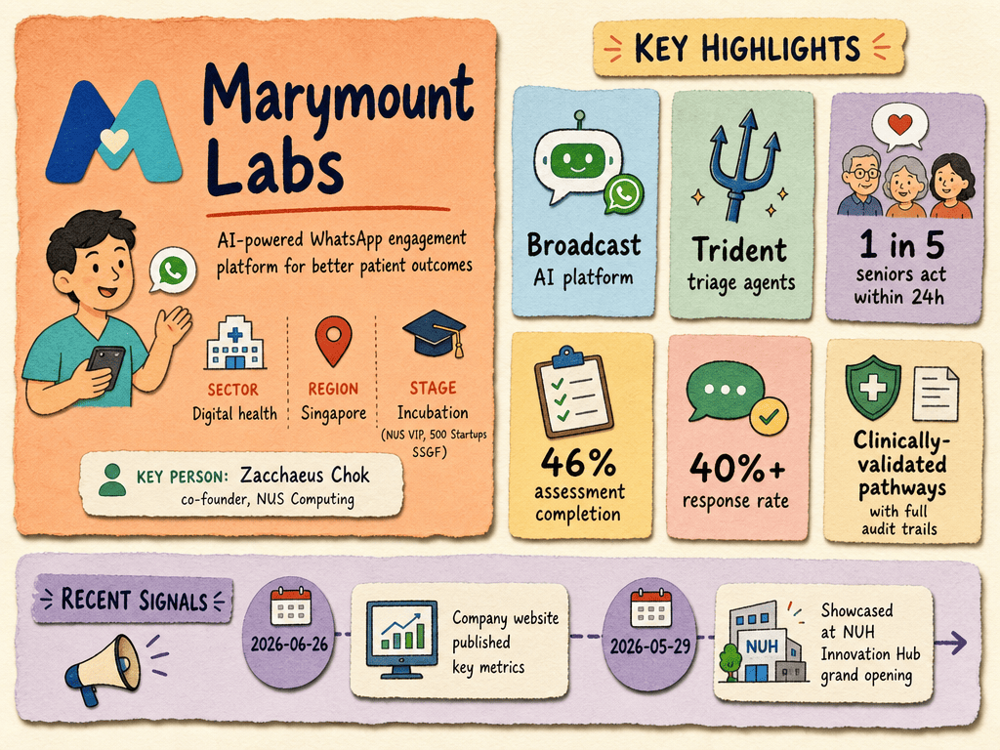

# Marymount Labs — LIVING BRIEF
_Last updated: 2026-06-26 15:36 UTC_

## Thesis
Marymount Labs is a Singapore digital-health startup building 'Broadcast', an AI-powered WhatsApp engagement platform that automates patient outreach across smoking-cessation, Hospital@Home triage, and preventive-care campaigns. Backed by NUS VIP and 500 Startups (SSGF), it has been showcased at the NUH Innovation Hub alongside other NUS Medicine DATA portfolio companies.

## Profile
- Sector: Digital health
- Region: Singapore
- Stage / funding: Incubation (NUS VIP, 500 Startups SSGF)
- Key people: Zacchaeus Chok (co-founder, NUS Computing)

## Recent signals

- **2026-06-26** — Marymount Labs — Turn Care Plans into Patient Action — [marymountlabs.com](https://www.marymountlabs.com)
  - Summary: Broadcast AI-powered patient messaging; Trident goal-driven triage agents. Metrics: 1 in 5 seniors act within 24h, 46% assessment completion, 40%+ response rate. Clinically-validated conversational pathways with full audit trails.
- **2026-05-29** — Marymount Labs was showcased at the NUH Innovation Hub grand opening alongside other NUS Medicine DATA portfolio startups. — [LinkedIn (NUS Medicine DATA)](https://www.linkedin.com/posts/nusmeddata_healthtech-startups-digitalhealth-activity-7450758713738465280-kPbP)

## Older signals

  _none_

## Open questions
- What specific milestones or traction has Marymount Labs achieved since joining the NUS Medicine DATA accelerator?
- Has the Broadcast platform been deployed commercially, or is it still in pilot with partner healthcare institutions?
- Is there a priced equity round in progress, or is the company still relying on grant and accelerator support?
