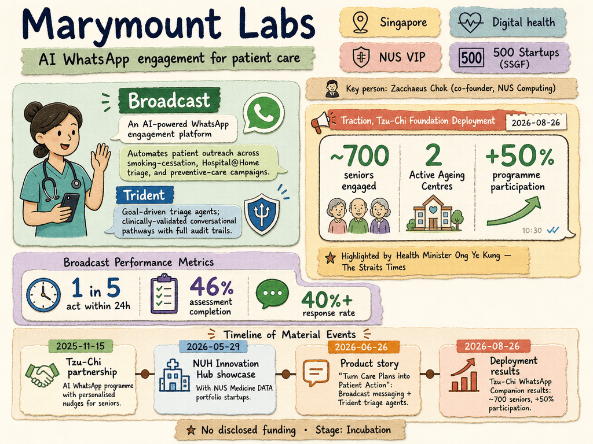

# Marymount Labs — LIVING BRIEF
_Last updated: 2026-08-07 14:18 UTC_

## Thesis
Marymount Labs is a Singapore digital-health startup building 'Broadcast', an AI-powered WhatsApp engagement platform that automates patient outreach across smoking-cessation, Hospital@Home triage, and preventive-care campaigns. Backed by NUS VIP and 500 Startups (SSGF), it has been showcased at the NUH Innovation Hub alongside other NUS Medicine DATA portfolio companies.

_Last material event: 2025-11-15 — Partnership with Tzu-Chi Foundation to bring AI-powered WhatsApp engagement to seniors_

## Profile
- Sector: Digital health
- Region: Singapore
- Stage / funding: Incubation (NUS VIP, 500 Startups SSGF)
- Key people: Zacchaeus Chok (co-founder, NUS Computing)

## Funding history
_No disclosed funding._

## Recent signals
_none_

## Older signals
- **2026-06-26** — Marymount Labs — Turn Care Plans into Patient Action — [marymountlabs.com](https://www.marymountlabs.com)
  - Summary: Broadcast AI-powered patient messaging; Trident goal-driven triage agents. Metrics: 1 in 5 seniors act within 24h, 46% assessment completion, 40%+ response rate. Clinically-validated conversational pathways with full audit trails.
- **2026-05-29** — Marymount Labs was showcased at the NUH Innovation Hub grand opening alongside other NUS Medicine DATA portfolio startups. — [LinkedIn (NUS Medicine DATA)](https://www.linkedin.com/posts/nusmeddata_healthtech-startups-digitalhealth-activity-7450758713738465280-kPbP)
- **2025-11-15** — Partnered with Tzu-Chi Foundation on an AI-powered WhatsApp programme delivering personalised nudges and activity recommendations to engage seniors, per coverage credited to The Straits Times — [marymountlabs.com](https://www.marymountlabs.com/blog)
  - Summary: Marymount Labs partnered with Tzu-Chi Foundation on an AI-powered WhatsApp programme that delivers personalised nudges and activity recommendations to engage seniors. The company's news listing credits the coverage to The Straits Times and positions the programme within its social-care solutions.

## Open questions
- What specific milestones or traction has Marymount Labs achieved since joining the NUS Medicine DATA accelerator?
- Is there a priced equity round in progress, or is the company still relying on grant and accelerator support?
- What is the commercial structure of the Tzu-Chi Foundation deployment — paid contract, grant, or pro-bono pilot?
