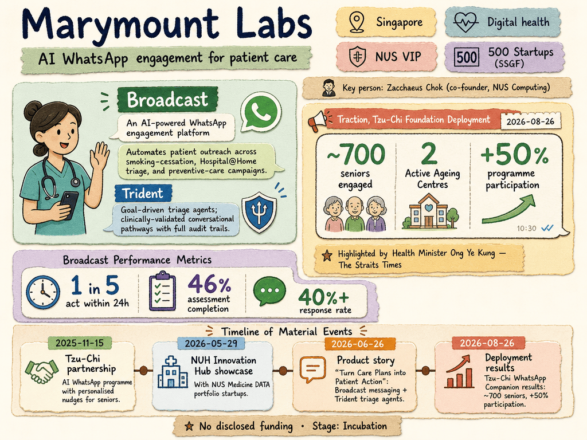

# Marymount Labs — LIVING BRIEF
_Last updated: 2026-09-27 20:18 UTC_

## Thesis
Marymount Labs is a Singapore digital-health startup building 'Broadcast', an AI-powered WhatsApp engagement platform that automates patient outreach across smoking-cessation, Hospital@Home triage, and preventive-care campaigns. The Health Ministry named its WhatsApp Companion as a showcase project at the SUSS Geronpreneurship Innovation Festival, highlighting deployment with the Tzu-Chi Foundation at Active Ageing Centres.

_Last material event: 2026-08-26 — Health Minister Ong Ye Kung names Marymount Labs' AI-powered WhatsApp Companion as a showcase project at SUSS Geronpreneurship Innovation Festival keynote_

## Profile
- Sector: Digital health
- Region: Singapore
- Stage / funding: Pre-seed (NUS Medicine Digital Health Accelerator); NUS VIP and 500 Startups (SSGF)
- Key people: Zacchaeus Chok (co-founder, NUS Computing)
- Identifiers: NUS Medicine DATA Accelerator (NUS Enterprise), 500 Startups, Tzu-Chi Foundation

## Funding history
_No disclosed funding._

## Recent signals
- **2026-08-26** — Health Ministry names Marymount Labs' WhatsApp Companion as a showcase project at SUSS Geronpreneurship Innovation Festival — [moh.gov.sg](https://moh.gov.sg/newsroom/speech-by-mr-ong-ye-kung--minister-for-health-and-coordinating-minister-for-social-policies--at-the-singapore-university-of-social-sciences-geronpreneurship-innovation-festival--26-august-2026)

### Hiring
- **date unknown** — Hiring and deployment activity ongoing across Singapore public healthcare institutions — [lever.co](<url>)

## Older signals
_none_

## Open questions
- _none open_
