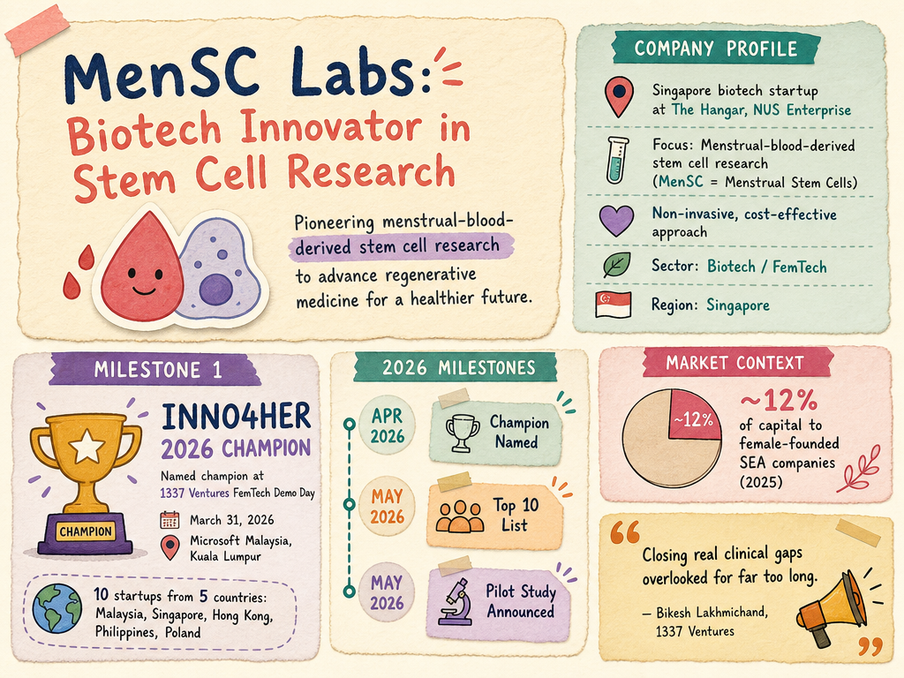

# MenSC Labs — LIVING BRIEF
_Last updated: 2026-05-30 14:39 UTC_

## Thesis
The Hangar (NUS Enterprise)-resident Singapore biotech startup focused on menstrual-blood-derived stem cell research (MenSC = Menstrual Stem Cells). Named INNO4HER 2026 Champion at 1337 Ventures' FemTech Demo Day in March 2026, the company is developing a non-invasive, cost-effective approach to stem cell research alongside peers Navo Health and Bosom.

## Profile
- Sector: Biotech / FemTech
- Region: Singapore (The Hangar, NUS Enterprise)

## Recent signals
- **2026-04-08** — MenSC Labs was named INNO4HER 2026 Champion at the Alpha Startups FemTech Demo Day hosted at Microsoft Malaysia, recognized for its menstrual blood stem cell research alongside Navo Health — [1337.ventures](https://1337.ventures/navo-health-and-mensc-labs-named-inno4her-2026-champions-f)
  - Summary: MenSC Labs and Navo Health were named INNO4HER 2026 Champions at the Alpha Startups FemTech Demo Day held March 31, 2026 at Microsoft Malaysia in Kuala Lumpur. The three-month hybrid accelerator by 1337 Ventures featured ten FemTech startups from five countries (Malaysia, Singapore, Hong Kong, Philippines, Poland). MenSC Labs was recognized for non-invasive, cost-effective menstrual blood stem cell research. Bosom won the Crowd Favourite title. Female-founded companies in Southeast Asia captured approximately 12% of capital deployed in YTD 2025, per an OSK Ventures report.
  - People: Bikesh Lakhmichand (CEO & Founding Partner, 1337 Ventures), Amelia Ong (CEO, OSK Ventures International Berhad)
  - Counterparties: 1337 Ventures (accelerator), Microsoft (event partner)
  - Numbers: 10 FemTech startups from 5 countries in the cohort; female-founded SEA companies captured ~12% of capital deployed YTD 2025
  - Quote: "These founders didn't come to build incremental solutions. They came to close real clinical gaps, the kind that have been overlooked for far too long." — Bikesh Lakhmichand, 1337 Ventures
- **2026-05-30** — 1337 Ventures named MenSC Labs among the Top 10 FemTech startups for INNO4HER 2026, listing the company alongside nine other startups spanning women's health, fertility, and maternal care — [hiswai.com](https://hiswai.com/1337-ventures-names-top-10-femtech-startups-for-inno4her-2026)
- **2026-05-30** — MenSC Labs announced a pilot study advancing menstrual blood stem cell research, shared via the FemTech Association Asia — [LinkedIn](https://www.linkedin.com/posts/femtechasia_femtechassociationasia-femtech-womenshealth-activity-7409050429139034112-_0ml)

## Older signals
_none_

## Open questions
- What is MenSC Labs' current funding status, and does it plan to raise a seed round following the INNO4HER win?
- What specific research or clinical milestones does the pilot study target?
