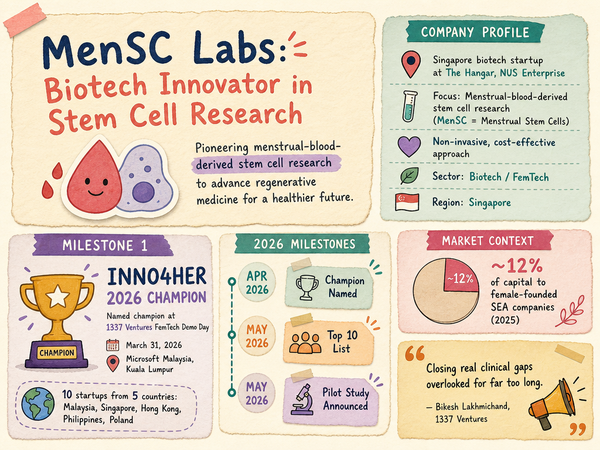

# MenSC Labs — LIVING BRIEF
_Last updated: 2026-10-04 20:11 UTC_

## Thesis
The Hangar (NUS Enterprise)-resident Singapore biotech startup focused on menstrual-blood-derived stem cell research (MenSC = Menstrual Stem Cells). Named INNO4HER 2026 Champion at 1337 Ventures' FemTech Demo Day in March 2026, the company is developing a non-invasive, cost-effective approach to stem cell research alongside peers Navo Health and Bosom.

_Last material event: 2026-09-13 — Began launching a menstrual-blood analysis service; products now in use at 10+ research labs across Singapore, Australia and the US_

## Profile
- Sector: Biotechnology / Digital health
- Region: Singapore (The Hangar, NUS Enterprise)

## Funding history
_No disclosed funding._

## Recent signals
- **2026-09-13** — The Straits Times profiled MenSC Labs' menstrual-blood stem cell work: products now used by 10+ research labs across Singapore, Australia and the US, and a menstrual-blood analysis service is launching for clinical screening — [comp.nus.edu.sg](https://comp.nus.edu.sg/news-media/cna-digital-cna-explains-why-ai-leaders-are-calling-for-a-slowdown-and-what-makes-it-so-difficult-copy)
  - Summary: The Straits Times featured MenSC Labs, the femtech startup co-founded by NUS Business Analytics alumnus Kyle Lao with life-sciences specialist Immanuella Indradjaja, who set the company up in November 2024 to work with stem cells from menstrual blood for women's health. Its products are now used by more than 10 research labs in Singapore, Australia and the United States, and the company is launching a menstrual blood analysis service to help clinicians screen for conditions such as endometriosis, with longer-term ambitions to develop regenerative treatments for Asherman's syndrome and premature ovarian insufficiency. The founders said they have raised just under $100,000 so far, including a grant from NUS Enterprise.
  - People: Kyle Lao (Co-founder), Immanuella Indradjaja (Co-founder)
  - Counterparties: NUS Enterprise (grant provider)
  - Numbers: products used by 10+ research labs (Singapore, Australia, US); just under $100,000 raised to date incl. NUS Enterprise grant

## Older signals
- **2026-05-30** — 1337 Ventures named MenSC Labs among the Top 10 FemTech startups for INNO4HER 2026, listing the company alongside nine other startups spanning women's health, fertility, and maternal care — [hiswai.com](https://hiswai.com/1337-ventures-names-top-10-femtech-startups-for-inno4her-2026)
- **2026-05-30** — MenSC Labs announced a pilot study advancing menstrual blood stem cell research, shared via the FemTech Association Asia — [LinkedIn](https://www.linkedin.com/posts/femtechasia_femtechassociationasia-femtech-womenshealth-activity-7409050429139034112-_0ml)
- **2026-04-08** — MenSC Labs was named INNO4HER 2026 Champion at the Alpha Startups FemTech Demo Day hosted at Microsoft Malaysia, recognized for its menstrual blood stem cell research alongside Navo Health — [1337.ventures](https://1337.ventures/navo-health-and-mensc-labs-named-inno4her-2026-champions-f)
  - Summary: MenSC Labs and Navo Health were named INNO4HER 2026 Champions at the Alpha Startups FemTech Demo Day held March 31, 2026 at Microsoft Malaysia in Kuala Lumpur. The three-month hybrid accelerator by 1337 Ventures featured ten FemTech startups from five countries (Malaysia, Singapore, Hong Kong, Philippines, Poland). MenSC Labs was recognized for non-invasive, cost-effective menstrual blood stem cell research. Bosom won the Crowd Favourite title. Female-founded companies in Southeast Asia captured approximately 12% of capital deployed in YTD 2025, per an OSK Ventures report.
  - People: Bikesh Lakhmichand (CEO & Founding Partner, 1337 Ventures), Amelia Ong (CEO, OSK Ventures International Berhad)
  - Counterparties: 1337 Ventures (accelerator), Microsoft (event partner)
  - Numbers: 10 FemTech startups from 5 countries in the cohort; female-founded SEA companies captured ~12% of capital deployed YTD 2025
  - Quote: "These founders didn't come to build incremental solutions. They came to close real clinical gaps, the kind that have been overlooked for far too long." — Bikesh Lakhmichand, 1337 Ventures

## Open questions
- What specific research or clinical milestones does the pilot study target?
