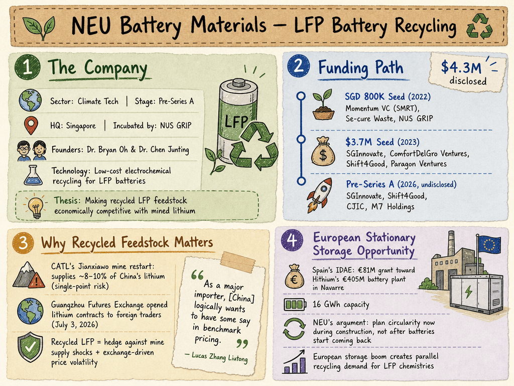

# NEU Battery Materials — LIVING BRIEF
_Last updated: 2026-07-14 14:49 UTC_

## Thesis
NUS GRIP-incubated battery-materials startup developing low-cost electrochemical recycling for lithium iron phosphate (LFP) batteries. Founded by Dr. Bryan Oh and Dr. Chen Junting, the company aims to make recycled LFP feedstock economically competitive with mined lithium, particularly as China's new lithium futures market introduces global price volatility.

## Profile
- Sector: Climate tech
- Region: Singapore
- Stage / funding: Pre-Series A
- Identifiers: [LinkedIn](https://sg.linkedin.com/company/neu-battery-materials), [Crunchbase](https://www.crunchbase.com/organization/neu-battery-materials), UEN: 202119965Z, [SGInnovate](https://www.sginnovate.com/investments/neu-battery-materials), [NUS CDE](https://cde.nus.edu.sg/research/industry-partnership/neu-battery-materials/)

## Funding history
- **2022-06-24** — Seed, SGD 800K — Momentum Venture Capital (SMRT Corporation), Se-cure Waste Management, Angel investors, NUS GRIP — [eco-business.com](https://www.eco-business.com/press-releases/nus-grip-deep-tech-start-up-neu-battery-materials-raises-s800000-in-seed-funding/)
- **2023-07-05** — Seed, $3.7M — SGInnovate; ComfortDelGro Ventures, Shift4Good, Paragon Ventures I, Angel investors — [prnewswire.com](https://www.prnewswire.com/news-releases/neu-battery-materials-concludes-oversubscribed-us3-7m-seed-funding-round-301869909.html)
- **2026-01-06** — Series A, undisclosed — SGInnovate, Shift4Good; CJIC (Central Japan Innovation Capital), M7 Holdings, Existing shareholders, Founders — [neumaterials.com](https://www.neumaterials.com/news/neu-battery-materials-closes-pre-series-a-to-scale-novel-lfp-battery-recycling-technology)

_Total disclosed: $4.3M._

## Recent signals
- **2026-07-14** — Europe's New LFP Storage Plants and a Circular Economy Plan — [neumaterials.com](https://www.neumaterials.com/news/europes-new-lfp-storage-plants-and-a-circular-economy-plan)
  - Summary: Weeks earlier, Spain s Institute for Diversification and Energy Saving (IDAE) confirmed an €81 million grant toward Hithium s projected €405 million battery and energy-storage plant in Navarre. Both projects are moving fast, and both are being built almost entirely around what happens before a cell ships, not after. That is the blind spot a genuine battery circular economy is supposed to close, and closing it is far cheaper to plan for now, while the sites are still under construction, than once the first batteries start coming back.
  - Numbers: 10%; 16 GWh
- **2026-07-07** — Published a thought-leadership article arguing that China's newly internationalised lithium futures market and CATL's Jianxiawo mine volatility make recycled feedstock more valuable as a stable supply alternative — [neumaterials.com](https://www.neumaterials.com/news/why-chinas-new-lithium-futures-market-makes-recycled-feedstock-more-valuable)
  - Summary: NEU Battery Materials published an article analysing the June 2026 restart of CATL's Jianxiawo mine (supplying ~8-10% of China's lithium) and the Guangzhou Futures Exchange's July 3 decision to open lithium contracts to foreign traders. The piece positions battery recycling as a hedge against single-mine supply shocks and exchange-driven price volatility.
  - Quote: "As a major importer, [China] logically wants to have some say in benchmark pricing," — Lucas Zhang Liutong, WaterRock Energy Economics

## Older signals
_none_

## Open questions
- When will NEU's first commercial-scale recycling facility come online and at what capacity?
- Has NEU secured feedstock supply agreements with battery manufacturers or EV OEMs?
- Will the European stationary storage boom create a parallel recycling demand that NEU's LFP process can address?
