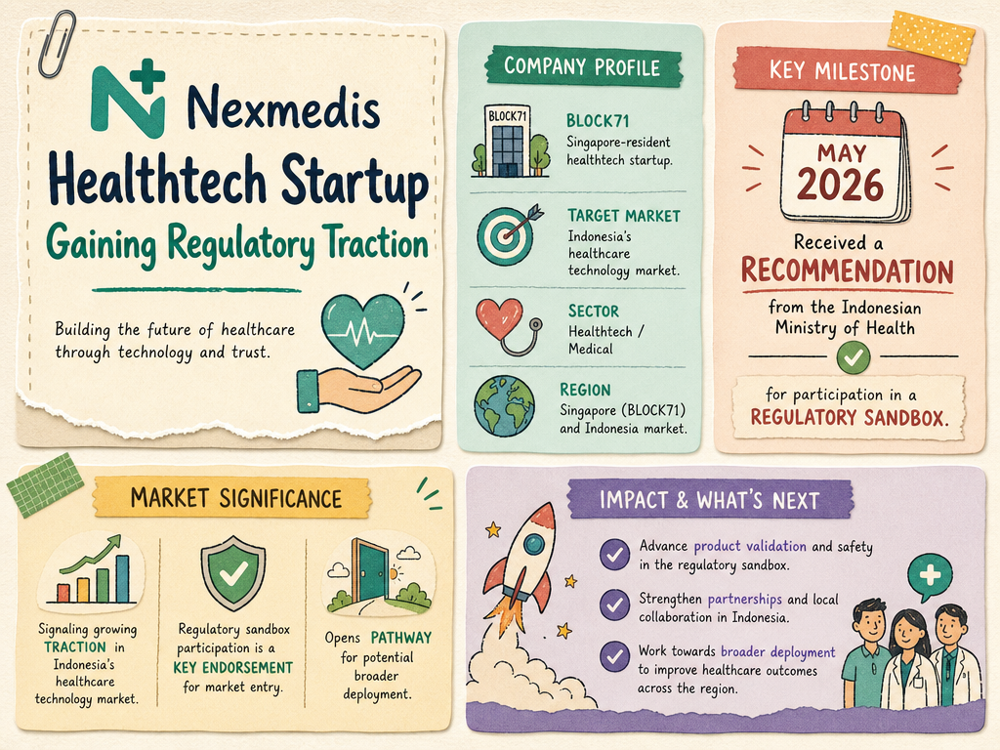

# Nexmedis — LIVING BRIEF
_Last updated: 2026-05-30 14:39 UTC_

## Thesis
BLOCK71 Singapore-resident healthtech startup. Received a recommendation from the Indonesian Ministry of Health for participation in a regulatory sandbox, signaling growing traction in Indonesia's healthcare technology market.

## Profile
- Sector: Healthtech / Medical
- Region: Singapore (BLOCK71); Indonesia market

## Recent signals
- **2026-05-30** — Nexmedis was recommended by the Indonesian Ministry of Health for participation in a regulatory sandbox, a milestone indicating regulatory endorsement and potential market access in Indonesia — [LinkedIn](https://www.linkedin.com/posts/nexmedis_nexmedis-kemenkesri-regulatorysandbox-activity-7427169534551379968-MR8X)

## Older signals
_none_

## Open questions
- What specific product or service does Nexmedis offer in the healthtech space?
- What is the scope and timeline of the Indonesian Ministry of Health regulatory sandbox?
