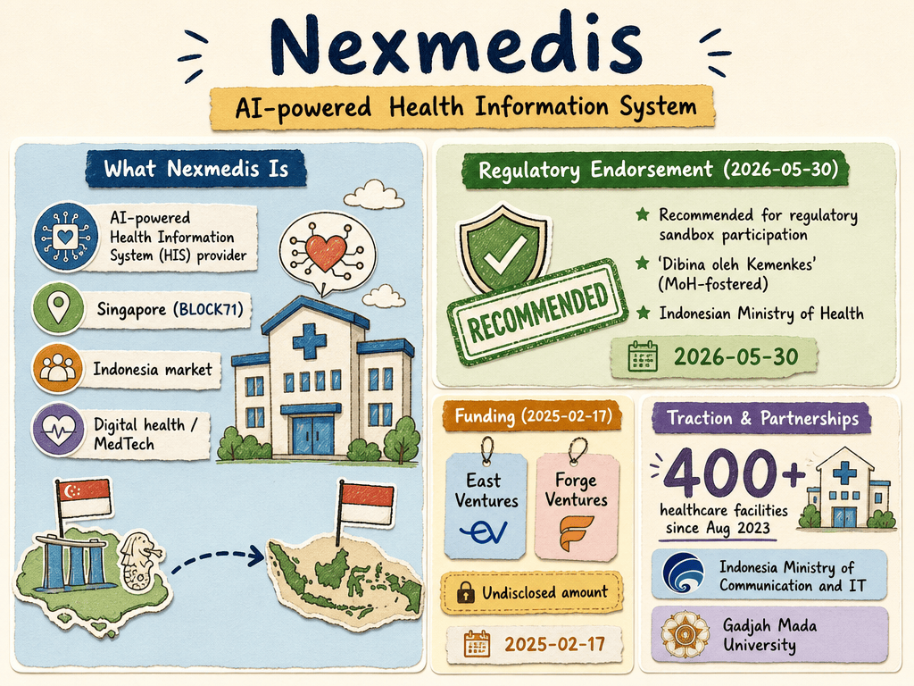

# Nexmedis — LIVING BRIEF
_Last updated: 2026-09-06 16:05 UTC_

## Thesis
BLOCK71 Singapore-resident healthtech startup. Received a recommendation from the Indonesian Ministry of Health for participation in a regulatory sandbox, signaling growing traction in Indonesia's healthcare technology market.

## Profile
- Sector: Digital health / MedTech
- Region: Singapore (BLOCK71); Indonesia market

## Funding history
_No disclosed funding._

## Recent signals
_none_

## Older signals
- **2026-05-30** — Nexmedis was recommended by the Indonesian Ministry of Health for participation in a regulatory sandbox, a milestone indicating regulatory endorsement and potential market access in Indonesia — [LinkedIn](https://www.linkedin.com/posts/nexmedis_nexmedis-kemenkesri-regulatorysandbox-activity-7427169534551379968-MR8X)
- **2025-02-17** — Nexmedis, an AI-powered Health Information System (HIS) provider, secured undisclosed funding co-led by East Ventures and Forge Ventures; served 400+ healthcare facilities since Aug 2023, with partnerships including Indonesia Ministry of Communication and IT and Gadjah Mada University; held 'Dibina oleh Kemenkes' (MoH-fostered) status in Indonesia's Ministry of Health Regulatory Sandbox — [east.vc](https://east.vc/news/press-release/nexmedis-ai-powered-health-information-system-secures-funding-co-led-east-ventures)

## Open questions
_none open_
