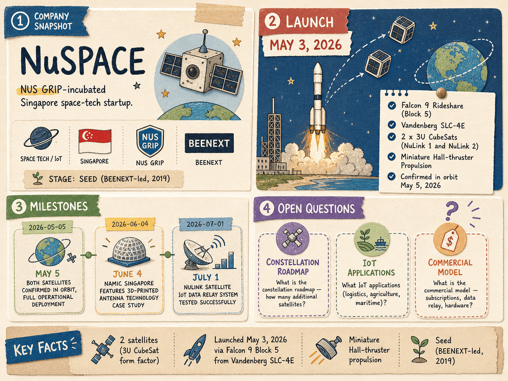

# NuSPACE — LIVING BRIEF
_Last updated: 2026-07-16 15:06 UTC_

## Thesis
NuSPACE is a Singapore-based space-tech startup incubated under NUS GRIP, building an IoT communications constellation with its NuLink CubeSat satellites. The company successfully launched its first two satellites (NuLink 1 and 2) on a Falcon 9 rideshare in May 2026, marking its transition from development to orbital operations.

## Profile
- Sector: Space tech / IoT
- Region: Singapore
- Stage / funding: Seed (BEENEXT-led, 2019)

## Funding history
- **2019-10** — Seed, undisclosed — BEENEXT — [e27.co](https://e27.co/space-tech-company-nuspace-raises-funding-to-bring-iot-connectivity-to-remote-places-20191003/)

## Recent signals
- **2026-07-01** — NuLink Satellite IoT Data Relay System Tested Successfully — [linkedin.com](https://www.linkedin.com/posts/nuspace-pte-ltd_nuspace-nulink-satelliteiot-activity-7477934037354049536--klh)
- **2026-06-04** — NAMIC Singapore features NuSpace's 3D-printed antenna technology as a case study in Singapore's space manufacturing capability — [LinkedIn (NAMIC Singapore)](https://www.linkedin.com/posts/namicsg_from-lab-to-orbit-how-singapores-3d-printed-activity-7468119340383535104-awhn)
- **2026-05-05** — NuSpace announced on LinkedIn that both NuLink-1 and NuLink-2 satellites are now in orbit, confirming full operational deployment of its first commercial satellite network following the May 3 Falcon 9 launch — [LinkedIn](https://sg.linkedin.com/company/nuspace-pte-ltd)
- **2026-05-03** — NuSpace's first two satellites (NuLink 1 and 2) launched on Falcon 9 rideshare, forming the initial segment of its IoT communications constellation — [Gunter's Space Page](https://space.skyrocket.de/doc_sdat/nulink-1.htm)
  - Summary: NuSpace successfully launched its first two satellites, NuLink 1 and NuLink 2 (3U CubeSats), on a Falcon 9 rideshare mission from Vandenberg Space Force Base on May 3, 2026. The satellites carry miniature Hall-thruster propulsion and form the initial segment of NuSpace's planned IoT communications constellation.
  - Numbers: 2 satellites (3U CubeSat form factor); launched May 3, 2026 via Falcon 9 Block 5 from Vandenberg SLC-4E
- **2026-05-03** — NuLink satellite launched by NuSpace, per company's LinkedIn announcement — [LinkedIn (NuSpace)](https://www.linkedin.com/posts/activity-7455434618704662530-RKvI)

## Older signals
_none_

## Open questions
- What is NuSpace's constellation roadmap — how many additional satellites are planned?
- What IoT applications (logistics, agriculture, maritime) is NuSpace targeting for its connectivity service?
- What is NuSpace's commercial model — satellite connectivity subscriptions, data relay services, or hardware sales?
