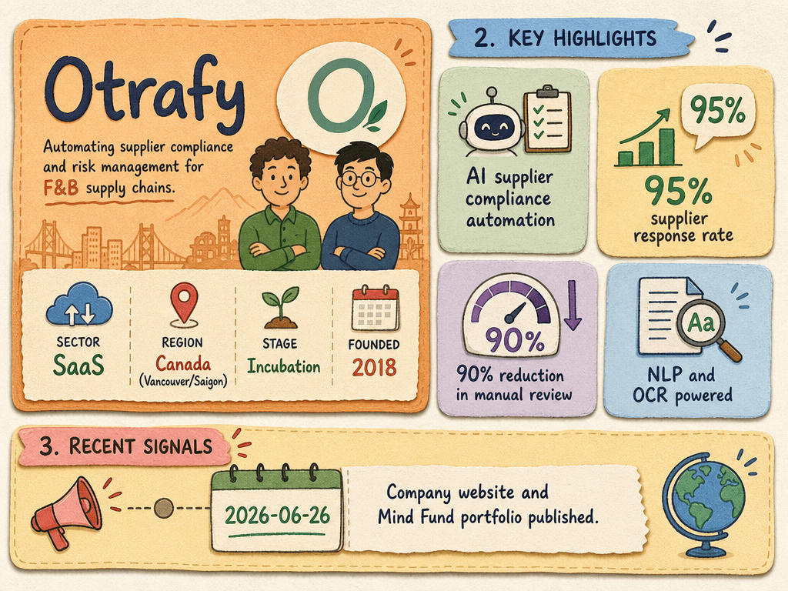

# Otrafy — LIVING BRIEF
_Last updated: 2026-06-26 15:36 UTC_

## Thesis
Otrafy is a Vancouver/Saigon-based enterprise-SaaS startup (founded 2018 by Lucas Cunha and Nhat Nguyen) automating supplier data collection, regulatory compliance, and risk management for F&B supply chains using NLP and OCR. Its platform achieves up to 95% supplier response rates for Fortune 500 clients and monitors compliance against FDA, EU MRLs, Prop 65, and PFAS regulations.

## Profile
- Sector: SaaS
- Region: Canada
- Founded: 2018
- Stage / funding: Incubation

## Recent signals
- **2026-06-26** — Otrafy — Smart Supplier Management platform — [otrafy.com](https://www.otrafy.com)
  - Summary: AI platform automates supplier collaboration, regulatory compliance (FDA, EU MRLs, Prop 65, PFAS), and risk management. 95% supplier response rates for Fortune 500 clients. 90% reduction in manual review.
- **2026-06-26** — Otrafy — Mind Fund portfolio — [mindfund.com](https://www.mindfund.com/portfolio/otrafy)

## Older signals
  _none_

## Open questions
- Is Otrafy generating revenue, and at what scale?
