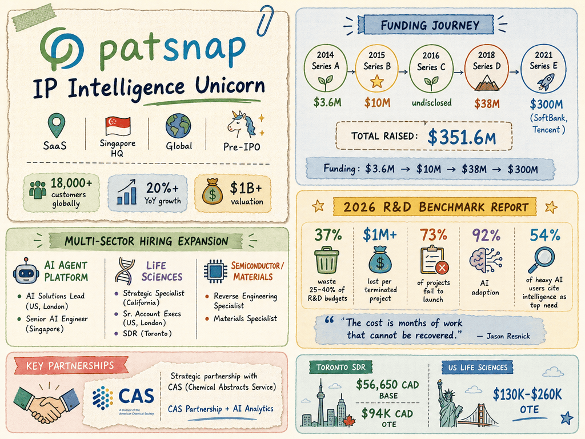

# Patsnap — LIVING BRIEF
_Last updated: 2026-06-12 16:12 UTC_

## Thesis
Patsnap is a Singapore-headquartered IP intelligence and innovation analytics SaaS company that helps organizations manage patents, trademarks, and R&D intelligence. The company is in an active growth phase, hiring across its AI Agent Platform (product growth, product marketing, engineering), life sciences vertical (account executives, support, SDRs, marketing interns), and semiconductor/material verticals — suggesting a multi-sector SaaS expansion beyond its core IP analytics base.

## Profile
- Sector: SaaS
- Region: Singapore (global operations)
- Identifiers: [LinkedIn](https://www.linkedin.com/company/patsnap), [Crunchbase](https://www.crunchbase.com/organization/patsnap)

## Funding history
- **2014** — Series A, $3.6M — Vertex Ventures — [e27.co](https://e27.co/patsnap-raises-us3-6m-funding-led-by-vertex-venture-holdings-20140901/)
- **2015-10-20** — Series B, $10M — Summit Partners; Vertex Ventures — [summitpartners.com](https://www.summitpartners.com/news/patsnap-secures-10-million-in-growth-financing-from-summit-partners)
- **2016-11-21** — Series C, undisclosed — Sequoia Capital China; Shunwei Capital, Qualgro — [prnewswire.com](https://www.prnewswire.com/news-releases/innovation-intelligence-platform-patsnap-closes-series-c-funding-led-by-sequoia-capital-china-300366521.html)
- **2018-06-14** — Series D, $38M — Sequoia Capital China, Shunwei Capital; Qualgro — [techcrunch.com](https://techcrunch.com/2018/06/14/patsnap-picks-up-38m/)
- **2021-03-16** — Series E, $300M — SoftBank Vision Fund 2, Tencent; Sequoia Capital China, CICC Capital, Vertex Growth — [tech.eu](https://tech.eu/2021/03/16/singapore-london-based-patsnap-snaps-up-300-million-in-series-e-funding/)

_Total disclosed: $351.6M._

## Recent signals
- **2026-06-12** — Hiring an AI Solutions Lead for IP Legal/Patent Drafting (US remote, East Coast preferred), mirroring the London-based role posted June 11 — [Patsnap · careers](https://jobs.lever.co/patsnap/ef9106c4-4b87-4158-9b68-eeca47e00926)
  - Summary: Patsnap is hiring an AI Solutions Lead for a US-based remote role (East Coast preferred) that bridges patent practitioner expertise with AI product strategy. The hire will act as a trusted advisor to IP professionals, support product development for AI-powered patent drafting, and work across Sales, Product, and Engineering teams. The role requires hands-on patent drafting experience, preferably as a European Patent Attorney or Patent Agent.
  - People: European Patent Attorney / Patent Agent (preferred)
  - Numbers: $300M Series E; $1B unicorn valuation; 12,000+ customers
  - Quote: "We're looking for someone with hands-on patent drafting experience who is interested in applying that expertise in a broader capacity." — Patsnap job posting
- **2026-06-11** — Hiring an AI Solutions Lead for IP Legal in London, blending patent attorney expertise with AI product strategy — [Patsnap · careers](https://jobs.lever.co/patsnap/e4e5de86-5693-4f8d-8dee-d8c595d35a3c)
  - Summary: Patsnap is hiring an AI Solutions Lead (IP Legal) for a London-based remote role. The position bridges patent practitioner expertise with AI product strategy: the hire will act as a trusted advisor to IP professionals, support product development for AI-powered patent drafting, and work across Sales, Product, and Engineering teams. The role requires hands-on patent drafting experience, preferably as a European Patent Attorney or Patent Agent.
  - People: European Patent Attorney / Patent Agent (preferred)
- **2026-06-04** — Publishes 2026 R&D Benchmark Report (patsnap.com direct press release) — [patsnap.com](https://www.patsnap.com/resources/blog/press_release/patsnap-releases-2026-rd-benchmark-report-revealing-the-intelligence-gap-costing-innovation-teams-millions)
  - Summary: Corroborates the June 4, 2026 R&D Benchmark Report announcement; no new facts.
- **2026-06-10** — Hiring a Senior AI Engineer to build company-wide AI knowledge infrastructure and RAG pipelines, signaling an internal AI transformation push — [Patsnap · careers](https://jobs.lever.co/patsnap/d338cfc9-9991-4bd0-a6d4-c7371b75ce62)
  - Summary: Patsnap is hiring a Senior AI Engineer for its AI Growth team in Singapore to design and build the company-wide AI knowledge infrastructure, including internal wiki, knowledge base, retrieval layer, and context management system. The role requires 4-7 years of backend engineering experience with at least 2 years of hands-on LLM application development, experience with RAG and vector databases (Pinecone, Weaviate, Chroma), and Mandarin fluency. The hire will own end-to-end technical delivery of internal AI tools and work with business, brand, PR, IR, and leadership stakeholders.
  - Numbers: 4-7 years backend experience; 2+ years LLM application experience
  - Quote: "Design and build the company-wide AI knowledge infrastructure, including company wiki, internal knowledge base, retrieval layer, and context management system." — Patsnap job posting
- **2026-06-05** — Patsnap hiring a Strategic Life Sciences Data & AI Expansion Specialist (remote, California) for DaaS account expansion, reinforcing Life Sciences vertical push — [Patsnap · careers](https://jobs.lever.co/patsnap/0e0f5286-41c2-4292-90f8-41768fb50de4)
  - Summary: Patsnap is hiring a Strategic Life Sciences Data & AI Expansion Specialist for a remote California-based role focused on expanding Data-as-a-Service (DaaS) opportunities within existing Life Sciences accounts across North America. The role acts as a subject-matter expert overlay supporting multiple Account Executives, targeting senior R&D, BD&L, Competitive Intelligence, and Innovation stakeholders in pharmaceutical, biotech, and medical device organizations.
  - Numbers: $130K–$260K OTE (50/50 base + uncapped commission); 12,000+ customers; Life Sciences business growing 20%+ YoY; pre-IPO unicorn at $1B+ valuation
  - Quote: "We are seeking a highly commercial, customer-facing Strategic Life Sciences Data & AI Expansion Specialist to drive growth across our existing Life Sciences customer base and support high-value strategic opportunities throughout North America." — Patsnap job posting
- **2026-06-05** — Patsnap hiring Senior Account Executive in San Antonio (Texas) for Connected Innovation Solutions, extending its North American sales coverage to the US South/West — [Patsnap · careers](https://jobs.lever.co/patsnap/a144a6aa-3e18-43dd-8add-9531ae569745)
  - Summary: Patsnap is hiring a remote, hunter-focused Senior Account Executive in San Antonio, Texas for net-new logo acquisition in its Connected Innovation Solutions vertical. The job posting describes Patsnap as a pre-IPO unicorn ($1B+ valuation) with 18,000+ customers globally, 20%+ YoY growth, and 82% growth in enterprise deals. The role covers the Americas and West Coast.
  - Numbers: 18,000+ customers globally; 20%+ YoY growth; 82% growth in enterprise deals; $1B+ valuation; $300M Series E
- **2026-06-04** — PatSnap publishes 2026 R&D Benchmark Report revealing structural R&D waste and an "intelligence gap" even among heavy AI adopters, alongside an interactive benchmark calculator — [EZ Newswire](https://www.voiceofalexandria.com/news/national_business_news/patsnap-releases-2026-r-d-benchmark-report-revealing-the-intelligence-gap-costing-innovation-teams-millions/article_372459cd-b728-50f6-9334-71485d94f73a.html)
  - Summary: PatSnap commissioned a survey of 200+ senior R&D leaders across North America, UK, and Europe (all with $50M+ annual R&D budgets). Key findings: 37% of organizations waste 25-40% of R&D budgets on projects that never reach market; 45% estimate $1M+ lost per terminated project; 73% report half or fewer of initiated projects ultimately launch. 92% use AI in R&D, but 54% of heavy AI users say better intelligence access would have the greatest impact on R&D success.
  - People: Jason Resnick (General Manager, PatSnap West)
  - Numbers: 37% waste 25-40% of R&D budget; $1M+ per terminated project; 73% of projects fail to launch; 92% AI adoption rate; 54% of heavy AI users cite intelligence as top need
  - Quote: "In R&D, the cost of acting on incomplete intelligence is not a delayed report. It is months of work that cannot be recovered." — Jason Resnick, General Manager, PatSnap West
- **2026-06-02** — Hiring a Senior Account Executive (Life Sciences) for a remote US-based role covering EST hours, continuing its North America commercial build-out — [Patsnap · careers](https://jobs.lever.co/patsnap/6886b6d9-1aaa-40a0-9df3-08b0993a6abc)
  - Summary: Patsnap is hiring a Senior Account Executive for the US market to lead strategic, consultative sales cycles with pharmaceutical, biotech, and medical device organizations. The Life Sciences vertical is described as growing 20%+ YoY and one of Patsnap's most strategic and fastest-growing verticals. The role involves building and executing territory plans, managing complex multi-threaded opportunities, and engaging stakeholders across R&D, Innovation, IP, and Commercial functions.
  - Numbers: Life Sciences business growing 20%+ YoY
- **2026-06-02** — Hiring a Senior Account Executive (Life Sciences) for a London hybrid role (Farringdon, 3 days/week), mirroring the US posting — [Patsnap · careers](https://jobs.lever.co/patsnap/dae69aa3-82bc-4804-b301-5f86bf2caa98)
  - Summary: Corroborates the June 2 Life Sciences AE posting; London-based version of the same role. No new facts beyond the location difference.
- **2026-05-28** — Hiring Sales Development Representative in Toronto with disclosed pre-IPO positioning and compensation structure — [Patsnap · careers](https://jobs.lever.co/patsnap/6d72034b-6765-4036-9b66-115e012e10c3)
  - Summary: Patsnap is hiring an SDR in Toronto, Canada for outbound lead generation and qualification, with a $56,650 CAD base salary and ~$94,166 CAD on-target earnings including uncapped commission. The job posting describes Patsnap as a "pre-IPO company" with 12,000+ R&D and IP team customers globally and offices in Toronto, London, Shanghai, and Singapore.
  - Numbers: Base $56,650 CAD/year; OTE ~$94,166 CAD/year; 12,000+ R&D and IP customers globally; 5 weeks paid vacation
  - Quote: "You will be the first point of contact for prospective customers, introducing them to Patsnap's innovation intelligence platform... identify, engage, and qualify prospects, building meaningful early-stage relationships that convert into long-term customers." — Patsnap job posting
- **2026-05-27** — Hiring Semiconductor Reverse Engineering Specialist / AI Domain Expert for Material vertical — [Patsnap · careers](https://jobs.lever.co/patsnap/5edb10a2-12ff-44db-b1c8-9488e8e8c361)
- **2026-05-27** — Hiring Semiconductor Materials Specialist for Material vertical — [Patsnap · careers](https://jobs.lever.co/patsnap/e61a7dab-2174-4b1f-a9f3-8537e3f4ba76)
- **2026-05-15** — New Account Executive posting for Connected Innovation Solutions Sales — [Patsnap · careers](https://jobs.lever.co/patsnap/20d8ae88-d16c-4c80-aeb1-d68daa6fbfdf)
- **2026-05-15** — Patsnap publishes thought leadership on companion animal biotech innovation and patents — [patsnap.com](https://www.patsnap.com/resources/blog/the-man-who-refused-to-let-his-dog-die/)
- **2026-05-15** — Patsnap publishes analysis on China as the next GLP-1 drug development frontier — [patsnap.com](https://www.patsnap.com/resources/blog/when-obesity-isnt-the-driver-why-china-signals-the-next-glp-1-frontier/)
- **2026-05-13** — Strategic partnership with CAS (Chemical Abstracts Service) to combine CAS's scientific content database with Patsnap's AI-powered innovation analytics platform — [Devdiscourse](https://www.devdiscourse.com/article/agency-wire/930997-cas-and-patsnap-forge-strategic-partnership-that-unites-market-leading-scientific-content-and-ai-powered-technology-to-accelerate-global-innovation)
- **2026-05-12** — Hiring Lead / Staff Engineer for AI Agent Platform (Search & Algorithm) — [Patsnap](https://jobs.lever.co/patsnap/3b8e49d4-dc8b-485e-9b46-415b155969e3)
- **2026-05-12** — Hiring Account Executive for Life Sciences Sales — [Patsnap](https://jobs.lever.co/patsnap/91674214-6d6c-41c2-b743-f40327fe134c)
- **2026-05-12** — Hiring Product Support Specialist (Life Sciences) — [Patsnap](https://jobs.lever.co/patsnap/e990d3dc-4298-487b-9a1e-ef33db46a22f)
- **2026-05-12** — Hiring Account Executive for Connected Innovation Solutions Sales — [Patsnap](https://jobs.lever.co/patsnap/9caa0b0b-8e39-400c-9fa2-0a9ae1728373)

## Older signals
- **2026-05-12** — Hiring Full Stack Intern (AI & Web Development, Material vertical) — [Patsnap](https://jobs.lever.co/patsnap/968e70fb-dd6b-4756-8d4d-ec2a7e482207)
- **2026-05-12** — Hiring Product Growth Manager for AI Agent Platform (IP Checking) — [Patsnap](https://jobs.lever.co/patsnap/5d9d748a-f9ce-40fd-aa3b-dde76007b0e6)
- **2026-05-12** — Hiring Sales Development Representative (Life Science Graduates) — [Patsnap](https://jobs.lever.co/patsnap/9a625f6f-9b2e-441e-9a69-5d5c46bf324e)
- **2026-05-12** — Hiring Community Operations Intern (R&D / PLG Product) — [Patsnap](https://jobs.lever.co/patsnap/3cc3a98b-de49-46ea-8694-6363f95af64f)
- **2026-05-12** — Hiring Industry Product Specialist (Semiconductor Packaging Technology) — [Patsnap](https://jobs.lever.co/patsnap/905f8dd4-c47e-4d73-b7d5-55e3cf740d8c)
- **2026-05-12** — Hiring Industry Product Specialist (Semiconductor) — [Patsnap](https://jobs.lever.co/patsnap/9dab3451-8d4a-4d59-89a9-8e90c916131a)
- **2026-05-12** — Hiring Product Marketing Manager for AI Agent Platform GTM — [Patsnap](https://jobs.lever.co/patsnap/b85aa927-6566-4d67-8d6c-b2c27776edf2)
- **2026-05-12** — Hiring Life Science Growth Marketing Intern — [Patsnap](https://jobs.lever.co/patsnap/06fa8277-13bf-4dd5-bd0b-e1198ba4f8f0)
- **2026-05-12** — Hiring Senior Digital Marketing Manager — [Patsnap](https://jobs.lever.co/patsnap/ba7981cc-46a3-4014-933f-800793cc4b59)

## Open questions
- Is the AI Agent Platform a new product line or an evolution of existing IP analytics? How does it differ from the core Patsnap offering?
- Is the life sciences hiring push related to a specific product launch or market expansion in pharma R&D?
- What is the commercial structure of the CAS-Patsnap partnership — is CAS data being integrated into Patsnap's platform, resold as a standalone dataset, or something else?
- Does the CAS partnership signal a strategic expansion beyond patent/IP analytics into the broader scientific and R&D content analytics market?
- Does the Toronto SDR hire and "pre-IPO" self-description indicate a North America go-to-market push and a concrete IPO timeline?
- What is the "Connected Innovation Solutions" vertical and how does it relate to Patsnap's core IP analytics and life sciences verticals?
