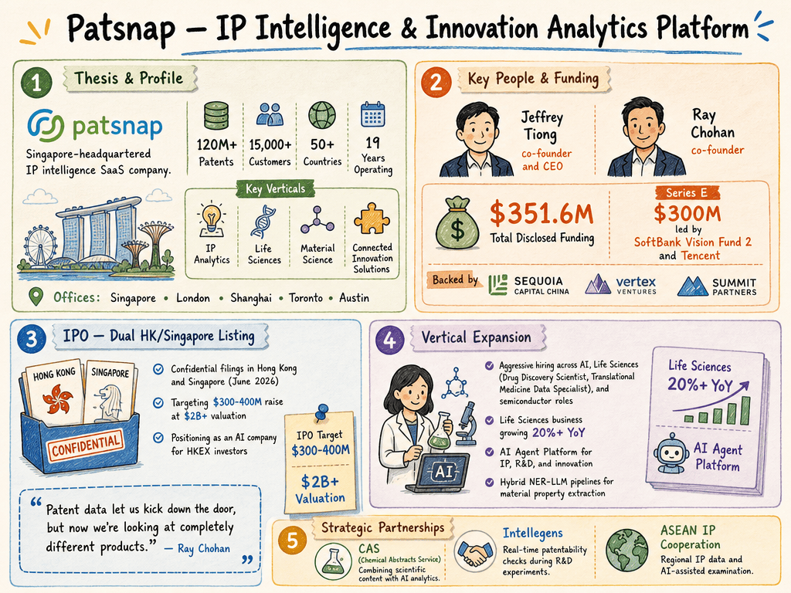

# Patsnap — LIVING BRIEF
_Last updated: 2026-08-01 14:37 UTC_

## Thesis
Patsnap is a Singapore-headquartered IP intelligence and innovation analytics SaaS company that has confidentially filed for a dual listing in Hong Kong and Singapore, signaling its IPO readiness. The company is pursuing a multi-sector SaaS expansion beyond its core IP analytics base into life sciences and material science verticals, supported by aggressive hiring across AI product, life sciences, and semiconductor roles, and by domain-specific AI agents to embed its platform into customer workflows.

_Last material event: 2026-06-15 — Confidential dual IPO filing in Hong Kong and Singapore_

## Profile
- Sector: SaaS
- Region: Singapore (global operations)
- Identifiers: [LinkedIn](https://www.linkedin.com/company/patsnap), [Crunchbase](https://www.crunchbase.com/organization/patsnap)

## Funding history
- **2014** — Series A, $3.6M — Vertex Ventures — [e27.co](https://e27.co/patsnap-raises-us3-6m-funding-led-by-vertex-venture-holdings-20140901/)
- **2015-10-20** — Series B, $10M — Summit Partners; Vertex Ventures — [summitpartners.com](https://www.summitpartners.com/news/patsnap-secures-10-million-in-growth-financing-from-summit-partners)
- **2016-11-21** — Series C, undisclosed — Sequoia Capital China; Shunwei Capital, Qualgro — [prnewswire.com](https://www.prnewswire.com/news-releases/innovation-intelligence-platform-patsnap-closes-series-c-funding-led-by-sequoia-capital-china-300366521.html)
- **2018-06-14** — Series D, $38M — Sequoia Capital China, Shunwei Capital; Qualgro — [techcrunch.com](https://techcrunch.com/2018/06/14/patsnap-picks-up-38m/)
- **2021-03-16** — Series E, $300M — SoftBank Vision Fund 2, Tencent; Sequoia Capital China, CICC Capital, Vertex Growth — [tech.eu](https://tech.eu/2021/03/16/singapore-london-based-patsnap-snaps-up-300-million-in-series-e-funding/)

_Total disclosed: $351.6M._

## Recent signals
- **2026-07-13** — Patsnap Joins ASEAN IP Cooperation to Support Trusted Regional IP Data and AI-Assisted Examination — [patsnap.com](https://www.patsnap.com/resources/blog/patsnap-joins-asean-ip-cooperation-to-support-trusted-regional-ip-data-and-ai-assisted-examination/)

### Hiring
- **2026-08-01** — 50+ roles posted since May 2026 across Life Sciences, Material, and AI verticals plus account-management/sales roles in Singapore, Toronto, London, Shanghai, and North America; newest wave (Aug 1) adds Lead Engineer AI Agent Systems, Senior Applied Scientist LLMs, and Senior Engineering Manager roles in the Data & Technology org, signaling continued multi-vertical build-out ahead of dual HK/SG IPO — [jobs.lever.co](https://jobs.lever.co/patsnap)
- **2026-06-27** — Forward Deployed Engineer for Japan (Japanese required), configuring AI Agent workflows for IP, R&D, and innovation enterprise customers — [jobs.lever.co](https://jobs.lever.co/patsnap/e80dcb4a-0644-4883-95f3-8e6a0c01e846)
  - Summary: Patsnap is hiring a Forward Deployed Engineer (FDE) to work directly with enterprise customers in Japan, configuring and deploying AI Agent workflows across IP, R&D, innovation, and strategic intelligence use cases. Business-level Japanese is required, reflecting a dedicated customer-facing presence for the Japan market.
  - People: Forward Deployed Engineer (Japanese-speaking)
  - Counterparties: Enterprise customers in Japan (IP, R&D, innovation teams)
- **2026-06-15** — Life Science Scientist (PhD, Singapore, on-site) to build AI-native life sciences products, transitioning Patsnap from traditional SaaS into an intelligent ecosystem powered by MCPs, Skills, and Agents — [jobs.lever.co](https://jobs.lever.co/patsnap/d8ed208f-0d67-4c4f-be6b-14f10fe0f645)
  - Summary: Patsnap is hiring a PhD-level Life Science Scientist for its LS department in Singapore to translate complex life sciences problems into AI-native products, turning data assets (clinical trials, sequences, targets, deals, patents) into MCPs, Skills, and Agents.
  - Quote: "We are building the next generation of AI Native products for life sciences, moving Patsnap beyond a traditional SaaS platform into an intelligent product ecosystem powered by MCPs, Skills, and Agents." — Patsnap job posting
- **2026-07-29** — Head of Legal — Legal — [jobs.lever.co](https://jobs.lever.co/patsnap/6e3c63ca-2745-495c-9455-dab5f8fc58ae)

## Older signals
- **2026-06-24** — Patsnap and Intellegens announce strategic partnership integrating Patsnap's global patent dataset with Intellegens' Alchemite Suite for AI-driven formulation design, enabling real-time patentability and freedom-to-operate checks during R&D experiments — [intellegens.com](https://intellegens.com/patsnap-and-intellegens-announce-strategic-partnership-bringing-real-time-ip-intelligence-into-ai-driven-formulation-design/)
  - Summary: Patsnap integrates its global patent dataset with Intellegens' Alchemite Suite, an AI-driven formulation design platform. R&D teams gain access to patentability and freedom-to-operate checks during experimental design, bridging the gap between IP intelligence and materials R&D workflows.
  - Counterparties: Intellegens (Strategic Partner)
- **2026-06-15** — PatSnap targeting $300-400M at $2B+ valuation for dual HK/Singapore IPO, positioning as an AI play for HKEX investors — [Asia Tech Review](https://www.asiatechreview.com/p/patsnap-ipo-could-lead-southeast) (Also reported by: [techinasia.com](https://www.techinasia.com/news/patsnap-files-confidentially-dual-ipos), [startupfortune.com](https://startupfortune.com/patsnaps-dual-ipo-filing-sets-hong-kong-and-singapore-against-each-other))
  - Summary: Asia Tech Review reports that PatSnap is targeting to raise $300-400M at a valuation of over $2 billion for its dual HK/Singapore IPO, positioning as an AI company for Hong Kong investors. The 19-year-old company operates a database of 120M+ patents with over 15,000 customers.
  - People: Ray Chohan (co-founder)
  - Counterparties: HongShan (backer), SoftBank (backer), Tencent (backer)
  - Numbers: $300-400M raise target; $2B+ valuation; 120M+ patents; 15,000+ customers; ~$400M capital raised to date; 19 years in operation
  - Quote: "Patent data let us kick down the door and earn respect, but now we're looking at completely different products." — Ray Chohan, co-founder
- **2026-06-15** — Patsnap has confidentially filed for a dual IPO in Hong Kong and Singapore, according to sources familiar with the matter, marking a major milestone for the Singapore-based patent intelligence unicorn — [Bloomberg](https://www.bloomberg.com/news/articles/2026-06-15/patsnap-said-to-confidentially-file-for-hk-singapore-dual-ipo)
- **2026-06-08** — The Business Times profiles Patsnap's GenAI strategy and customer-led growth, with CEO Jeffrey Tiong recounting his initial anxiety about GenAI displacing the platform and how the company instead embraced AI to embed deeper into customer workflows — [The Business Times](https://www.businesstimes.com.sg/startups-tech/technology/unicorn-patent-intelligence-platform-patsnap-harnesses-genai-and-customer-needs-growth)
  - Summary: The Business Times published a profile on PatSnap's GenAI adoption and growth strategy. CEO Jeffrey Tiong acknowledged initial anxiety about GenAI potentially enabling a competitor to displace PatSnap's patent intelligence platform, but the company embraced AI to strengthen its offering. PatSnap has expanded across 50 countries with key R&D centres in Shanghai and London.
  - People: Jeffrey Tiong (co-founder and CEO)
  - Numbers: 50+ countries; 20,000+ enterprises, law firms, and research institutions; one-third of world's largest R&D spenders
  - Quote: "PatSnap's patent intelligence platform helps companies to avoid infringing existing patents with their new products while being able to see the direction in which competitors are developing their patents." — The Business Times
- **2026-06-04** — PatSnap publishes 2026 R&D Benchmark Report revealing structural R&D waste and an "intelligence gap" even among heavy AI adopters, alongside an interactive benchmark calculator — [Voice of Alexandria](https://www.voiceofalexandria.com/news/national_business_news/patsnap-releases-2026-r-d-benchmark-report-revealing-the-intelligence-gap-costing-innovation-teams-millions/article_372459cd-b728-50f6-9334-71485d94f73a.html) (Also reported by: [EZ Newswire](https://www.eznewswire.com/newsroom/patsnap-2026-rd-benchmark-report-intelligence-gap), [patsnap.com](https://www.patsnap.com/resources/blog/press_release/patsnap-releases-2026-rd-benchmark-report-revealing-the-intelligence-gap-costing-innovation-teams-millions))
  - Summary: PatSnap commissioned a survey of 200+ senior R&D leaders across North America, UK, and Europe (all with $50M+ annual R&D budgets). Key findings: 37% of organizations waste 25-40% of R&D budgets on projects that never reach market; 45% estimate $1M+ lost per terminated project; 73% report half or fewer of initiated projects ultimately launch. 92% use AI in R&D, but 54% of heavy AI users say better intelligence access would have the greatest impact on R&D success.
  - People: Jason Resnick (General Manager, PatSnap West)
  - Numbers: 37% waste 25-40% of R&D budget; $1M+ per terminated project; 73% of projects fail to launch; 92% AI adoption rate; 54% of heavy AI users cite intelligence as top need
  - Quote: "In R&D, the cost of acting on incomplete intelligence is not a delayed report. It is months of work that cannot be recovered." — Jason Resnick, General Manager, PatSnap West
- **2026-05-15** — Patsnap publishes thought leadership on companion animal biotech innovation and patents — [patsnap.com](https://www.patsnap.com/resources/blog/the-man-who-refused-to-let-his-dog-die/)
- **2026-05-15** — Patsnap publishes analysis on China as the next GLP-1 drug development frontier — [patsnap.com](https://www.patsnap.com/resources/blog/when-obesity-isnt-the-driver-why-china-signals-the-next-glp-1-frontier/)
- **2026-05-13** — Strategic partnership with CAS (Chemical Abstracts Service) to combine CAS's scientific content database with Patsnap's AI-powered innovation analytics platform — [Devdiscourse](https://www.devdiscourse.com/article/agency-wire/930997-cas-and-patsnap-forge-strategic-partnership-that-unites-market-leading-scientific-content-and-ai-powered-technology-to-accelerate-global-innovation)

## Open questions
- What is the expected valuation and timeline for the dual HK/Singapore IPO? Which exchange will be the primary listing?
- Is the AI Agent Platform a new product line or an evolution of existing IP analytics? How does it differ from the core Patsnap offering?
- Is the life sciences hiring push related to a specific product launch or market expansion in pharma R&D?
- What is the commercial structure of the CAS-Patsnap partnership — is CAS data being integrated into Patsnap's platform, resold as a standalone dataset, or something else?
