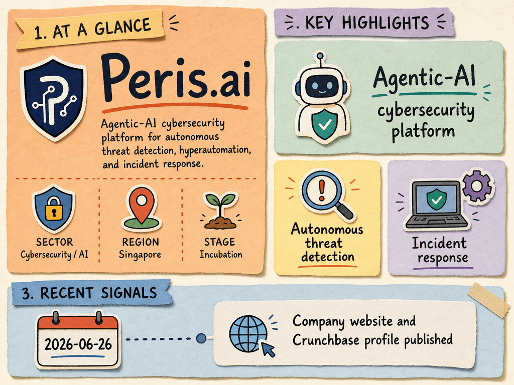

# Peris.ai — LIVING BRIEF
_Last updated: 2026-06-26 15:36 UTC_

## Thesis
Peris.ai is a Singapore-based cybersecurity-AI startup (BLOCK71-resident) building an Agentic-AI cybersecurity platform for autonomous threat detection, hyperautomation, and incident response across the attack surface.

## Profile
- Sector: Cybersecurity / AI
- Region: Singapore
- Stage / funding: Incubation

## Recent signals
- **2026-06-26** — Peris.ai — Agentic-AI Cybersecurity Platform — [peris.ai](https://www.peris.ai)
  - Summary: Peris.ai is an Agentic-AI cybersecurity platform for autonomous threat detection, hyperautomation, and incident response.
- **2026-06-26** — Peris.ai — Crunchbase Company Profile — [crunchbase.com](https://www.crunchbase.com/organization/peris-ai)

## Older signals
  _none_

## Open questions
- What commercial traction or pilot deployments does Peris.ai have to date?
- Is Peris.ai generating revenue, and at what scale?
