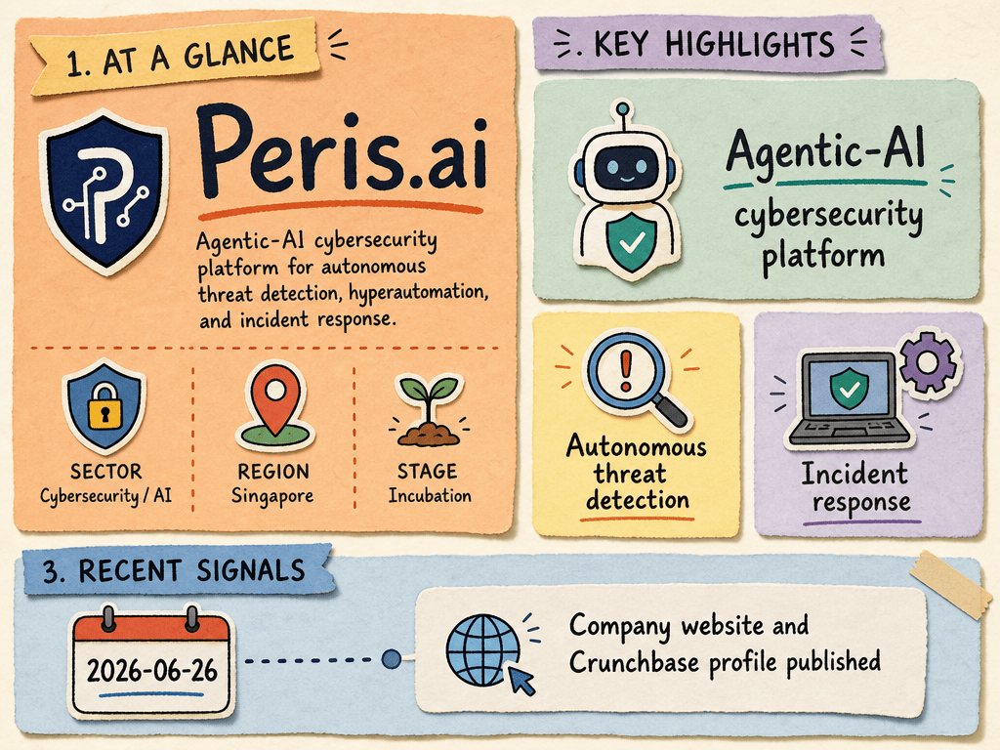

# Peris.ai — LIVING BRIEF
_Last updated: 2026-10-07 22:38 UTC_

## Thesis
Peris.ai is a Singapore-based cybersecurity-AI startup (BLOCK71-resident) building an Agentic-AI cybersecurity platform for autonomous threat detection, hyperautomation, and incident response across the attack surface.

_Last material event: none on record_

## Profile
- Sector: Cybersecurity / AI
- Region: Singapore
- Stage / funding: Incubation

## Funding history
_No disclosed funding._

## Recent signals
_none_

## Older signals
- **2026-08-26** — Peris.ai published its BrahmaFusion architecture, framing SIEM/XDR/SOAR/case management as one converged agentic-AI stack with 100+ integrations, and citing a finance-startup deployment claiming 40% SOC cost savings — [peris.ai](https://peris.ai/blog/siem-xdr-convergence-2026-legacy-siem-replacement)
  - Summary: In a company blog post, Peris.ai argues the passive SIEM log-store model is being retired in favour of a converged architecture where its BrahmaFusion agentic-AI platform ingests telemetry from 100+ integrations across endpoint, network, identity, cloud and threat intelligence, then correlates low-confidence signals into high-fidelity incidents instead of raw alerts. Its XDR layer performs behavioural rather than rule-based detection, and its IRP product provides unified case management for investigation and response. Peris.ai cites a finance startup using BrahmaFusion reporting 40% SOC cost savings and a finance-company CEO using IRP reporting a 35% reduction in analyst workload.
  - Numbers: 100+ integrations; 40% SOC cost savings (finance-startup customer); 35% analyst-workload reduction (finance-company CEO)
  - Quote: "The passive log store model of SIEM, where raw events accumulate in a database, static rules generate alerts, and analysts sort through them, was designed for a threat landscape that no longer exists." — Peris.ai
- **2026-06-26** — Peris.ai — Agentic-AI Cybersecurity Platform — [peris.ai](https://www.peris.ai)
  - Summary: Peris.ai is an Agentic-AI cybersecurity platform for autonomous threat detection, hyperautomation, and incident response.
- **2026-06-26** — Peris.ai — Crunchbase Company Profile — [crunchbase.com](https://www.crunchbase.com/organization/peris-ai)

## Open questions
- Is Peris.ai generating revenue, and at what scale?
