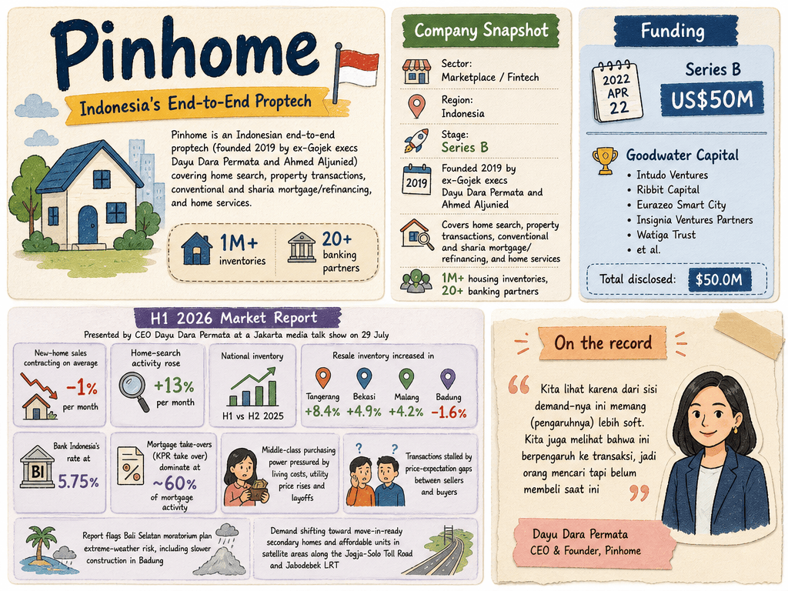

# Pinhome — LIVING BRIEF
_Last updated: 2026-08-24 14:04 UTC_

## Thesis
Pinhome is an Indonesian end-to-end proptech (founded 2019 by ex-Gojek execs Dayu Dara Permata and Ahmed Aljunied) covering home search, property transactions, conventional and sharia mortgage/refinancing, and home services. Backed by US$50M in Series B funding, it serves 1M+ housing inventories with 20+ banking partners.

_Last material event: 2022-04-22 — US$50M Series B led by Goodwater Capital_

## Profile
- Sector: Marketplace / Fintech
- Region: Indonesia
- Stage / funding: Series B

## Funding history
- **2022-04-22** — Series B, US$50M — Goodwater Capital; Intudo Ventures, Ribbit Capital, Eurazeo Smart City, Insignia Ventures Partners, Watiga Trust, et al. — [aimgroup.com](https://aimgroup.com/2022/04/22/indonesia-based-proptech-pinhome-raises-50m/)

_Total disclosed: $50.0M._

## Recent signals
- **2026-07-31** — Pinhome's H1 2026 market report shows new-home sales contracting ~1%/month while home-search activity rose 13%/month; resale inventory up in Tangerang, Bekasi and Malang — [fortuneidn.com](https://www.fortuneidn.com/business/penjualan-rumah-melemah-pinhome-ungkap-tekanan-pasar-properti-2026-00-4vfn9-t5k1dr) (Also reported by: [pinhome.id](https://www.pinhome.id/research/en), [jakartadaily.id](https://www.jakartadaily.id/market-finance/16217442941/pinhome-report-finds-homebuyers-prioritising-quality-of-life-amid-economic-uncertainty))
  - Summary: Pinhome's Indonesia Residential Property Market Report for H1 2026, presented by CEO Dayu Dara Permata at a Jakarta media talk show on 29 July, found new-home sales contracting on average 1% per month while home-search activity rose 13% per month, as middle-class purchasing power stays pressured by living costs, utility price rises and layoffs. Resale inventory increased in Tangerang (8.4%), Bekasi (4.9%) and Malang (4.2%), but transactions remain stalled by price-expectation gaps between sellers and buyers. The report also flags the Bali Selatan moratorium plan and extreme-weather risk, including slower construction in Badung. Buyers are adapting rather than exiting: with Bank Indonesia's rate at 5.75%, mortgage take-overs (KPR take over) now dominate at ~60% of mortgage activity, and demand is shifting toward move-in-ready secondary homes and affordable units in satellite areas along the Jogja-Solo Toll Road and Jabodebek LRT.
  - People: Dayu Dara Permata (CEO and Founder)
  - Numbers: −1%/month new-home sales; +13%/month search growth; national inventory +5% H1 vs H2 2025; BI rate 5.75% → KPR take-over ~60%; resale +8.4% Tangerang, +4.9% Bekasi, +4.2% Malang; Badung −1.6%
  - Quote: "Kita lihat karena dari sisi demand-nya ini memang (pengaruhnya) lebih soft. Kita juga melihat bahwa ini berpengaruh ke transaksi, jadi orang mencari tapi belum membeli saat ini" — Dayu Dara Permata, CEO and Founder, Pinhome

## Older signals
- **2026-06-26** — Indonesian startup founder bootstrapped a company out of her garage (CNBC) — [cnbc.com](https://www.cnbc.com/indonesia-startup-founder-bootstrapped-garage)
- **2026-06-26** — Pinhome — Genesis Alternative Ventures portfolio — [genesisventures.co](https://www.genesisventures.co/portfolio/pinhome)
  - Summary: Pinhome is Indonesia's largest property transaction platform. Founded 2019 by Dayu Dara and Ahmed Aljunied. Online-to-offline property brokerage. Key operations: Indonesia. Industry: Proptech.
- **2026-06-26** — Pinhome — LinkedIn — [linkedin.com](https://www.linkedin.com/company/pinhome)

## Open questions
- What commercial traction or pilot deployments does Pinhome have to date?
- Is Pinhome generating revenue, and at what scale?
- How is Pinhome's own transaction and mortgage volume tracking against the H1 2026 market contraction?
