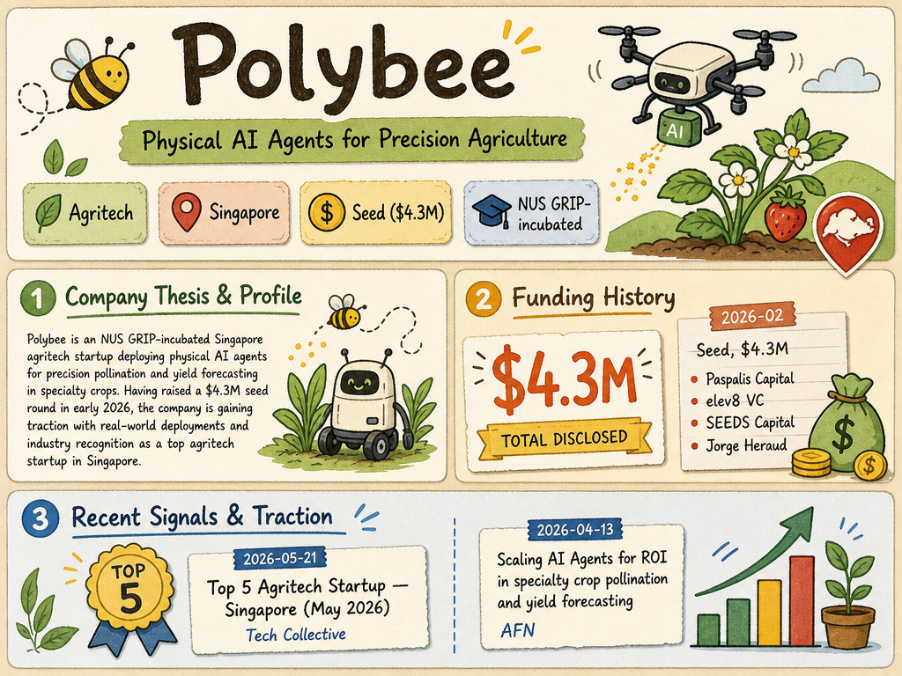

# polybee — LIVING BRIEF
_Last updated: 2026-05-23 14:34 UTC_

## Thesis
Polybee is an NUS GRIP-incubated Singapore agritech startup deploying physical AI agents for precision pollination and yield forecasting in specialty crops. Having raised a $4.3M seed round in early 2026, the company is gaining traction with real-world deployments and industry recognition as a top agritech startup in Singapore.

## Profile
- Sector: Agritech
- Region: Singapore
- Stage / funding: Seed ($4.3M, Feb 2026)
- Identifiers: [LinkedIn](https://sg.linkedin.com/company/polybee), [Crunchbase](https://www.crunchbase.com/organization/polybee), UEN: 201930630R

## Funding history
- **2026-02** — Seed, $4.3M — Paspalis Capital, elev8 VC; SEEDS Capital, Jorge Heraud — [agfundernews.com](https://agfundernews.com/polybee-raises-4-3m-to-automate-yield-forecasting-and-pollination-with-physical-ai-agents)

_Total disclosed: $4.3M._

## Recent signals
- **2026-05-21** — Named among top 5 agritech startups in Singapore — [Tech Collective](https://techcollectivesea.com/2026/05/21/agritech-startups-in-singapore/)
- **2026-04-13** — Scaling physical AI agents for immediate ROI in specialty crop pollination and yield forecasting — [AFN](https://agfundernews.com/polybee-scales-physical-ai-agents-for-immediate-bankable-roi-in-specialty-crops)

## Older signals
_none_

## Open questions
- What markets or crop types are Polybee's AI agents currently deployed in beyond the pilots described in the AFN article?
- Any additional fundraising beyond the Feb 2026 seed round?
