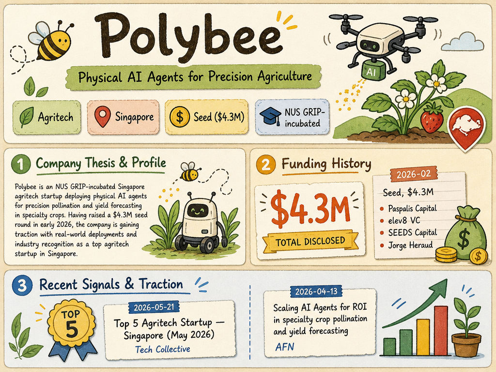

# polybee — LIVING BRIEF
_Last updated: 2026-09-17 17:33 UTC_

## Thesis
Polybee is an NUS GRIP-incubated Singapore agritech startup deploying physical AI agents for precision pollination and yield forecasting in specialty crops. Having raised a $4.3M seed round in early 2026, the company has expanded to Australia with an ANZ headquarters in Victoria, partnering with La Trobe University, Hort Innovation, and major growers. Founder Siddharth Jadhav projects A$10M revenue within two years from 5 key crops including leafy greens and berries.

_Last material event: 2026-07-20 — Commercial partnership with Bayer to scale AI yield forecasting through Bayer's grower network into vegetables_

## Profile
- Sector: Agritech
- Region: Singapore
- Stage / funding: Seed ($4.3M, Feb 2026)
- Identifiers: [LinkedIn](https://sg.linkedin.com/company/polybee), [Crunchbase](https://www.crunchbase.com/organization/polybee), UEN: 201930630R

## Funding history
- **2026-02** — Seed, $4.3M — Paspalis Capital, elev8 VC; SEEDS Capital, Jorge Heraud — [agfundernews.com](https://agfundernews.com/polybee-raises-4-3m-to-automate-yield-forecasting-and-pollination-with-physical-ai-agents)

_Total disclosed: $4.3M._

## Recent signals
_none_

## Older signals
- **2026-07-20** — Polybee signed a new non-exclusive commercial partnership with Bayer to scale its AI yield-forecasting platform through Bayer's existing grower relationships, extending it from fruit into spinach and broccoli with lettuce due by end-2026 — [freshplaza.com](https://www.freshplaza.com/north-america/article/9858864/ai-crop-forecaster-takes-the-next-step-in-scaling-up/)
  - Summary: FreshPlaza reports that Polybee's new commercial partnership with Bayer expands access to its yield-forecasting technology via Bayer's existing customer relationships, which founder-CEO Siddharth Jadhav frames as the next stage of scaling after years of proving grower returns. Polybee charges a flat fee per hectare covering equipment, software, setup, maintenance and support, and says growers who follow its harvest-timing recommendations see three to seven times return within the same crop cycle. Split-field trials across varieties, seasons and locations produced a consistent 8-15% yield uplift at no marginal cost, and the Bayer relationship pushed the company beyond fruit into vegetable crops.
  - People: Siddharth Jadhav (founder and CEO, Polybee)
  - Counterparties: Bayer (channel partner)
  - Numbers: 8-15% yield uplift in split-field trials; 3x-7x grower return in the same crop cycle; fixed fee per hectare; 2 crops proven (spinach, broccoli); lettuce expected by end-2026
  - Quote: "Bayer pointed us to the opportunity of doing yield forecasting in vegetable crops" — Siddharth Jadhav, founder and CEO, Polybee
- **2026-06-21** — Polybee opened ANZ headquarters in Victoria, Australia, with partnerships at La Trobe University, Hort Innovation, and Western Sydney University; Perfection Fresh and Flavourite Group are customers — [austrade.gov.au](https://international.austrade.gov.au/en/news-and-analysis/success-stories/how-Polybee-found-growth-innovation-and-collaboration-in-Australia)
  - Summary: Polybee established its Australia/New Zealand headquarters in Victoria in 2025, continuing collaborations with La Trobe University, Hort Innovation, and Western Sydney University. Perfection Fresh and Flavourite Group have become both customers and development partners. Founder Siddharth Jadhav projects A$10M revenue within two years from 5 target crops: leafy greens, broccoli, strawberries, blueberries, and greenhouse tomatoes.
  - People: Siddharth Jadhav (founder)
  - Counterparties: La Trobe University, Hort Innovation, Western Sydney University, Perfection Fresh, Flavourite Group
  - Numbers: A$1.3M research project completed, targeting A$10M revenue in 2 years, 5 key crops, 3x ROI target for customers
  - Quote: "Australian growers were willing to work alongside us; inviting us to their farms to test the product and figure it out together" — Siddharth Jadhav
- **2026-05-21** — Named among top 5 agritech startups in Singapore — [Tech Collective](https://techcollectivesea.com/2026/05/21/agritech-startups-in-singapore/)
- **2026-04-13** — Scaling physical AI agents for immediate ROI in specialty crop pollination and yield forecasting — [AFN](https://agfundernews.com/polybee-scales-physical-ai-agents-for-immediate-bankable-roi-in-specialty-crops)

## Open questions
- Any additional fundraising beyond the Feb 2026 seed round?
- What is Polybee's current revenue run-rate and how close is it to the A$10M projection?
- How much of Polybee's pipeline now flows through the Bayer channel, and does the non-exclusive agreement carry volume commitments?
- Does the 8-15% yield uplift hold commercially in lettuce, and does it shorten the path to the A$10M revenue projection?
