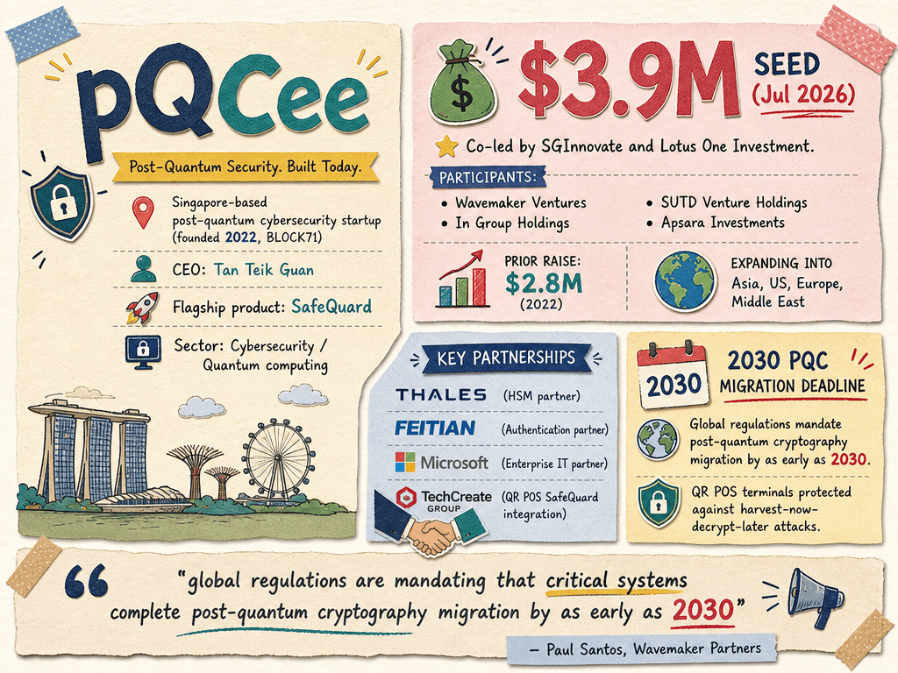

# pQCee — LIVING BRIEF
_Last updated: 2026-07-21 15:04 UTC_

## Thesis
pQCee is a Singapore-based post-quantum cybersecurity startup (founded 2022) building NIST-aligned quantum-safe encryption and key-lifecycle management tools, with a flagship SafeQuard™ document-protection product. After raising a $3.9M seed round co-led by SGInnovate and Lotus One Investment in July 2026, the company is scaling its team and targeting expansion across Asia, the US, Europe, and the Middle East, supported by integration partnerships with Thales, Feitian, Microsoft, and others.

## Profile
- Sector: Cybersecurity / Quantum computing
- Region: Singapore (BLOCK71 Singapore-resident)
- Founded: 2022
- Stage / funding: Seed ($3.9M, Jul 2026); CyberSG TIG Collaboration Centre portfolio
- Key people: Tan Teik Guan (CEO)
- Identifiers: [LinkedIn](https://www.linkedin.com/company/pqcee), [Website](https://www.pqcee.com)

## Recent signals

- **2026-07-17** — Raised $3.9M in a seed round co-led by SGInnovate and Lotus One Investment to scale quantum-safe encryption globally — [technode.global](https://technode.global/2026/07/17/singapores-cryptography-solution-firm-pqcee-raises-3-9m-seed-round-to-scale-quantum-safe-encryption-globally)
  - Summary: pQCee closed a $3.9M seed round co-led by SGInnovate and Lotus One Investment, with participation from In Group Holdings, Wavemaker Ventures, SUTD Venture Holdings, and Apsara Investments. The company will use the funds to expand its Singapore team, deepen presence across Asia, and enter the US, Europe, and Middle East markets. The round follows a $2.8M raise in 2022.
  - People: Dr. Teik Guan Tan (CEO, pQCee), Hsien-Hui Tong (Executive Director of Investments, SGInnovate), Paul Santos (Co-founder and Managing Partner, Wavemaker Partners)
  - Counterparties: SGInnovate (co-lead), Lotus One Investment (co-lead), Thales (HSM partner), Microsoft (enterprise IT partner)
  - Numbers: $3.9M seed round; second institutional round; $2.8M prior raise (2022)
  - Quote: "global regulations are mandating that critical systems complete post-quantum cryptography migration by as early as 2030" — Paul Santos, Co-founder and Managing Partner, Wavemaker Partners
- **2026-06-26** — pQCee — Be Quantum Ready (LinkedIn) — [sg.linkedin.com](https://sg.linkedin.com/company/pqcee)
- **2026-06-26** — How this quantum cybersecurity startup is enabling businesses to stay ahead (SGInnovate) — [sginnovate.com](https://www.sginnovate.com/investments/pqcee)
- **2026-06-26** — pQCee | PKI Consortium — [pkic.org](https://pkic.org/about/membership/members/pqcee/)
- **2026-05-31** — Partnered with TechCreate Group to integrate NIST post-quantum cryptography (via SafeQuard) into QR Hybrid POS terminals, protecting payment data against harvest-now-decrypt-later quantum attacks — [Digital Transactions](https://www.digitaltransactions.net/techcreate-teams-with-pqcee-to-harden-qr-pos-terminal-security/)
  - Summary: TechCreate Group, a Singapore-based payments-software provider, will embed pQCee's SafeQuard quantum-safe cryptography into its QR Hybrid POS terminals that combine QR code scanning with contactless payment functions. The partnership targets the transition from current RSA/ECC encryption to post-quantum standards, aiming to demonstrate that PQC can be integrated into real-time payment systems without compromising performance or scalability.
  - People: Tan Teik Guan (CEO, pQCee), Heng Hai Lim (CEO, TechCreate)
  - Counterparties: TechCreate Group Ltd. (partner)
  - Quote: "By embedding quantum-safe protections into the fabric of payments, both TechCreate and pQCee help the entire ecosystem stay resilient. Our work ensures that banks, merchants, and consumers alike can transact with confidence, knowing the industry is shielded against both today's cyber risks and tomorrow's quantum threats." — Tan Teik Guan, CEO, pQCee

## Older signals

  _none_

## Open questions
- Is the TechCreate integration a paid contract or a joint proof-of-concept?
- What is the expected timeline for PQC-certified QR POS terminal rollout?
- Will the $3.9M seed round be sufficient to achieve announced US/EU/Middle East market entry before the 2030 regulatory deadline?
- How do the new Thales and Feitian HSM integrations complement or compete with the existing TechCreate POS partnership?
