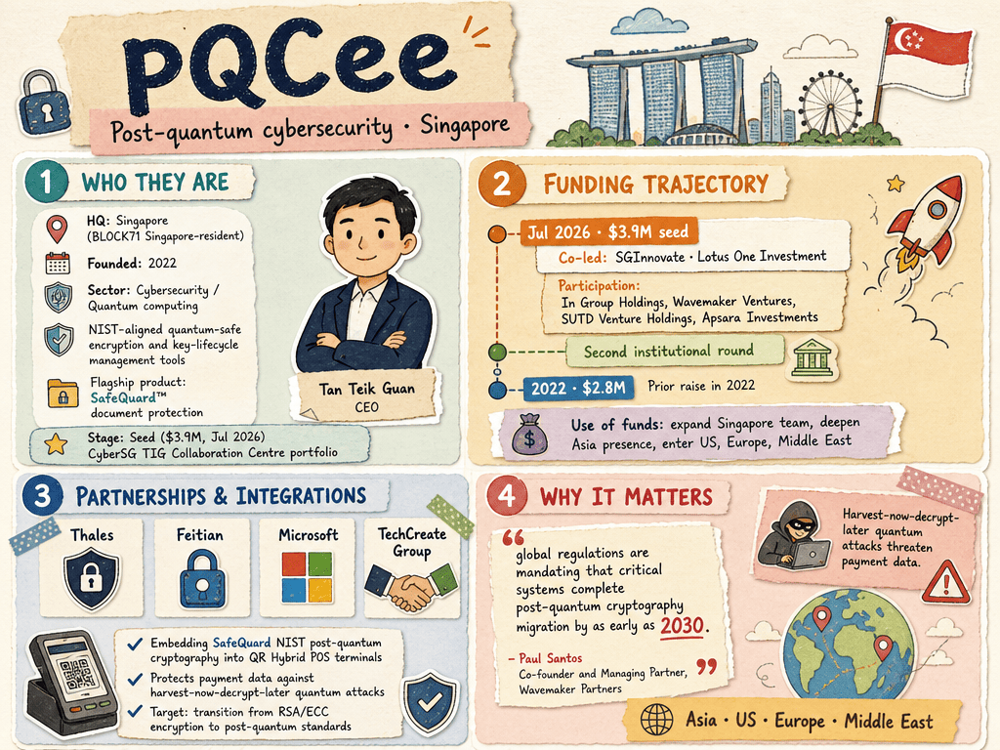

# pQCee — LIVING BRIEF
_Last updated: 2026-09-03 17:01 UTC_

## Thesis
pQCee is a Singapore-based post-quantum cybersecurity startup (founded 2022) building NIST-aligned quantum-safe encryption and key-lifecycle management tools, with a flagship SafeQuard™ document-protection product. In August 2026 the company signed a definitive share exchange agreement under which Vancouver-based digital-assets investment firm Universal Digital Inc. (CSE: LFG) will acquire all of pQCee's shares in a change-of-business transaction, alongside a concurrent US$5–10M private placement at a US$72.5M combined pre-money valuation. Closing is subject to shareholder and CSE approvals, with Universal Digital's shares suspended until the transaction completes or terminates.

_Last material event: 2026-08-05 — Definitive share exchange agreement with Universal Digital Inc. (CSE: LFG); US$72.5M combined pre-money, US$5–10M concurrent placement_

## Profile
- Sector: Cybersecurity / Quantum computing
- Region: Singapore (BLOCK71 Singapore-resident)
- Founded: 2022
- Stage / funding: Seed ($3.9M, Jul 2026); pending acquisition by Universal Digital Inc. (CSE: LFG) via share exchange; CyberSG TIG Collaboration Centre portfolio
- Key people: Tan Teik Guan (CEO)
- Identifiers: [LinkedIn](https://www.linkedin.com/company/pqcee), [Website](https://www.pqcee.com)

## Funding history
_No disclosed funding._

## Recent signals
- **2026-08-05** — Signed a definitive share exchange agreement for Vancouver-based Universal Digital Inc. (CSE: LFG) to acquire all of pQCee in a change-of-business deal; US$72.5M combined pre-money, concurrent US$5–10M placement — [kalkinemedia.com](https://kalkinemedia.com/ca/news/announcements/universal-digital-inc-to-acquire-singapore-based-post-quantum-cybersecurity-firm-pqcee-in-definitive-share-exchange-agreement) (Also reported by: [pqcee.com](https://www.pqcee.com/blog/universal-digital-inc-announces-definitive-share-exchange-agreement-to-acquire-pqcee-pte-ltd))
  - Summary: Universal Digital Inc., a Vancouver-headquartered Canadian investment firm focused on digital assets and blockchain, agreed to acquire all outstanding shares of PQCEE Pte. Ltd. in exchange for 655,038,050 common shares — about 88% of the post-transaction issuer on a fully diluted, pre-consolidation basis. The deal is structured as a change of business under CSE Policy 8, with a concurrent private placement targeting US$5–10M in gross proceeds at a combined enterprise pre-money valuation of US$72.5M; proceeds would fund product development, IP enhancements, and commercialization. Closing is conditioned on board, shareholder, and CSE approvals, and Universal Digital's shares remain suspended pending completion or termination.
  - Counterparties: Universal Digital Inc. (acquirer), Rock Property Investment Limited (buy-side M&A advisor), CSE (regulator)
  - Numbers: 655,038,050 shares (~88% of post-transaction issuer); US$72.5M combined pre-money; US$5–10M concurrent placement; US$6.7M prior raises (2022 + 2026); 10:1 pre-closing consolidation; 10% of purchaser shares escrowed 12 months

## Older signals
- **2026-07-17** — Raised $3.9M in a seed round co-led by SGInnovate and Lotus One Investment to scale quantum-safe encryption globally — [technode.global](https://technode.global/2026/07/17/singapores-cryptography-solution-firm-pqcee-raises-3-9m-seed-round-to-scale-quantum-safe-encryption-globally)
  - Summary: pQCee closed a $3.9M seed round co-led by SGInnovate and Lotus One Investment, with participation from In Group Holdings, Wavemaker Ventures, SUTD Venture Holdings, and Apsara Investments. The company will use the funds to expand its Singapore team, deepen presence across Asia, and enter the US, Europe, and Middle East markets. The round follows a $2.8M raise in 2022.
  - People: Dr. Teik Guan Tan (CEO, pQCee), Hsien-Hui Tong (Executive Director of Investments, SGInnovate), Paul Santos (Co-founder and Managing Partner, Wavemaker Partners)
  - Counterparties: SGInnovate (co-lead), Lotus One Investment (co-lead), Thales (HSM partner), Microsoft (enterprise IT partner)
  - Numbers: $3.9M seed round; second institutional round; $2.8M prior raise (2022)
  - Quote: "global regulations are mandating that critical systems complete post-quantum cryptography migration by as early as 2030" — Paul Santos, Co-founder and Managing Partner, Wavemaker Partners
- **2026-06-26** — pQCee — Be Quantum Ready (LinkedIn) — [sg.linkedin.com](https://sg.linkedin.com/company/pqcee)
- **2026-06-26** — How this quantum cybersecurity startup is enabling businesses to stay ahead (SGInnovate) — [sginnovate.com](https://www.sginnovate.com/investments/pqcee)
- **2026-06-26** — pQCee | PKI Consortium — [pkic.org](https://pkic.org/about/membership/members/pqcee/)
- **2026-05-31** — Partnered with TechCreate Group to integrate NIST post-quantum cryptography (via SafeQuard) into QR Hybrid POS terminals, protecting payment data against harvest-now-decrypt-later quantum attacks — [Digital Transactions](https://www.digitaltransactions.net/techcreate-teams-with-pqcee-to-harden-qr-pos-terminal-security/) (Also reported by: [businesswire.com](https://www.businesswire.com/news/home/20260420365518/en/TechCreate-Group-Ltd.-and-pQCee-Intend-to-Collaborate-on-One-of-the-First-Quantum-Safe-QR-Hybrid-POS-Terminal))
  - Summary: TechCreate Group, a Singapore-based payments-software provider, will embed pQCee's SafeQuard quantum-safe cryptography into its QR Hybrid POS terminals that combine QR code scanning with contactless payment functions. The partnership targets the transition from current RSA/ECC encryption to post-quantum standards, aiming to demonstrate that PQC can be integrated into real-time payment systems without compromising performance or scalability.
  - People: Tan Teik Guan (CEO, pQCee), Heng Hai Lim (CEO, TechCreate)
  - Counterparties: TechCreate Group Ltd. (partner)
  - Quote: "By embedding quantum-safe protections into the fabric of payments, both TechCreate and pQCee help the entire ecosystem stay resilient. Our work ensures that banks, merchants, and consumers alike can transact with confidence, knowing the industry is shielded against both today's cyber risks and tomorrow's quantum threats." — Tan Teik Guan, CEO, pQCee

## Open questions
- Will the Universal Digital acquisition close — what are the key conditions and expected timeline (shareholder and CSE approvals, private-placement minimums)?
- How does the deal's US$72.5M pre-money valuation and ~88% share issuance treat existing seed investors (SGInnovate, Lotus One, Wavemaker)?
- Does pQCee continue operating as a standalone subsidiary with its existing roadmap and partnerships (TechCreate, Thales, Feitian, Microsoft) after closing?
- Is the TechCreate integration a paid contract or a joint proof-of-concept?
