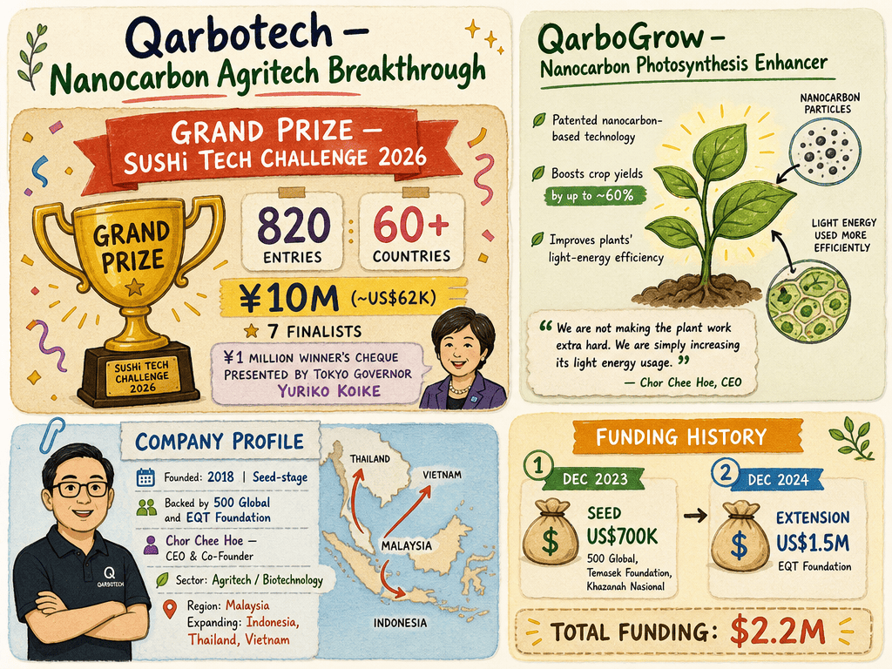

# Qarbotech — LIVING BRIEF
_Last updated: 2026-06-27 14:40 UTC_

## Thesis
Qarbotech is a Malaysian agritech startup commercialising a patented nanocarbon-based photosynthesis enhancer (QarboGrow) that boosts crop yields by up to ~60% by improving plants' light-energy efficiency. The company recently won the SusHi Tech Global Pitch Challenge 2026 Grand Prize (¥10M), signalling strong international validation and positioning it for fast-track expansion across key Asian markets.

## Profile
- Sector: Agritech / Biotechnology
- Region: Malaysia (BLOCK71 Bandung-listed), expanding into Indonesia, Thailand, Vietnam
- Founded: 2018
- Stage / funding: Seed-stage; backed by 500 Global and EQT Foundation
- Key people: Chor Chee Hoe (CEO and Co-Founder)
- Identifiers: <https://www.linkedin.com/company/qarbotech>, <https://qarbotech.com>

## Funding history
- **2023-12-04** — Seed, US$700K — 500 Global; Temasek Foundation (grant), Khazanah Nasional Dana Impak (grant) — [technode.global](https://technode.global/2023/12/04/malaysian-agritech-startup-qarbotech-lands-700000-seed-funding/)
- **2024-12-01** — Seed extension, US$1.5M — EQT Foundation — [digitalnewsasia.com](https://www.digitalnewsasia.com/startups/agritech-startup-qarbotech-secures-us15mil-seed-extension-round)

_Total disclosed: $2.2M._

## Recent signals
- **2026-06-27** — Corroborating coverage of Qarbotech's SusHi Tech Challenge 2026 grand prize win; adds detail on the selection process (820 entries, 7 finalists) and a ¥1M winner's cheque presented by Tokyo Governor Yuriko Koike — [carbonwire.org](https://carbonwire.org/announcements/climate-focused-agritech-startup-qarbotech-takes-top-prize-at-sushi-tech-challenge-2026)
  - Summary: Carbonwire.org reports Qarbotech was crowned grand winner of the SusHi Tech Challenge 2026, selected from 820 entries as one of seven finalists after multiple rounds of pitching and technical vetting. Tokyo Governor Yuriko Koike presented the prize at the summit's final day. The article frames the win as validation of the company's readiness to scale and accelerate expansion into Asian markets where food self-sufficiency is a priority.
  - People: Chor Chee Hoe (CEO and Co-Founder)
  - Counterparties: Tokyo Governor Yuriko Koike (award presenter)
  - Numbers: 820 entries; 7 finalists; ¥1 million winner's cheque
- **2026-05-31** — Won the SusHi Tech Global Pitch Challenge 2026 Grand Prize (¥10M, ~US$62K) in Tokyo, beating over 800 applicants from 60+ countries; prize awarded by Tokyo Governor Yuriko Koike — [Malaysia SME](https://www.malaysiasme.com.my/qarbotech-wins-grand-prize-at-sushi-tech-challenge-2026-elevating-southeast-asian-agritech-on-the-global-stage/)
  - Summary: Qarbotech's nanocarbon-based photosynthesis-enhancement technology earned top honours at the SusHi Tech 2026 pitch competition in Tokyo. The win validates the company's approach of optimising plants' natural light-energy utilisation without pushing crops beyond biological limits. The company plans partner-led distribution through seed manufacturers and agricultural input distributors.
  - People: Chor Chee Hoe (CEO and Co-Founder)
  - Counterparties: Tokyo Governor Yuriko Koike (award presenter)
  - Numbers: ¥10 million (~US$62,000) Grand Prize; 800+ global applicants; 60+ countries represented
  - Quote: "We are not making the plant work extra hard. We are simply increasing its light energy usage. In regions like Southeast Asia, overcast weather and prolonged rainy seasons can reduce productivity by up to 40 per cent. Our technology bridges that gap." — Chor Chee Hoe, CEO and Co-Founder
- **2026-04-29** — Corroborating coverage from The Stoly on Qarbotech's SusHi Tech Global Pitch Challenge 2026 Grand Prize win; the article recaps the ¥10M prize, 800+ applicants, and the significance for Southeast Asian agritech — [thestoly.com](https://thestoly.com/2026/05/qarbotech-wins-grand-prize-at-sushi-tech-challenge-2026-elevating-southeast-asian-agritech-on-the-global-stage)
  - Summary: Corroborates the 2026-05-31 announcement; no new facts.

## Older signals
_none_

## Open questions
- How will the SusHi Tech prize proceeds be deployed — R&D, capacity expansion, or market-entry?
- What is Qarbotech's current production capacity utilisation rate at 100,000 L/month?
- Has a priced equity round been opened following the seed extension?
