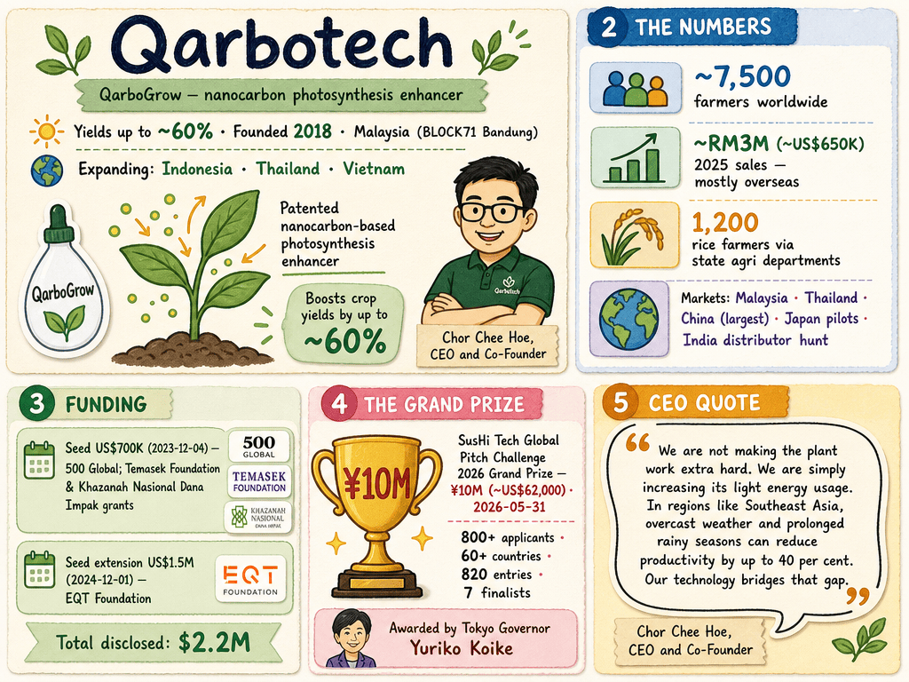

# Qarbotech — LIVING BRIEF
_Last updated: 2026-09-17 17:33 UTC_

## Thesis
Qarbotech is a Malaysian agritech startup commercialising a patented nanocarbon-based photosynthesis enhancer (QarboGrow) that boosts crop yields by up to ~60% by improving plants' light-energy efficiency. The company recently won the SusHi Tech Global Pitch Challenge 2026 Grand Prize (¥10M), signalling strong international validation and positioning it for fast-track expansion across key Asian markets.

_Last material event: 2026-05-31 — Won SusHi Tech Global Pitch Challenge 2026 Grand Prize (¥10M, ~US$62K)_

## Profile
- Sector: Agritech / Biotechnology
- Region: Malaysia (BLOCK71 Bandung-listed), expanding into Indonesia, Thailand, Vietnam
- Founded: 2018
- Stage / funding: Seed-stage; backed by 500 Global and EQT Foundation
- Key people: Chor Chee Hoe (CEO and Co-Founder)
- Identifiers: <https://www.linkedin.com/company/qarbotech>, <https://qarbotech.com>

## Funding history
- **2023-12-04** — Seed, US$700K — 500 Global; Temasek Foundation (grant), Khazanah Nasional Dana Impak (grant) — [technode.global](https://technode.global/2023/12/04/malaysian-agritech-startup-qarbotech-lands-700000-seed-funding/)
- **2024-12-01** — Seed extension, US$1.5M — EQT Foundation — [digitalnewsasia.com](https://www.digitalnewsasia.com/startups/agritech-startup-qarbotech-secures-us15mil-seed-extension-round)

_Total disclosed: $2.2M._

## Recent signals
- **2026-08-26** — Founder and chief scientist Dr Suraya Rashid profiled in The Peak's Power List 2026; carbon-quantum-dot photosynthesis enhancer framed as raising yields without extra agricultural inputs — [thepeakmagazine.com.sg](https://www.thepeakmagazine.com.sg/people/qarbotech-wants-plants-be-more-efficient-photosynthesis)
  - Summary: The Peak Power List 2026 profile traces Dr Suraya Rashid's path from materials-science research on carbon quantum dots to founding Qarbotech, a Malaysian deep-tech spin-off whose patented biocompatible solution enhances plants' photosynthetic efficiency. The piece emphasises the company's farmer-first philosophy — growers care about yield and input efficiency, not the underlying quantum mechanics. No new financial or commercial disclosures beyond prior signals.
  - People: Dr Suraya Rashid (founder and chief scientist)
  - Quote: "Farmers don't start by asking how the technology works. They start by asking what problem it solves." — Dr Suraya Rashid

## Older signals
- **2026-08-14** — Qarbotech published a field case study showing QarboGrow lifted total eggplant yield 10.6% and Grade A revenue 11.3% at Braintree Technologies' Selangor farms, framing the gain as better returns without extra labour — [qarbotech.com](https://qarbotech.com/a-case-study-on-qarbogrow-at-braintree-technologies-sungai-tangkas-bangi-selangor/)
  - Summary: Qarbotech's own case study covers a QarboGrow deployment at Braintree Technologies, a Malaysian agritech company farming at Sungai Tangkas, Bangi and Olak Lempit in Selangor, on the Leckat 313 "Little Nyonya" eggplant variety. Braintree combined QarboGrow with JADAM-based natural farming to address inconsistent yields, a heavy lower-grade mix and rising crop-protection costs; total yield, Grade A yield and premium-grade revenue all improved against the comparison plots. Braintree CEO Arif Makhdzir adopted the product from July 2024, making the farm one of QarboGrow's earliest adopters.
  - People: Arif Makhdzir (CEO, Braintree Technologies), Syazwan Sofian (farm manager, Braintree Technologies)
  - Counterparties: Braintree Technologies (customer and field-trial partner)
  - Numbers: total yield +10.6% (3,859.9 kg vs 3,489.3 kg per plot); Grade A yield +8.7%; Grade A revenue +11.3%; deployment since July 2024
  - Quote: "With QarboGrow, we saw straighter heavier eggplants, shinier skin, and more uniform size." — Syazwan Sofian, farm manager, Braintree Technologies
- **2026-07-26** — QarboGrow now used by ~7,500 farmers worldwide; ~RM3M in 2025 sales, mostly overseas; Japan pilot trials underway and India distributor hunt, says CEO Chor Chee Hoe — [nst.com.my](https://www.nst.com.my/business/corporate/2026/07/1497319/malaysian-agritech-startup-qarbotech-expands-global-footprint)
  - Summary: Qarbotech's QarboGrow photosynthesis enhancer is now used by nearly 7,500 farmers worldwide and recorded nearly RM3 million in sales last year, a large share from overseas. The product sells in Malaysia, Thailand and China, with China the largest market by farmer count; pilot trials are running in Japan and the company is seeking distributors in India. Domestic adoption lags because Qarbotech reaches smallholders but has yet to secure strong anchor distributors for medium-sized and larger plantations.
  - People: Chor Chee Hoe (Co-founder and CEO)
  - Counterparties: Departments of Agriculture, Penang/Terengganu/Kelantan (government partners)
  - Numbers: ~7,500 farmers; ~RM3M (~US$650K) 2025 sales; 1,200 rice farmers reached via state agriculture departments; pilot trials in Japan
  - Quote: "We already have the large-scale manufacturing facility here in Malaysia, so we are looking to work with more distributors and enter different markets" — Chor Chee Hoe, Co-founder and CEO, Qarbotech
- **2026-06-27** — Corroborating coverage of Qarbotech's SusHi Tech Challenge 2026 grand prize win; adds detail on the selection process (820 entries, 7 finalists) and a ¥1M winner's cheque presented by Tokyo Governor Yuriko Koike — [carbonwire.org](https://carbonwire.org/announcements/climate-focused-agritech-startup-qarbotech-takes-top-prize-at-sushi-tech-challenge-2026)
  - Summary: Carbonwire.org reports Qarbotech was crowned grand winner of the SusHi Tech Challenge 2026, selected from 820 entries as one of seven finalists after multiple rounds of pitching and technical vetting. Tokyo Governor Yuriko Koike presented the prize at the summit's final day. The article frames the win as validation of the company's readiness to scale and accelerate expansion into Asian markets where food self-sufficiency is a priority.
  - People: Chor Chee Hoe (CEO and Co-Founder)
  - Counterparties: Tokyo Governor Yuriko Koike (award presenter)
  - Numbers: 820 entries; 7 finalists; ¥1 million winner's cheque
- **2026-05-31** — Won the SusHi Tech Global Pitch Challenge 2026 Grand Prize (¥10M, ~US$62K) in Tokyo, beating over 800 applicants from 60+ countries; prize awarded by Tokyo Governor Yuriko Koike — [Malaysia SME](https://www.malaysiasme.com.my/qarbotech-wins-grand-prize-at-sushi-tech-challenge-2026-elevating-southeast-asian-agritech-on-the-global-stage/) (Also reported by: [thestoly.com](https://thestoly.com/2026/05/qarbotech-wins-grand-prize-at-sushi-tech-challenge-2026-elevating-southeast-asian-agritech-on-the-global-stage))
  - Summary: Qarbotech's nanocarbon-based photosynthesis-enhancement technology earned top honours at the SusHi Tech 2026 pitch competition in Tokyo. The win validates the company's approach of optimising plants' natural light-energy utilisation without pushing crops beyond biological limits. The company plans partner-led distribution through seed manufacturers and agricultural input distributors.
  - People: Chor Chee Hoe (CEO and Co-Founder)
  - Counterparties: Tokyo Governor Yuriko Koike (award presenter)
  - Numbers: ¥10 million (~US$62,000) Grand Prize; 800+ global applicants; 60+ countries represented
  - Quote: "We are not making the plant work extra hard. We are simply increasing its light energy usage. In regions like Southeast Asia, overcast weather and prolonged rainy seasons can reduce productivity by up to 40 per cent. Our technology bridges that gap." — Chor Chee Hoe, CEO and Co-Founder

## Open questions
- How will the SusHi Tech prize proceeds be deployed — R&D, capacity expansion, or market-entry?
- Do the yield gains in Qarbotech's own case studies replicate in third-party trials and outside eggplant?
- Has a priced equity round been opened following the seed extension?
- What share of the ~RM3M 2025 sales came from China, its largest market by farmer count?
