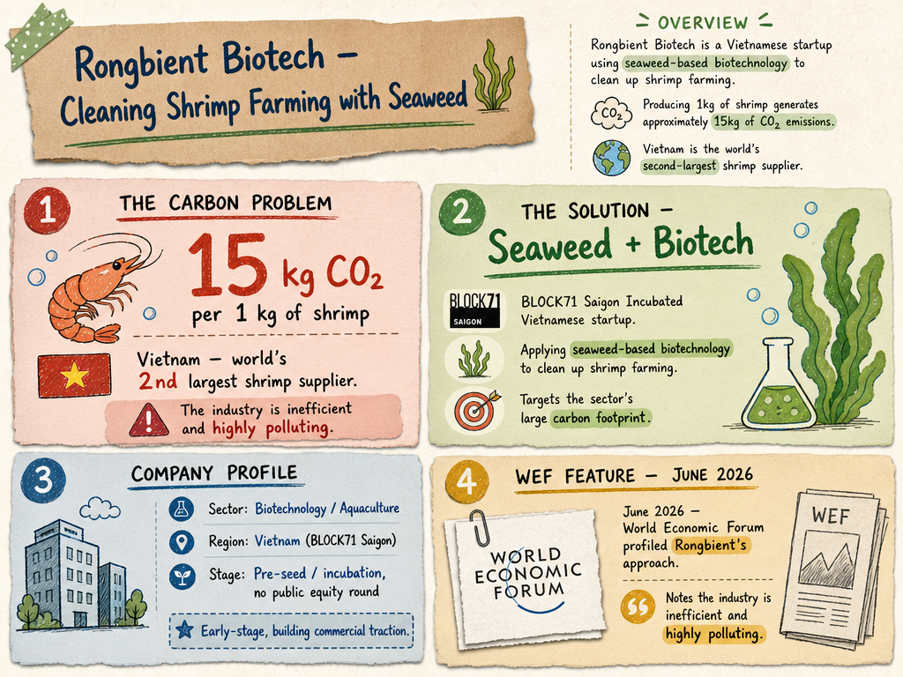

# Rongbient Biotech — LIVING BRIEF
_Last updated: 2026-06-01 18:48 UTC_

## Thesis
Rongbient Biotech is a BLOCK71 Saigon-incubated Vietnamese startup applying seaweed-based biotechnology to clean up the highly polluting shrimp-farming industry. Vietnam is the world's second-largest shrimp supplier, and the company's approach targets the sector's large carbon footprint — producing 1kg of shrimp generates approximately 15kg of CO2 emissions. Early-stage and still building public evidence of commercial traction.

## Profile
- Sector: Biotechnology / Aquaculture
- Region: Vietnam (BLOCK71 Saigon)
- Stage / funding: Pre-seed / incubation (BLOCK71 Saigon, no public equity round)

## Recent signals
- **2026-06-01** — WEF profiled Rongbient's seaweed-and-biotech approach to reducing shrimp farming's environmental impact in Vietnam, the world's second-largest supplier. — [weforum.org](https://www.weforum.org/videos/this-start-up-is-using-seaweed-to-clean-up-shrimp-farming/)
  - Summary: The World Economic Forum featured Rongbient's approach of combining seaweed and biotechnology to address carbon-heavy shrimp farming in Vietnam. The piece notes that producing 1kg of shrimp generates approximately 15kg of CO2 emissions and describes the industry as inefficient and highly polluting.
  - Numbers: 15kg CO2 per 1kg shrimp; Vietnam is world's second-largest shrimp supplier

## Older signals
_none_

## Open questions
- What is Rongbient's specific biotechnology mechanism (e.g., seaweed species, bioremediation process)?
- Has the company moved beyond pilots into commercial deployment with shrimp farms?
- Is there any disclosed equity funding, or is the company operating on grants and incubation support only?
