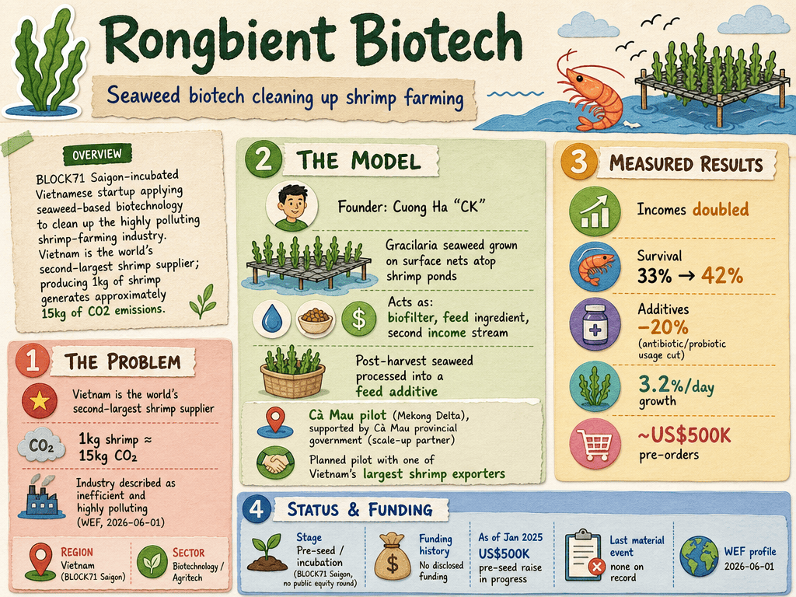

# Rongbient Biotech — LIVING BRIEF
_Last updated: 2026-08-08 13:48 UTC_

## Thesis
Rongbient Biotech is a BLOCK71 Saigon-incubated Vietnamese startup applying seaweed-based biotechnology to clean up the highly polluting shrimp-farming industry. Vietnam is the world's second-largest shrimp supplier, and the company's approach targets the sector's large carbon footprint — producing 1kg of shrimp generates approximately 15kg of CO2 emissions. Early-stage and still building public evidence of commercial traction.

_Last material event: none on record_

## Profile
- Sector: Biotechnology / Agritech
- Region: Vietnam (BLOCK71 Saigon)
- Stage / funding: Pre-seed / incubation (BLOCK71 Saigon, no public equity round)

## Funding history
_No disclosed funding._

## Recent signals
_none_

## Older signals
- **2026-06-01** — WEF profiled Rongbient's seaweed-and-biotech approach to reducing shrimp farming's environmental impact in Vietnam, the world's second-largest supplier. — [weforum.org](https://www.weforum.org/videos/this-start-up-is-using-seaweed-to-clean-up-shrimp-farming/)
  - Summary: The World Economic Forum featured Rongbient's approach of combining seaweed and biotechnology to address carbon-heavy shrimp farming in Vietnam. The piece notes that producing 1kg of shrimp generates approximately 15kg of CO2 emissions and describes the industry as inefficient and highly polluting.
  - Numbers: 15kg CO2 per 1kg shrimp; Vietnam is world's second-largest shrimp supplier
- **2025-01-29** — The Fish Site profiled Rongbient's surface-net Gracilaria polyculture model: Cà Mau pilot ponds doubled farmer incomes, ~US$500K in pre-orders, and a US$500K pre-seed raise in progress — [thefishsite.com](https://thefishsite.com/articles/rongbient-shrimp-and-seaweed-a-recipe-for-success-for-vietnam)
  - Summary: The Fish Site's seaweed-industry analyst profiled Rongbient's integrated multi-trophic model: Gracilaria seaweed grown on surface nets atop shrimp ponds acts as biofilter, feed ingredient, and second income stream. As of early 2025 the company ran pilot hectares in Cà Mau (Mekong Delta) that doubled farmer incomes and lifted shrimp survival from 33% to 42%; post-harvest seaweed is processed into a feed additive that cut antibiotic/probiotic usage by 20%. Rongbient held roughly US$500K in pre-orders and was raising a US$500K pre-seed round to scale supply and processing.
  - People: Cuong Ha "CK" (Founder)
  - Counterparties: One of Vietnam's largest shrimp exporters (planned pilot), Cà Mau provincial government (scale-up partner)
  - Numbers: US$500K pre-orders; US$500K pre-seed raise target; shrimp survival 33%→42%; feed-additive use −20%; 3.2%/day seaweed growth rate
  - Quote: "If you can cut 50 percent of those additives, it would mean 10 to 15 percent of the total cost. That is close to a farmer's yearly profit margin." — Cuong Ha (CK), Founder

## Open questions
- Did the US$500K pre-seed round (in progress as of Jan 2025) close, and has any further funding been disclosed?
- Has Rongbient scaled beyond its Cà Mau pilot hectares, and did the planned pilot with one of Vietnam's largest shrimp exporters materialize?
- Has the feed-additive line reached its 50% additive-reduction target, and is the government-backed 20,000–30,000 ha expansion progressing?
