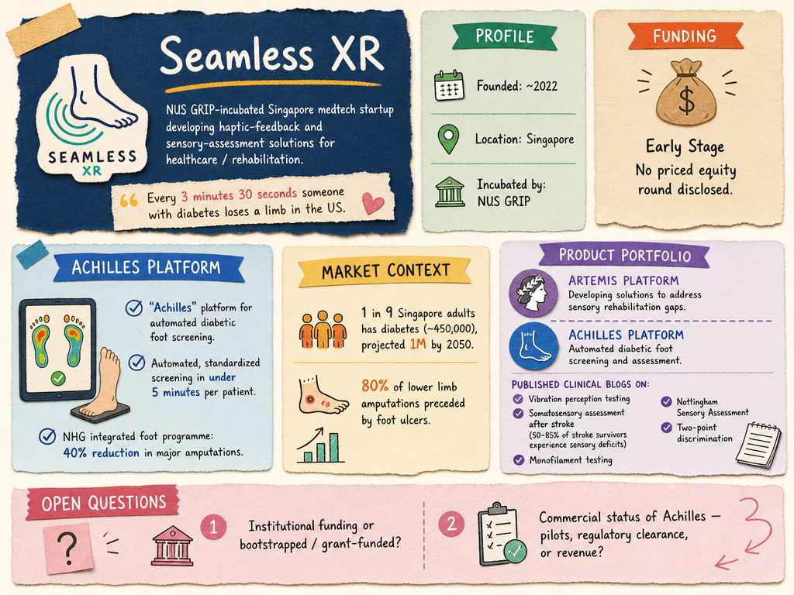

# seamless — LIVING BRIEF
_Last updated: 2026-06-07 15:01 UTC_

## Thesis
Seamless (Seamless XR) is an NUS GRIP-incubated Singapore deep-tech startup developing haptic-feedback and sensory-assessment solutions for the healthcare and rehabilitation market. Its "Achilles" platform for automated diabetic foot screening and ongoing blog output on sensory rehabilitation protocols point to a product strategy targeting the large and underserved diabetic neuropathy screening market.

## Profile
- Sector: MedTech / sensory rehabilitation / XR health
- Region: Singapore
- Founded: ~2022
- Stage / funding: Early stage; no priced equity round disclosed
- Identifiers: [LinkedIn](https://www.linkedin.com/company/seamless-xr)

## Recent signals
- **2026-03-12** — Published clinical blog on vibration perception testing for diabetic neuropathy screening, positioning the Achilles platform as an automated alternative to manual biothesiometry — [seamless.sg](https://www.seamless.sg/blog/vibration-perception-testing-in-diabetic-neuropathy-screening)
  - Summary: The blog posts comprehensively cover sensory assessment techniques. An article on diabetic foot screening highlights that every 3 minutes 30 seconds someone with diabetes loses a limb in the US, and positions Seamless XR's Achilles platform as delivering automated, standardized screening in under 5 minutes per patient.
  - Numbers: 1 in 9 Singapore adults has diabetes (~450,000), projected 1M by 2050; 80% of lower limb amputations preceded by foot ulcers
- **2026-03-12** — Published clinical blog on somatosensory assessment after stroke, noting 50–85% of stroke survivors experience sensory deficits — [seamless.sg](https://www.seamless.sg/blog/why-somatosensory-assessment-matters-after-stroke)
- **2026-03-12** — Published clinical blog on Semmes-Weinstein monofilament testing protocols and inter-rater reliability — [seamless.sg](https://www.seamless.sg/blog/semmes-weinstein-monofilament-testing)
- **2026-03-12** — Published clinical blog on the Nottingham Sensory Assessment for stroke rehabilitation — [seamless.sg](https://www.seamless.sg/blog/the-nottingham-sensory-assessment)
- **2026-03-12** — Published blog on how Artemis platform addresses gaps in sensory rehabilitation — [seamless.sg](https://www.seamless.sg/blog/how-artemis-can-fix-the-gaps-in-sensory-rehabilitation)
- **2026-03-12** — Published clinical blog on two-point discrimination testing standards and normative data — [seamless.sg](https://www.seamless.sg/blog/two-point-discrimination-testing-standards-normative-data-and-clinical-applications)
  - Summary: Corroborates seamless's technical depth in sensory assessment, covering normative values, reliability metrics, and clinical implementation protocols relevant to their product platforms.
- **2026-03-12** — Published blog on the problem of under-screened diabetics leading to preventable amputations, promoting Seamless's Achilles platform — [seamless.sg](https://www.seamless.sg/blog/diabetics-are-not-being-screened-enough-and-it-s-leading-to-amputations)
  - Summary: Corroborates the screening-gap narrative; Singapore's National Healthcare Group integrated foot programme achieved 40% reduction in major amputations.
- **2026-03-12** — Published blog reviewing current sensory rehabilitation methods and their limitations, advocating for technology-assisted alternatives — [seamless.sg](https://www.seamless.sg/blog/sensory-rehabilitation-is-necessary-but-here-s-the-problem)
  - Summary: Reviews traditional sensory retraining techniques and advocates for technology-assisted approaches (VR/robotic platforms) as superior standardized, high-dose alternatives requiring less therapist time.

## Older signals
_none_

## Open questions
- Has seamless raised any institutional funding, or is development still bootstrapped / grant-funded?
- What is the commercial status of the Achilles platform — pilot deployments, regulatory clearance, or revenue?
