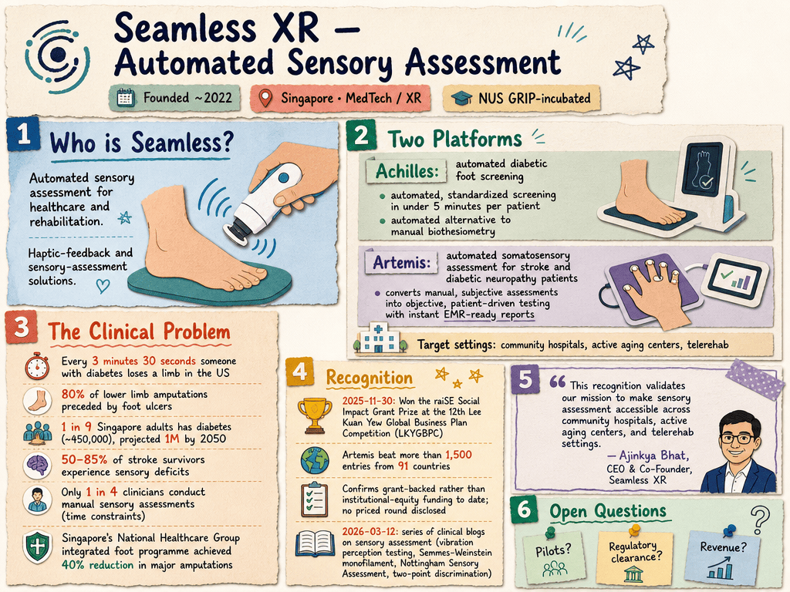

# seamless — LIVING BRIEF
_Last updated: 2026-09-02 17:10 UTC_

## Thesis
Seamless (Seamless XR) is an NUS GRIP-incubated Singapore deep-tech startup developing haptic-feedback and sensory-assessment solutions for the healthcare and rehabilitation market. Its "Achilles" platform for automated diabetic foot screening and ongoing blog output on sensory rehabilitation protocols point to a product strategy targeting the large and underserved diabetic neuropathy screening market.

_Last material event: 2025-11-30 — Won the raiSE Social Impact Grant Prize at the 12th Lee Kuan Yew Global Business Plan Competition_

## Profile
- Sector: MedTech / XR
- Region: Singapore
- Founded: ~2022
- Stage / funding: Early stage; no priced equity round disclosed
- Key people: Ajinkya Bhat (CEO & Co-Founder)
- Identifiers: [LinkedIn](https://www.linkedin.com/company/seamless-xr)

## Funding history
_No disclosed funding._

## Recent signals
_none_

## Older signals
- **2026-03-12** — Published clinical blog on vibration perception testing for diabetic neuropathy screening, positioning the Achilles platform as an automated alternative to manual biothesiometry — [seamless.sg](https://www.seamless.sg/blog/vibration-perception-testing-in-diabetic-neuropathy-screening)
  - Summary: The blog posts comprehensively cover sensory assessment techniques. An article on diabetic foot screening highlights that every 3 minutes 30 seconds someone with diabetes loses a limb in the US, and positions Seamless XR's Achilles platform as delivering automated, standardized screening in under 5 minutes per patient.
  - Numbers: 1 in 9 Singapore adults has diabetes (~450,000), projected 1M by 2050; 80% of lower limb amputations preceded by foot ulcers
- **2026-03-12** — Published clinical blog on somatosensory assessment after stroke, noting 50–85% of stroke survivors experience sensory deficits — [seamless.sg](https://www.seamless.sg/blog/why-somatosensory-assessment-matters-after-stroke)
- **2026-03-12** — Published clinical blog on Semmes-Weinstein monofilament testing protocols and inter-rater reliability — [seamless.sg](https://www.seamless.sg/blog/semmes-weinstein-monofilament-testing)
- **2026-03-12** — Published clinical blog on the Nottingham Sensory Assessment for stroke rehabilitation — [seamless.sg](https://www.seamless.sg/blog/the-nottingham-sensory-assessment)
- **2026-03-12** — Published blog on how Artemis platform addresses gaps in sensory rehabilitation — [seamless.sg](https://www.seamless.sg/blog/how-artemis-can-fix-the-gaps-in-sensory-rehabilitation)
- **2026-03-12** — Published clinical blog on two-point discrimination testing standards and normative data — [seamless.sg](https://www.seamless.sg/blog/two-point-discrimination-testing-standards-normative-data-and-clinical-applications)
  - Summary: Corroborates seamless's technical depth in sensory assessment, covering normative values, reliability metrics, and clinical implementation protocols relevant to their product platforms.
- **2026-03-12** — Published blog on the problem of under-screened diabetics leading to preventable amputations, promoting Seamless's Achilles platform — [seamless.sg](https://www.seamless.sg/blog/diabetics-are-not-being-screened-enough-and-it-s-leading-to-amputations)
  - Summary: Corroborates the screening-gap narrative; Singapore's National Healthcare Group integrated foot programme achieved 40% reduction in major amputations.
- **2026-03-12** — Published blog reviewing current sensory rehabilitation methods and their limitations, advocating for technology-assisted alternatives — [seamless.sg](https://www.seamless.sg/blog/sensory-rehabilitation-is-necessary-but-here-s-the-problem)
  - Summary: Reviews traditional sensory retraining techniques and advocates for technology-assisted approaches (VR/robotic platforms) as superior standardized, high-dose alternatives requiring less therapist time.
- **2025-11-30** — Won the raiSE Social Impact Grant Prize at the 12th Lee Kuan Yew Global Business Plan Competition (LKYGBPC) for its Artemis automated somatosensory assessment platform, among 1,500+ entries from 91 countries — [seamless.sg](https://www.seamless.sg/news/seamless-xr-wins-raise-social-impact-grant-prize)
  - Summary: Seamless XR was awarded the raiSE Social Impact Grant Prize at the 12th LKYGBPC, offered in partnership with raiSE to recognise social enterprises using technology to address pressing social needs in Singapore. Its Artemis platform beat more than 1,500 entries from 91 countries with an automated somatosensory assessment system for stroke and diabetic neuropathy patients, converting manual, subjective assessments — which only 1 in 4 clinicians conduct due to time constraints — into objective, patient-driven testing with instant EMR-ready reports. The prize confirms grant-backed rather than institutional-equity funding to date: no priced round is disclosed.
  - People: Ajinkya Bhat (CEO & Co-Founder)
  - Counterparties: raiSE (grant-prize partner), LKYGBPC (competition organiser)
  - Numbers: 1,500+ entries; 91 countries; 1 in 4 clinicians performing manual sensory assessments
  - Quote: "This recognition validates our mission to make sensory assessment accessible across community hospitals, active aging centers, and telerehab settings." — Ajinkya Bhat, CEO and Co-Founder, Seamless XR

## Open questions
- What is the commercial status of the Achilles platform — pilot deployments, regulatory clearance, or revenue?
