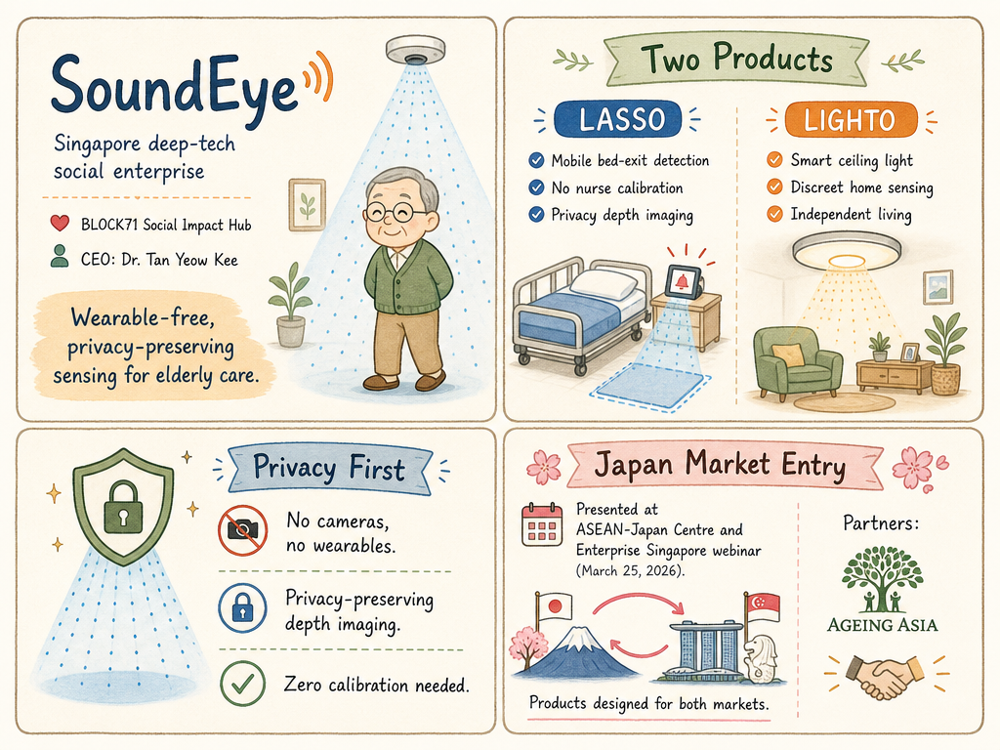

# SoundEye — LIVING BRIEF
_Last updated: 2026-06-02 12:00 UTC_

## Thesis
SoundEye is a BLOCK71 Social Impact Hub-resident Singapore deep-tech social enterprise developing wearable-free, privacy-preserving sensing for elderly fall detection and abnormal-event detection. The company's LASSO (bed-exit detection for nursing homes) and LIGHTO (smart ceiling light for home sensing) products are gaining exposure through government-backed international channels, positioning it for cross-border deployment in aging-society markets like Japan.

## Profile
- Sector: Elderly care technology / assisted living sensors
- Region: Singapore
- Stage / funding: Early-stage (BLOCK71 Social Impact Hub portfolio)
- Key people: Dr. Tan Yeow Kee (CEO & Founder)

## Recent signals
- **2026-06-02** — Presented LASSO and LIGHTO products at an ASEAN-Japan Centre and Enterprise Singapore-organized webinar on Singapore technologies for aging societies, targeting the Japan market — [ASEAN-Japan Centre](https://www.asean.or.jp/en/event-info/20260318/)
  - Summary: SoundEye's CEO & Founder Dr. Tan Yeow Kee presented the company's two products at a free online webinar (March 25, 2026, 300 attendees max) co-organized by the ASEAN-Japan Centre and Enterprise Singapore. LASSO is described as the first mobile bed-exit detection system for nursing homes/hospitals requiring no nurse calibration, using privacy-preserving depth imaging for fall prevention. LIGHTO is a smart ceiling light for residential homes with discreet sensing for independent living. Both products were designed based on requirements from stakeholders in Japan and Singapore.
  - People: Dr. Tan Yeow Kee (CEO & Founder)
  - Counterparties: ASEAN-Japan Centre, Enterprise Singapore, Ageing Asia (collaborator)

## Older signals
_none_

## Open questions
- Has SoundEye secured any pilot deployments or commercial partnerships in Japan as a result of this Enterprise Singapore-led market introduction?
- What is the pricing and deployment model for LASSO in nursing home settings (per-bed, per-facility, SaaS)?
