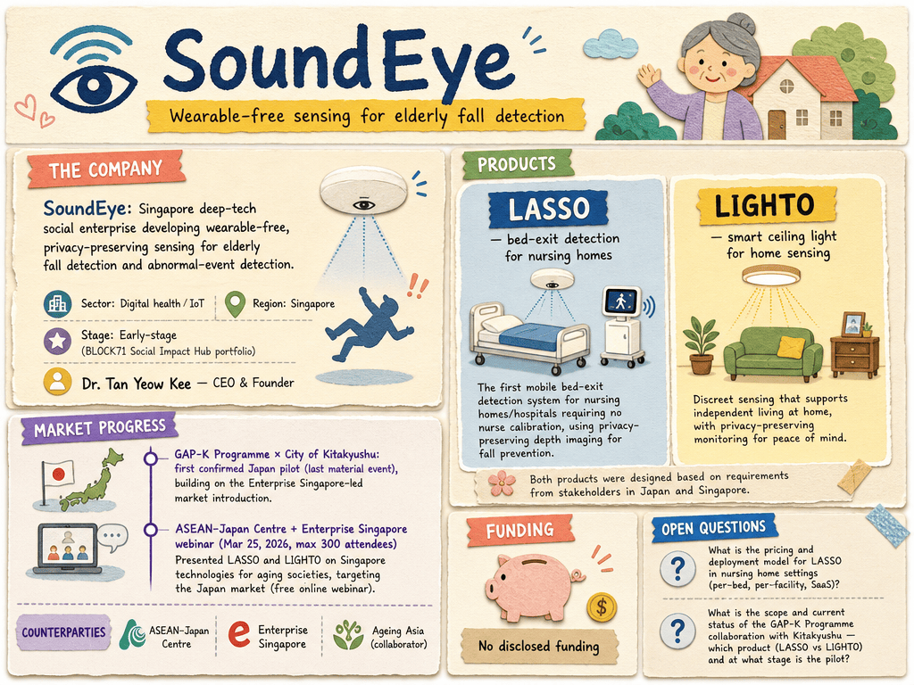

# SoundEye — LIVING BRIEF
_Last updated: 2026-08-09 13:54 UTC_

## Thesis
SoundEye is a BLOCK71 Social Impact Hub-resident Singapore deep-tech social enterprise developing wearable-free, privacy-preserving sensing for elderly fall detection and abnormal-event detection. The company's LASSO (bed-exit detection for nursing homes) and LIGHTO (smart ceiling light for home sensing) products are gaining exposure through government-backed international channels; a GAP-K Programme collaboration with Japan's City of Kitakyushu gives it a first confirmed Japan pilot, positioning it for cross-border deployment in aging-society markets.

_Last material event: 2024-11-01 — GAP-K Programme collaboration with City of Kitakyushu (Japan pilot)_

## Profile
- Sector: Digital health / IoT
- Region: Singapore
- Stage / funding: Early-stage (BLOCK71 Social Impact Hub portfolio)
- Key people: Dr. Tan Yeow Kee (CEO & Founder)

## Funding history

_No disclosed funding._

## Recent signals
_none_

## Older signals
- **2026-06-02** — Presented LASSO and LIGHTO products at an ASEAN-Japan Centre and Enterprise Singapore-organized webinar on Singapore technologies for aging societies, targeting the Japan market — [ASEAN-Japan Centre](https://www.asean.or.jp/en/event-info/20260318/)
  - Summary: SoundEye's CEO & Founder Dr. Tan Yeow Kee presented the company's two products at a free online webinar (March 25, 2026, 300 attendees max) co-organized by the ASEAN-Japan Centre and Enterprise Singapore. LASSO is described as the first mobile bed-exit detection system for nursing homes/hospitals requiring no nurse calibration, using privacy-preserving depth imaging for fall prevention. LIGHTO is a smart ceiling light for residential homes with discreet sensing for independent living. Both products were designed based on requirements from stakeholders in Japan and Singapore.
  - People: Dr. Tan Yeow Kee (CEO & Founder)
  - Counterparties: ASEAN-Japan Centre, Enterprise Singapore, Ageing Asia (collaborator)
- **2024-11-01** — GAP-K Programme collaboration with Japan's City of Kitakyushu gives SoundEye its first confirmed Japan pilot, building on the Enterprise Singapore-led market introduction — [linkedin.com](https://www.linkedin.com/posts/soundeye_soundeye-lasso-innovation-activity-7270994161556713472-gIj5)

## Open questions
- What is the pricing and deployment model for LASSO in nursing home settings (per-bed, per-facility, SaaS)?
- What is the scope and current status of the GAP-K Programme collaboration with Kitakyushu — which product (LASSO vs LIGHTO) and at what stage is the pilot?
