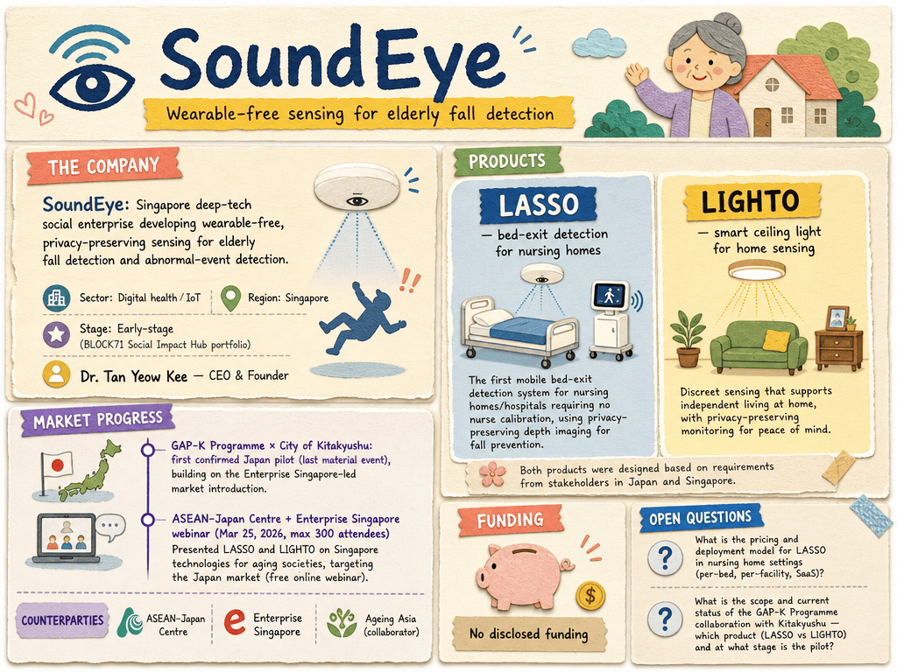

# SoundEye — LIVING BRIEF
_Last updated: 2026-10-07 22:38 UTC_

## Thesis
SoundEye is a BLOCK71 Social Impact Hub-resident Singapore deep-tech social enterprise developing wearable-free, privacy-preserving sensing for elderly fall detection and abnormal-event detection. The company's LASSO (bed-exit detection for nursing homes) and LIGHTO (smart ceiling light for home sensing) products are gaining exposure through government-backed international channels; a GAP-K Programme collaboration with Japan's City of Kitakyushu gives it a first confirmed Japan pilot, positioning it for cross-border deployment in aging-society markets.

_Last material event: 2026-09-29 — Singapore General Hospital published results of its Virtual Sitter LASSO deployment (90+ monitoring cases; 53% of restrained patients had restraint reduced)_

## Profile
- Sector: Digital health / IoT
- Region: Singapore
- Stage / funding: Early-stage (BLOCK71 Social Impact Hub portfolio)
- Key people: Dr. Tan Yeow Kee (CEO & Founder)

## Funding history
_No disclosed funding._

## Recent signals
- **2026-09-29** — Singapore General Hospital's Virtual Nursing Unit has run SoundEye's LASSO as a "Virtual Sitter" since December 2025, completing 90+ monitoring cases, cutting restraint use and recording no unwitnessed falls — [sgh.com.sg](https://www.sgh.com.sg/news/patient-care/more-help-keeping-an-eye-on-admitted-patients)
  - Summary: SGH set up a Virtual Nursing Unit in December 2025 in which a central-hub nurse watches high-risk, disoriented or suicide-prevention patients through SoundEye's LASSO — a depth-imaging (non-camera) bedside device with a two-way audio link — and prompts ward staff to the bedside when a patient tries to get up unassisted. Across 90+ cases since the pilot began, two-thirds of patients were under some form of physical restraint and 53% of those had restraint points reduced; the remaining third were monitored with no restraint. SGH reports no unwitnessed falls or fall-related injuries and says the system returned more than 20,000 hours of bedside observation time. The service remains in its pilot phase, with SGH planning to extend it to more wards and add remote vital-signs and medication-checking.
  - People: Teo Kai Yunn (Assistant Director, Nursing Safety & Quality, Virtual Nursing, Singapore General Hospital)
  - Counterparties: Singapore General Hospital (customer)
  - Numbers: 90+ monitoring cases since December 2025; 53% of restrained patients had restraint points reduced; 20,000+ hours of bedside observation time returned; 92 staff surveyed Jan-Jul 2026, >95% found it helpful; >90% of families reported improved safety and care
  - Quote: "Now, a single nurse from the virtual team can watch over several patients at once with the use of LASSO, which has given us back more than 20,000 hours of bedside observation time, allowing staff in the wards to focus on hands-on patient care." — Ms Teo Kai Yunn, Assistant Director, Nursing Safety & Quality, Virtual Nursing, Singapore General Hospital

## Older signals
- **2026-06-02** — Presented LASSO and LIGHTO products at an ASEAN-Japan Centre and Enterprise Singapore-organized webinar on Singapore technologies for aging societies, targeting the Japan market — [ASEAN-Japan Centre](https://www.asean.or.jp/en/event-info/20260318/)
  - Summary: SoundEye's CEO & Founder Dr. Tan Yeow Kee presented the company's two products at a free online webinar (March 25, 2026, 300 attendees max) co-organized by the ASEAN-Japan Centre and Enterprise Singapore. LASSO is described as the first mobile bed-exit detection system for nursing homes/hospitals requiring no nurse calibration, using privacy-preserving depth imaging for fall prevention. LIGHTO is a smart ceiling light for residential homes with discreet sensing for independent living. Both products were designed based on requirements from stakeholders in Japan and Singapore.
  - People: Dr. Tan Yeow Kee (CEO & Founder)
  - Counterparties: ASEAN-Japan Centre, Enterprise Singapore, Ageing Asia (collaborator)
- **2024-11-01** — GAP-K Programme collaboration with Japan's City of Kitakyushu gives SoundEye its first confirmed Japan pilot, building on the Enterprise Singapore-led market introduction — [linkedin.com](https://www.linkedin.com/posts/soundeye_soundeye-lasso-innovation-activity-7270994161556713472-gIj5)

## Open questions
- What is the pricing and deployment model for LASSO in nursing home settings (per-bed, per-facility, SaaS)?
- What is the scope and current status of the GAP-K Programme collaboration with Kitakyushu — which product (LASSO vs LIGHTO) and at what stage is the pilot?
