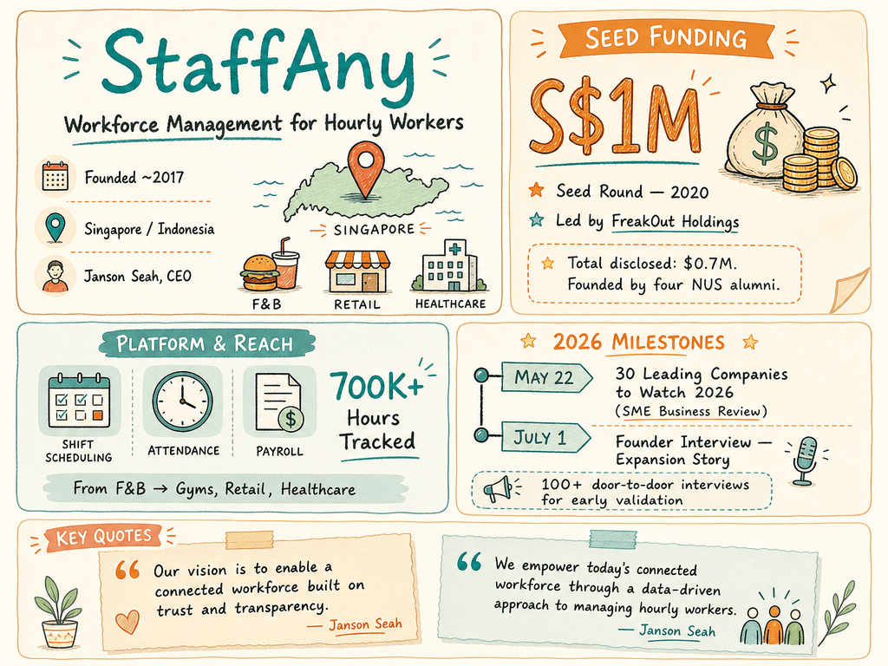

# StaffAny — LIVING BRIEF
_Last updated: 2026-07-05 14:33 UTC_

## Thesis

StaffAny is a Singapore-headquartered HR-tech startup building a workforce management SaaS for hourly workers in F&B, retail, and hospitality. Backed by FreakOut Holdings and founded by four NUS alumni, it has tracked over 700K hours through its scheduling, attendance, and payroll platform, and is expanding from its F&B base into healthcare and field services across Southeast Asia.

## Profile

- Sector: SaaS
- Region: Singapore / Indonesia
- Founded: ~2017
- Stage / funding: Seed (S$1M, 2020)
- Key people: Janson Seah (Co-Founder & CEO)
- Identifiers: [staffany.com](https://www.staffany.com/)

## Funding history

- **2020-08-01** — Seed, S$1M — FreakOut Holdings; Kenji Niwa, Lim Qing Ru, Kwok Yang Bin, Royston Tay — [vulcanpost.com](https://vulcanpost.com/672619/staffany-singapore-seed-funding/)

_Total disclosed: $0.7M._

## Recent signals

- **2026-07-01** — In-depth founder profile: Janson Seah discusses StaffAny's founding journey, expansion from F&B into gyms/retail/healthcare, and vision of building a connected workforce on trust and transparency — [smebusinessreview.com](https://smebusinessreview.com/profiles/profile/ultimate-shift-work-management-software-janson-seah-co-founder-ceo-staffany)
  - Summary: SME Business Review published an extended interview with StaffAny co-founder and CEO Janson Seah, covering the company's origin story (NUS hackathons / Overseas College, 2017), early product validation through 100+ door-to-door interviews, and industry expansion from restaurants into gyms, retail, events, processing plants, and maintenance. Seah cites healthcare, hotels, and field services as next vertical targets.
  - People: Janson Seah (Co-Founder & CEO)
  - Quote: "Our vision is to enable a connected workforce built on trust and transparency." — Janson Seah
- **2026-05-22** — StaffAny named to SME Business Review's "30 Leading Companies to Watch 2026" list, with a profile detailing its all-in-one workforce management platform — [smebusinessreview.com](https://smebusinessreview.com/profiles/profile/how-staffany-connects-businesses-leaner-workforce-tomorrow)
  - Summary: SME Business Review included StaffAny in its "30 Leading Companies to Watch 2026" list. The profile covers StaffAny's integrated platform for shift scheduling, attendance tracking, payroll coordination, and multi-location workforce management, targeting hourly workers across retail, F&B, hospitality, and healthcare.
  - People: Janson Seah (Co-Founder & CEO)
  - Quote: "We empower today's connected workforce through the provision of a data-driven approach to managing hourly workers." — Janson Seah

## Older signals

_none_

## Open questions

- Has StaffAny raised any subsequent funding since its S$1M seed round in 2020?
- How many active users or paying customers does StaffAny currently have?
- What is StaffAny's geographic footprint beyond Singapore and Indonesia?
