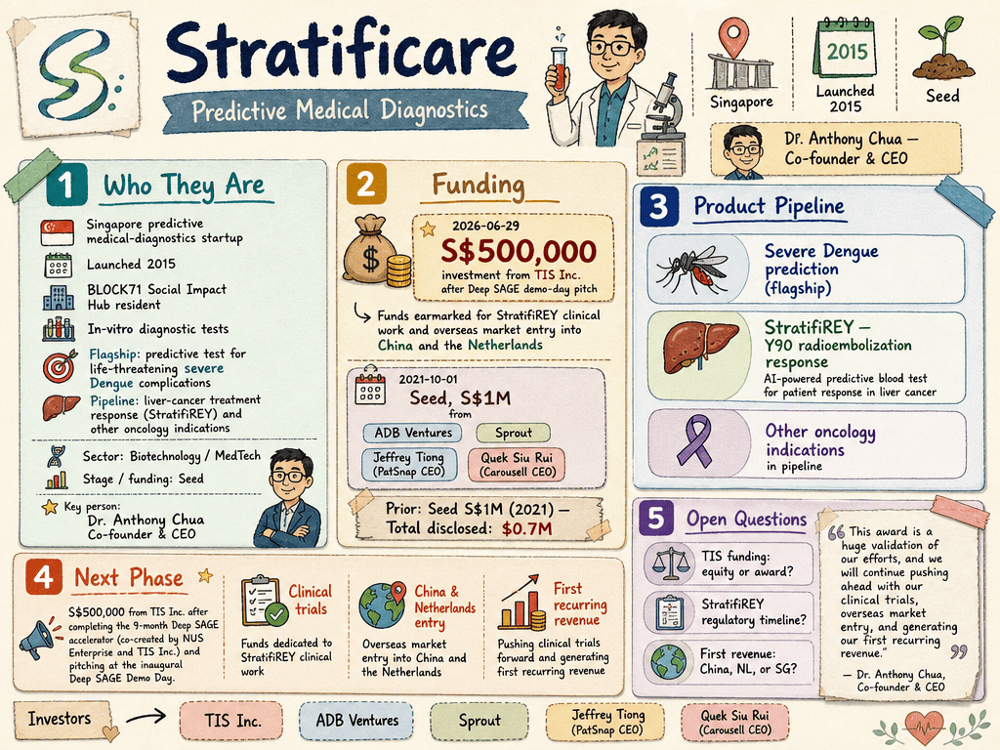

# Stratificare — LIVING BRIEF
_Last updated: 2026-08-17 13:42 UTC_

## Thesis
Stratificare is a Singapore predictive medical-diagnostics startup (launched 2015, BLOCK71 Social Impact Hub resident) building in-vitro diagnostic tests — a flagship predictive test for life-threatening severe Dengue complications, plus a pipeline for liver-cancer treatment response (StratifiREY) and other oncology indications. In June 2026 it raised S$500,000 from TIS Inc. after the Deep SAGE accelerator demo day, funds earmarked for StratifiREY clinical work and overseas market entry into China and the Netherlands. The company frames the next phase as pushing its clinical trials forward and generating its first recurring revenue.

_Last material event: 2026-06-29 — S$500,000 investment from TIS Inc. to advance precision diagnostics_

## Profile
- Sector: Biotechnology / MedTech
- Region: Singapore
- Founded: 2015
- Stage / funding: Seed
- Key people: Dr. Anthony Chua (Co-founder & CEO)

## Funding history
- **2021-10-01** — Seed, S$1M — ADB Ventures; Sprout, Jeffrey Tiong (PatSnap CEO), Quek Siu Rui (Carousell CEO) — [1covidnews.com](https://1covidnews.com/2021/10/08/stratificare-attracts-seed-funding-from-adb-ventures-sprout-for-its-dengue-disease-prediction-test/)

_Total disclosed: $0.7M._

## Recent signals
_none_

## Older signals
- **2026-06-29** — S$500,000 investment from TIS Inc. after its Deep SAGE demo-day pitch, earmarked for the StratifiREY liver-cancer blood test — [stratificare.com](https://www.stratificare.com/post/stratificare-secures-s-500-000-investment-from-tis-inc-to-advance-precision-diagnostics)
  - Summary: StratifiCare closed a S$500,000 investment from TIS Inc. after completing the 9-month Deep SAGE accelerator (co-created by NUS Enterprise and TIS Inc.) and pitching at the inaugural Deep SAGE Demo Day. The funds are dedicated to StratifiREY, its AI-powered predictive blood test for patient response to Y90 radioembolization in liver cancer. The accelerator's fractional-C-suite support helped the company accelerate entry into overseas markets including China and the Netherlands.
  - People: Dr. Anthony Chua (Co-founder & CEO), Cici Chen (Fractional Chief Revenue Officer), Chern Chet Yong (Mentor)
  - Counterparties: TIS Inc. (investor), NUS Enterprise (accelerator co-creator)
  - Numbers: S$500,000 investment
  - Quote: "This award is a huge validation of our efforts, and we will continue pushing ahead with our clinical trials, overseas market entry, and generating our first recurring revenue." — Dr. Anthony Chua, Co-founder & CEO

## Open questions
- Is the TIS Inc. funding an equity round or an accelerator-linked award, and what stake or terms does it carry?
- What is the regulatory/clinical-trial timeline for StratifiREY, and in which jurisdiction would it first seek approval?
- When does the company expect its first recurring revenue, and from which market (China vs. Netherlands vs. Singapore)?
