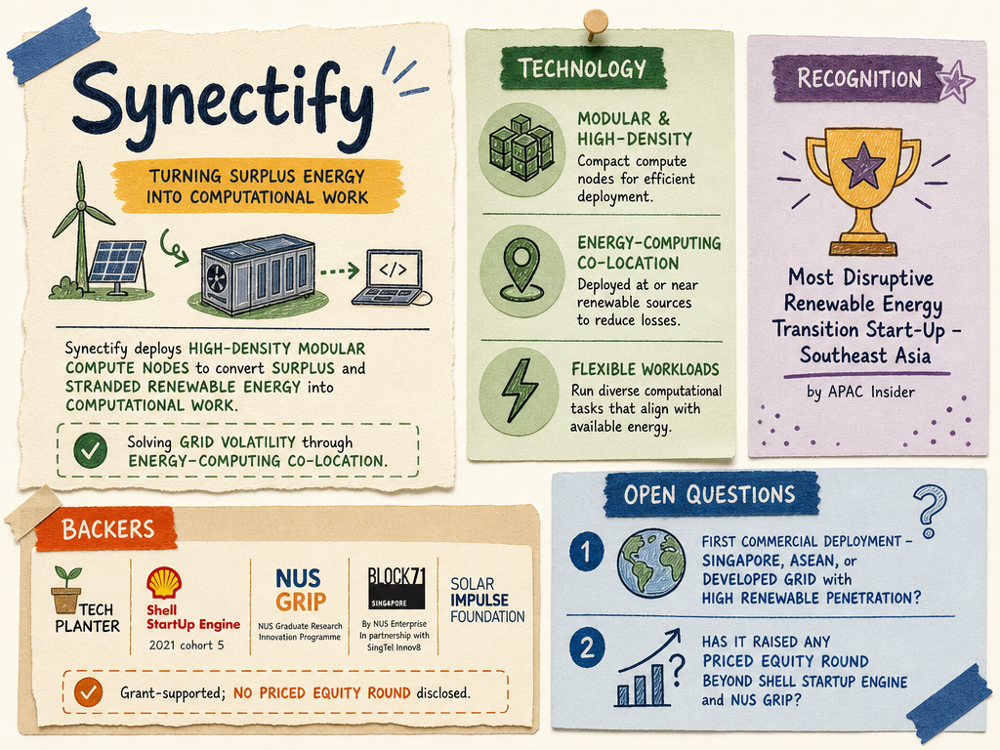

# Synectify — LIVING BRIEF
_Last updated: 2026-06-07 15:01 UTC_

## Thesis
Synectify is a Singapore deep-tech startup (NUS GRIP spin-off) deploying high-density modular compute nodes to convert surplus and stranded energy from renewable sources into computational work. Its award as "Most Disruptive Renewable Energy Transition Start-Up - Southeast Asia" by APAC Insider recognizes its approach to addressing grid volatility through energy-computing co-location.

## Profile
- Sector: Renewable energy / high-performance computing
- Region: Singapore
- Founded: ~2021
- Stage / funding: Grant-supported; no priced equity round disclosed
- Backers: Tech Planter, Shell StartUp Engine (2021 cohort 5), NUS GRIP, BLOCK71, Solar Impulse
- Identifiers: [LinkedIn](https://www.linkedin.com/company/synectify)

## Recent signals
- **2026-06-07** — Awarded "Most Disruptive Renewable Energy Transition Start-Up - Southeast Asia" by APAC Insider — [APAC Insider](https://www.apac-insider.com/winners/synectify-pte-ltd/)
  - Summary: Synectify was recognized for addressing grid volatility and stranded power through high-density baseload computing solutions. The company deploys modular compute nodes engineered to convert surplus energy to value-generating computational work, solving the growing mismatch between intermittent renewable energy supply and increasing computing demand.

## Older signals
_none_

## Open questions
- Has Synectify raised any priced equity round beyond the Shell StartUp Engine and NUS GRIP incubation support?
- Where is its first commercial deployment — Singapore, another ASEAN market, or a developed grid with high renewable penetration?
