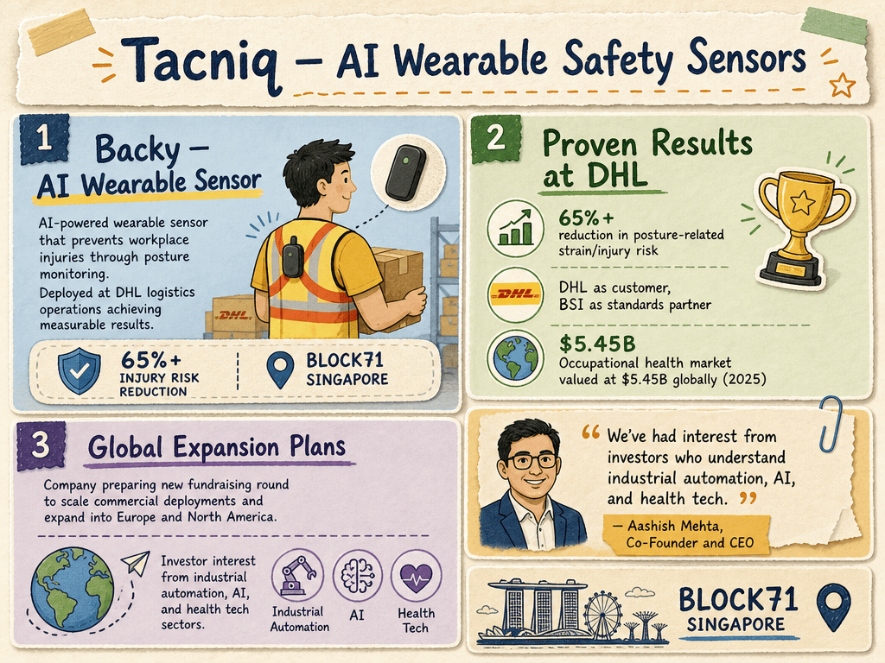

# Tacniq — LIVING BRIEF
_Last updated: 2026-06-16 18:02 UTC_

## Thesis
Tacniq is a Singapore-based deep-tech startup developing AI-powered wearable sensors to prevent workplace injuries, with its flagship product Backy deployed at DHL achieving over 65% reduction in posture-related risk. The company is preparing for a fundraising round to scale commercial deployments and expand into Europe and North America from its BLOCK71 Singapore base.

## Profile
- Sector: AI
- Region: Singapore

## Recent signals
- **2026-06-16** — TacnIQ AI's wearable Backy reduces workplace injury risk by 65%+ at DHL; company preparing new fundraising round for global expansion — [BioSpectrum Asia](https://www.biospectrumasia.com/opinion/46/26573/singapore-has-been-a-great-launchpad-owing-to-its-structured-safety-frameworks.html)
  - Summary: BioSpectrum Asia profiles TacnIQ AI's flagship wearable Backy, already live with DHL reducing posture-related injury risk by over 65%. The company is preparing a new fundraising round for scaling commercial deployments and expanding into Europe and North America.
  - People: Aashish Mehta (Co-Founder and CEO)
  - Counterparties: DHL (customer), BSI (standards partner)
  - Numbers: 65%+ reduction in posture-related strain/injury risk at DHL; occupational health market valued at $5.45B globally in 2025
  - Quote: "We've had interest from investors who understand industrial automation, AI, and health tech." — Aashish Mehta, Co-Founder and CEO

## Older signals
_none_

## Open questions
- What is the target valuation and lead investor for the upcoming fundraising round?
- What is the revenue model — hardware sale, SaaS subscription, or both?
- Which hospital and eldercare partners are piloting Backy outside DHL?
