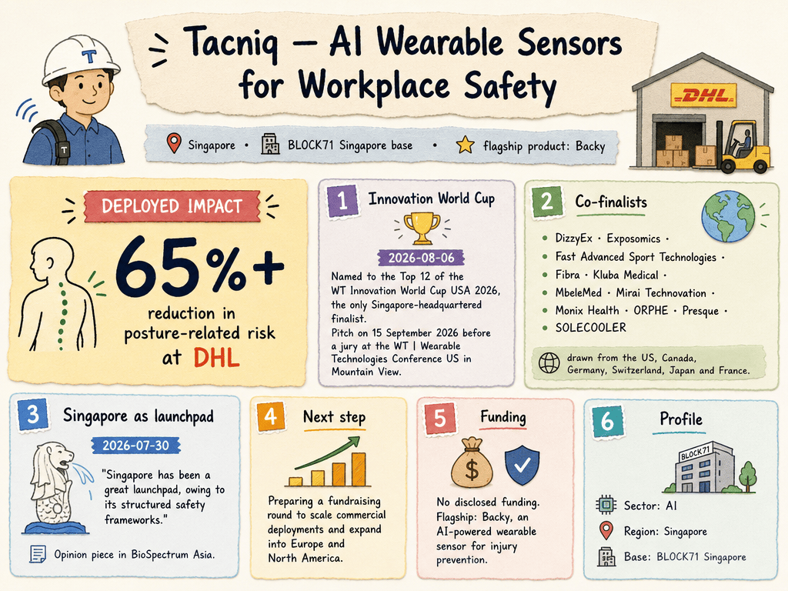

# Tacniq — LIVING BRIEF
_Last updated: 2026-07-30 15:16 UTC_

## Thesis
Tacniq is a Singapore-based deep-tech startup developing AI-powered wearable sensors to prevent workplace injuries, with its flagship product Backy deployed at DHL achieving over 65% reduction in posture-related risk. The company is preparing for a fundraising round to scale commercial deployments and expand into Europe and North America from its BLOCK71 Singapore base.

_Last material event: 2026-07-30 — "Singapore has been a great launchpad, owing to its structured safety frameworks_

## Profile
- Sector: AI
- Region: Singapore

## Funding history
_No disclosed funding._

## Recent signals
_none_

## Older signals
- **2026-07-30** — "Singapore has been a great launchpad, owing to its structured safety frameworks" — [biospectrumasia.com](https://biospectrumasia.com/opinion/46/26573/singapore-has-been-a-great-launchpad-owing-to-its-structured-safety-frameworks.html)

## Open questions
- What is the target valuation and lead investor for the upcoming fundraising round?
- What is the revenue model — hardware sale, SaaS subscription, or both?
- Which hospital and eldercare partners are piloting Backy outside DHL?
