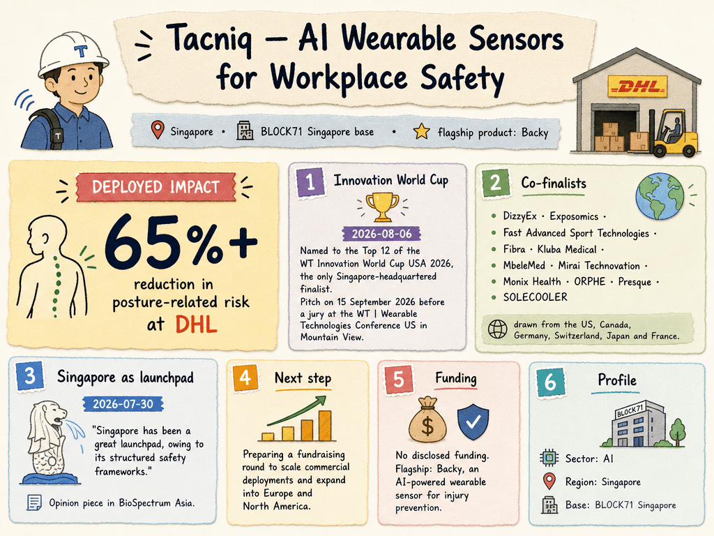

# Tacniq — LIVING BRIEF
_Last updated: 2026-10-04 20:11 UTC_

## Thesis
Tacniq is a Singapore-based deep-tech startup building AI-powered tactile sensors and software that let machines interpret physical contact, with its Backy workplace-safety wearable deployed at DHL achieving over 65% reduction in posture-related risk. In September 2026 it raised US$1.5M from In Group Holdings within a US$3M pre-seed round to fund engineering hires, model development and commercial deployments, and is co-developing deployable tactile-AI hardware with Synaptics as it scales beyond its BLOCK71 Singapore base.

_Last material event: 2026-09-23 — Raised US$1.5M from In Group Holdings as part of a US$3M pre-seed round_

## Profile
- Sector: AI
- Region: Singapore

## Funding history
_No disclosed funding._

## Recent signals
- **2026-09-23** — Singapore's TacniQ raised US$1.5M from In Group Holdings within a US$3M pre-seed round to build tactile-sensor AI, and is co-developing commercially deployable tactile-AI hardware with Synaptics — [apac.entrepreneur.com](https://apac.entrepreneur.com/business-news/singapores-tacniq-raises-1-5-mn-to-build-ai-that-learns-from-touch)
  - Summary: TacnIQ.ai said it secured US$1.5M from Singapore investment firm In Group Holdings as part of a US$3M pre-seed round, with the money earmarked for engineering hires, model development and more commercial deployments; the announcement disclosed no valuation, named no other investors and did not clarify whether the larger round had closed. The startup builds touch sensors and AI software in Singapore and California, collecting data from workplace wearables and robotic sensors to train reusable models. It says its Backy workplace-safety wearable uses pressure and tilt sensors with vibration alerts, its TAC-02 robotic finger development kit carries 64 touch-sensing elements, and it has collected more than 5,000 hours of tactile interactions with paying customers across logistics, construction, e-commerce, hospitality and healthcare. It is also working with US-listed semiconductor firm Synaptics on turning tactile-AI research into commercially deployable hardware.
  - People: Aashish Mehta (CEO & co-founder, TacnIQ.ai), Liu Song (CEO, In Group Holdings), Mahesh Srinivasan (VP & GM Touch & Display, Synaptics)
  - Counterparties: In Group Holdings (lead investor), Synaptics (technology partner)
  - Numbers: US$1.5M from In Group Holdings (part of a US$3M pre-seed); no valuation disclosed; 5,000+ hours of tactile data; 64 touch-sensing elements (TAC-02 kit)

## Older signals
- **2026-08-06** — Named to the Top 12 of the WT Innovation World Cup USA 2026, the only Singapore entrant, ahead of a 15 September jury pitch in Mountain View — [innovationworldcup.com](https://innovationworldcup.com/the-top-12-of-the-wt-innovation-world-cup-usa-2026)
  - Summary: The Innovation World Cup Series, the wearables sector's longest-running open-innovation competition, named TacnIQ.ai to the Top 12 of its WT Innovation World Cup USA 2026 edition. The twelve Wearable Techpreneurs pitch on 15 September 2026 before a jury at the WT | Wearable Technologies Conference US in Mountain View. TacnIQ.ai is the only Singapore-headquartered finalist; the others are drawn from the US, Canada, Germany, Switzerland, Japan and France — DizzyEx, Exposomics, Fast Advanced Sport Technologies, Fibra, Kluba Medical, MbeleMed, Mirai Technovation, Monix Health, ORPHE, Presque and SOLECOOLER.
  - Counterparties: Innovation World Cup Series / Techpreneurs GmbH (competition organiser)
  - Numbers: Top 12 finalists; pitch on 2026-09-15
- **2026-07-30** — "Singapore has been a great launchpad, owing to its structured safety frameworks" — [biospectrumasia.com](https://biospectrumasia.com/opinion/46/26573/singapore-has-been-a-great-launchpad-owing-to-its-structured-safety-frameworks.html)

## Open questions
- What is the revenue model — hardware sale, SaaS subscription, or both?
- Which hospital and eldercare partners are piloting Backy outside DHL?
- Will the US$3M pre-seed round close, and who are the other investors beyond In Group Holdings?
- Does the Synaptics collaboration extend to a commercial supply agreement, and on what terms?
