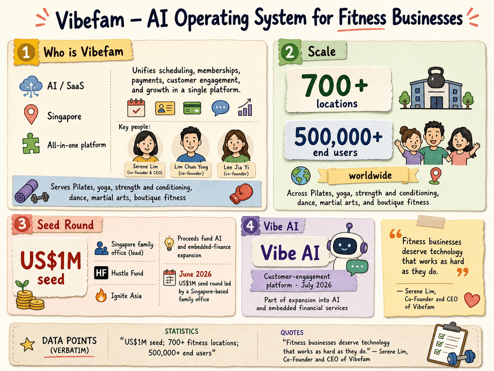

# Vibefam — LIVING BRIEF
_Last updated: 2026-09-18 16:59 UTC_

## Thesis
Vibefam is a Singapore-based startup building an AI-powered operating system for fitness businesses, unifying scheduling, memberships, payments, customer engagement, and growth in a single platform used by more than 700 fitness locations and 500,000+ end users worldwide. A US$1M seed round in June 2026 led by a Singapore-based family office funds expansion into AI and embedded financial services, including the Vibe AI customer-engagement platform launching in July 2026.

_Last material event: 2026-06-18 — US$1M seed round led by a Singapore-based family office_

## Profile
- Sector: AI / SaaS
- Region: Singapore
- Key people: Serene Lim (co-founder & CEO), Lim Chun Yong (co-founder), Lee Jia Yi (co-founder)

## Funding history
_No disclosed funding._

## Recent signals
_none_

## Older signals
- **2026-07-08** — An NUS Computing alumni feature traces Vibefam from a 2021 student project to 700+ fitness locations and details Vibe AI's July 2026 launch as a WhatsApp/SMS booking agent needing no app download or portal login — [comp.nus.edu.sg](https://comp.nus.edu.sg/news/building-an-ai-powered-operating-system-for-the-gym-floor-two-nus-computing-graduates-rethinking-how-fitness-businesses-run)
  - Summary: NUS Computing profiled alumni co-founders Lim Chun Yong (CTO), Serene Lim (CEO) and Lee Jia Yi (CPO), who built Vibefam from a summer 2021 side project into a platform serving 700+ fitness locations and 500,000+ end users and closed a US$1M seed round in June 2026 backed by a Singapore-based family office, with Hustle Fund and Ignite Asia from an earlier round. Proceeds go to AI development and embedded finance. Vibe AI, launching July 2026, answers incumbent studio-management platforms by living on the channels members already use — WhatsApp and SMS — handling bookings, cancellations, schedule browsing and package enquiries, proactively messaging members hit by cancellations with rebooking options, and giving studios a unified inbox with human escalation, each agent trained on the studio's own schedule, packages, policies and brand voice and customisable without code.
  - People: Lim Chun Yong (Co-founder & CTO), Serene Lim (Co-founder & CEO), Lee Jia Yi (Co-founder & CPO)
  - Counterparties: Singapore-based family office (lead investor); Hustle Fund (earlier investor); Ignite Asia (earlier investor); NUS Venture Initiation Programme (S$10,000 grant); BLOCK71 Singapore (incubator)
  - Numbers: 700+ fitness locations; 500,000+ end users; US$1M June 2026 seed; S$10,000 NUS Venture Initiation Programme grant
  - Quote: "We can use data already on the platform to offer financing these operators couldn’t otherwise access." — Lim Chun Yong, Co-founder & CTO, Vibefam
- **2026-06-18** — Vibefam raised a US$1M seed round, led by an unnamed Singapore-based family office, to expand its AI-powered operating system for fitness businesses (700+ locations, 500K+ users) — [finance.yahoo.com](https://finance.yahoo.com/technology/ai/articles/vibefam-raises-us-1-million-080000605.html) (Also reported by: [prnewswire.com](https://www.prnewswire.com/news-releases/vibefam-raises-us1-million-to-build-an-ai-powered-operating-system-for-fitness-businesses-302800222.html), [vibefam.com](https://vibefam.com/vibefam-raises-usd1m-to-build-the-operating-system-for-fitness-studios/))
  - Summary: Vibefam, an AI-powered operating system for fitness businesses, completed a US$1M seed round led by a Singapore-based family office, with Hustle Fund and Ignite Asia among earlier backers. The platform serves 700+ fitness locations and 500,000+ end users across Pilates, yoga, strength and conditioning, dance, martial arts, and boutique fitness. Proceeds go to AI and embedded-finance expansion, including Vibe AI, a messaging-native customer-engagement platform launching July 2026.
  - People: Serene Lim (co-founder & CEO), Lim Chun Yong (co-founder), Lee Jia Yi (co-founder)
  - Counterparties: Singapore-based family office (lead investor); Hustle Fund (investor); Ignite Asia (investor)
  - Numbers: US$1M seed; 700+ fitness locations; 500,000+ end users
  - Quote: "Fitness businesses deserve technology that works as hard as they do." — Serene Lim, Co-Founder and CEO of Vibefam

## Open questions
- Which Singapore-based family office led the seed round, and at what valuation?
- Will embedded-finance lending become a revenue line, or is it a retention feature?
- Is Australia a live market for Vibefam — the team appeared at a Sydney fitness conference — or still prospecting?
