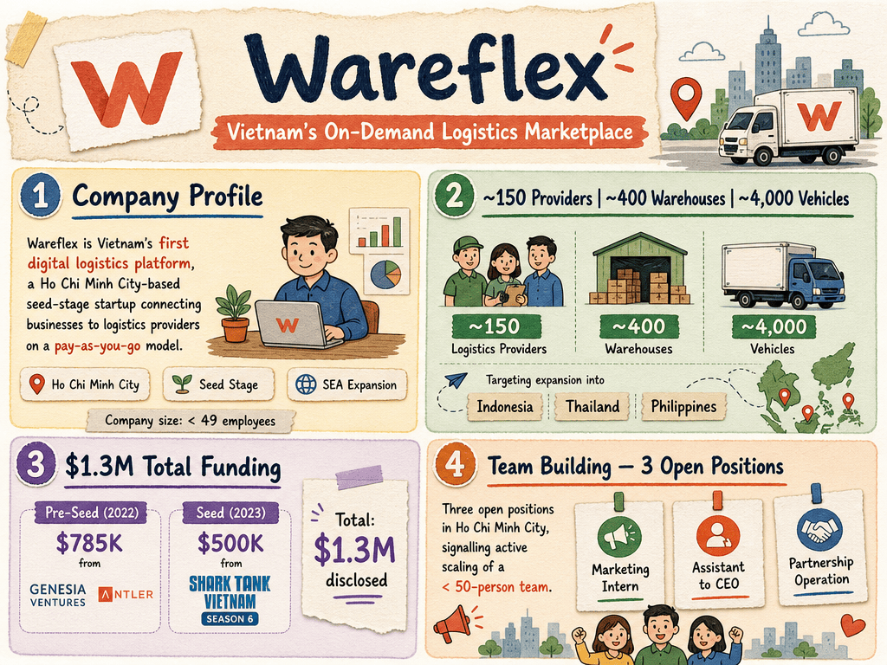

# Wareflex — LIVING BRIEF
_Last updated: 2026-06-18 16:01 UTC_

## Thesis
Vietnamese on-demand logistics startup operating a tech-enabled marketplace connecting businesses to ~150 logistics providers across nearly 400 warehouses and ~4,000 vehicles nationwide on a pay-as-you-go model. Wareflex has raised pre-seed funding from Genesia Ventures and Antler, plus a Shark Tank Vietnam seed round, and is targeting SEA expansion into Indonesia, Thailand, and the Philippines.

## Profile
- Sector: Logistics
- Region: Vietnam (Ho Chi Minh City)
- Stage / funding: Seed

## Funding history
- **2022-01-01** — Pre-Seed, US$785K — Genesia Ventures; Antler — [istishub.com](https://istishub.com/library/case-studies/wareflex/)
- **2023-06-01** — Seed (Shark Tank Vietnam S6), US$500K — Shark Hùng Lâm, Shark Tuệ Lâm — [istishub.com](https://istishub.com/library/case-studies/wareflex/)

_Total disclosed: $1.3M._

## Recent signals
- **2026-06-01** — Wareflex posted three job openings (Marketing Intern, Assistant to CEO, Partnership Operation) in Ho Chi Minh City, signalling active team-building at its small, sub-50-person startup — [ybox.vn](https://ybox.vn/tuyen-dung/startup-hcm-nen-tang-logistics-wareflex-tuyen-dung-thuc-tap-sinh-marketing-truyen-thong-tro-ly-giam-doc-team-partnership-operation-full-time-2026-69b7737dd0ecf9555516bd1b)
  - Summary: Wareflex's job listings on YBox cover marketing, executive support, and partnership/operations roles. The company describes itself as Vietnam's first digital logistics platform connecting warehouse rental and transportation services. Company size is listed as small (< 49 employees with social insurance).
  - Numbers: < 49 employees (company size), 3 open positions

## Older signals
_none_

## Open questions
- What is Wareflex's current revenue trajectory and customer count as it scales its logistics platform beyond its initial base?
- Has Wareflex secured additional institutional funding beyond its Antler and Shark Tank rounds to support SEA expansion?
